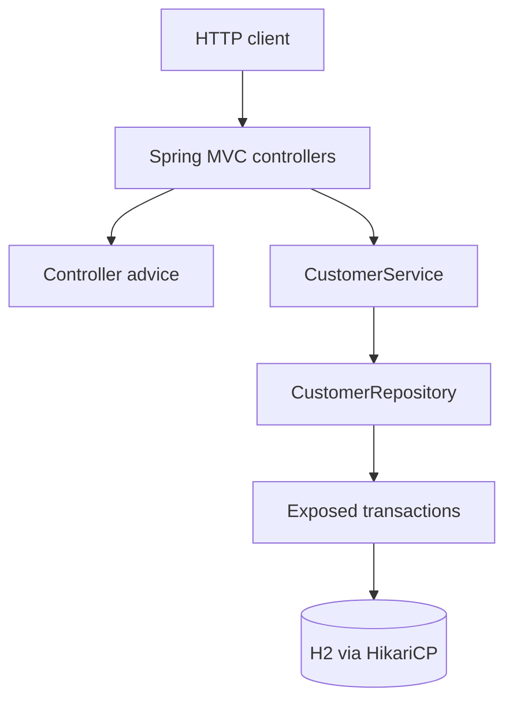

# Spring Boot 애플리케이션 아키텍처

[English](README.md) | [한국어](README.ko.md)

이 모듈은 chapter 12 애플리케이션 아키텍처 주제의 Spring Boot 4 쌍입니다.
Ktor 모듈과 같은 문제를 얇은 컨트롤러 계층, 서비스 경계, Exposed JDBC
저장소로 구현합니다.



## 보여주는 내용

- Spring Boot 4 자동 구성과 명시적 애플리케이션 빈 구성.
- 얇은 MVC 컨트롤러와 정제된 JSON 오류 응답.
- 저장 전 서비스 계층 입력 검증.
- 저장소 내부로 격리된 Exposed JDBC 트랜잭션.
- 서비스 검증, 저장소 동작, HTTP 라우트에 대한 집중 테스트.

## Spring Boot 4와 Ktor 비교

| 관심사 | Spring Boot 4 모듈 | Ktor 모듈 |
|---|---|---|
| HTTP 연결 | 애노테이션 기반 MVC 컨트롤러 | 명시적 routing DSL |
| JSON/오류 | Boot 관리 Jackson과 `@RestControllerAdvice` | Ktor serialization과 `StatusPages` |
| 영속성 | 저장소 메서드 내부의 blocking Exposed 호출 | `Dispatchers.IO` 뒤로 격리한 blocking Exposed 호출 |
| 테스트 형태 | `@SpringBootTest`와 `MockMvc` | `testApplication` |

## 실행

```bash
./gradlew :02-spring-application-architecture:test
./gradlew :02-spring-application-architecture:compileKotlin
```

