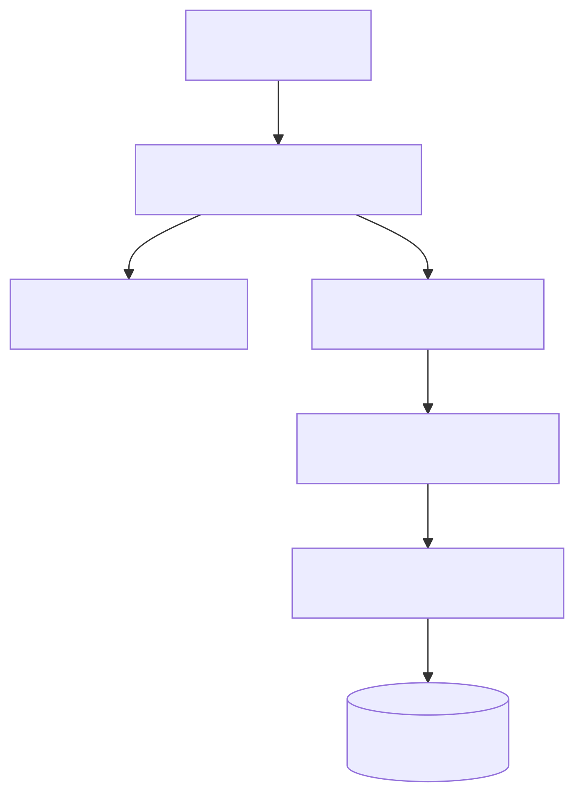

# Spring Boot Application Architecture

[English](README.md) | [한국어](README.ko.md)

This module is the Spring Boot 4 pair for the chapter 12 application
architecture topic. It mirrors the Ktor module with a thin controller layer, a
service boundary, and an Exposed JDBC repository.

## Architecture



## What This Shows

- Spring Boot 4 auto-configuration plus explicit application beans.
- Thin MVC controllers with sanitized JSON error responses.
- Service-level validation before persistence.
- Exposed JDBC transactions isolated in the repository.
- Focused tests for service validation, repository behavior, and HTTP routes.

## Spring Boot 4 vs Ktor

| Concern | Spring Boot 4 module | Ktor module |
|---|---|---|
| HTTP wiring | Annotation-driven MVC controllers | Explicit routing DSL |
| JSON/errors | Boot-managed Jackson and `@RestControllerAdvice` | Ktor serialization and `StatusPages` |
| Persistence | Blocking Exposed calls inside repository methods | Blocking Exposed calls behind `Dispatchers.IO` |
| Test shape | `@SpringBootTest` plus `MockMvc` | `testApplication` |

## Run

```bash
./gradlew :02-spring-application-architecture:test
./gradlew :02-spring-application-architecture:compileKotlin
```
