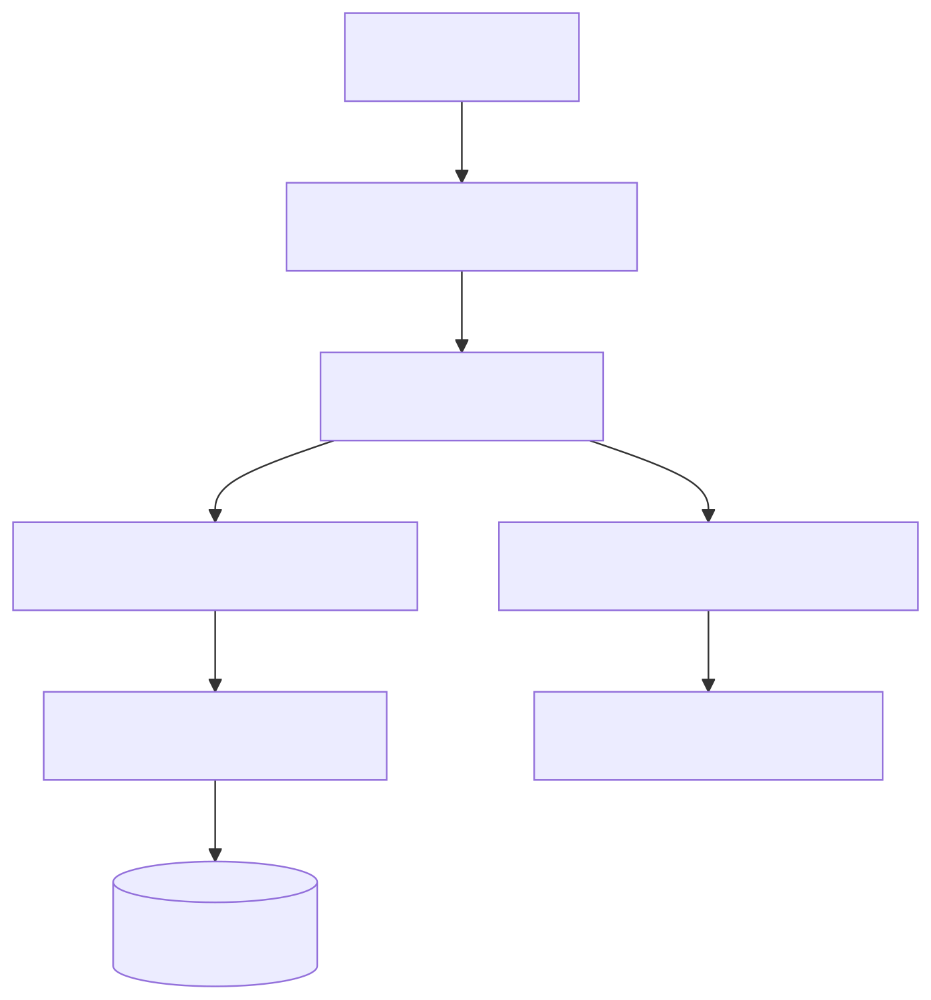

# Spring HTTP 아웃박스와 멱등성

[English](README.md) | [한국어](README.ko.md)

이 모듈은 chapter 12 HTTP 클라이언트 아웃박스/멱등성 주제의 Spring Boot 4
구현입니다. 외부 HTTP 서비스를 호출하기 전에 발신 결제 의도를 먼저
저장하고, 멱등성 키를 중복 요청의 경계로 사용합니다.

## 아키텍처



## 학습 내용

- 결제 생성, 재시도, 조회를 제공하는 Spring Boot 4 MVC 엔드포인트.
- 발신 요청 레코드를 저장소 경계 안의 Exposed JDBC 트랜잭션으로 관리.
- 멱등성 키 유니크 제약으로 중복 생성 대신 기존 레코드 반환.
- 재시도 가능한 외부 실패와 영구 실패의 분리.
- 실제 외부 HTTP 서비스 없이 fake gateway로 검증하는 테스트 구조.

## HTTP 계약

| 메서드 | 경로 | 동작 |
|---|---|---|
| `POST` | `/payments` | pending 아웃박스 레코드를 저장하고 gateway를 호출한 뒤 `201`을 반환합니다. 중복 멱등성 키는 기존 레코드와 `200`을 반환합니다. |
| `POST` | `/payments/{id}/retry` | `RETRYABLE_FAILED` 상태의 레코드만 재시도합니다. |
| `GET` | `/payments/{id}` | 단일 결제/아웃박스 레코드를 반환합니다. |
| `GET` | `/payments` | 모든 결제/아웃박스 레코드를 반환합니다. |

## 실행

```bash
./gradlew :03-spring-http-outbox-idempotency:bootRun
```

```bash
curl -X POST http://localhost:8080/payments \
  -H 'Content-Type: application/json' \
  -d '{"orderId":"order-100","amountCents":2500,"idempotencyKey":"payment-key-100"}'
```

기본 gateway base URL은 실제 결제가 발생하지 않도록 예제용 비라우팅 호스트를
가리킵니다. 테스트에서는 인메모리 fake gateway로 대체합니다.

## 테스트

```bash
./gradlew :03-spring-http-outbox-idempotency:test
```

테스트는 성공 dispatch, 중복 멱등성 키, 재시도 가능한 실패 후 성공 재시도,
영구 실패, 저장소 영속성, MVC 오류 매핑을 검증합니다.
