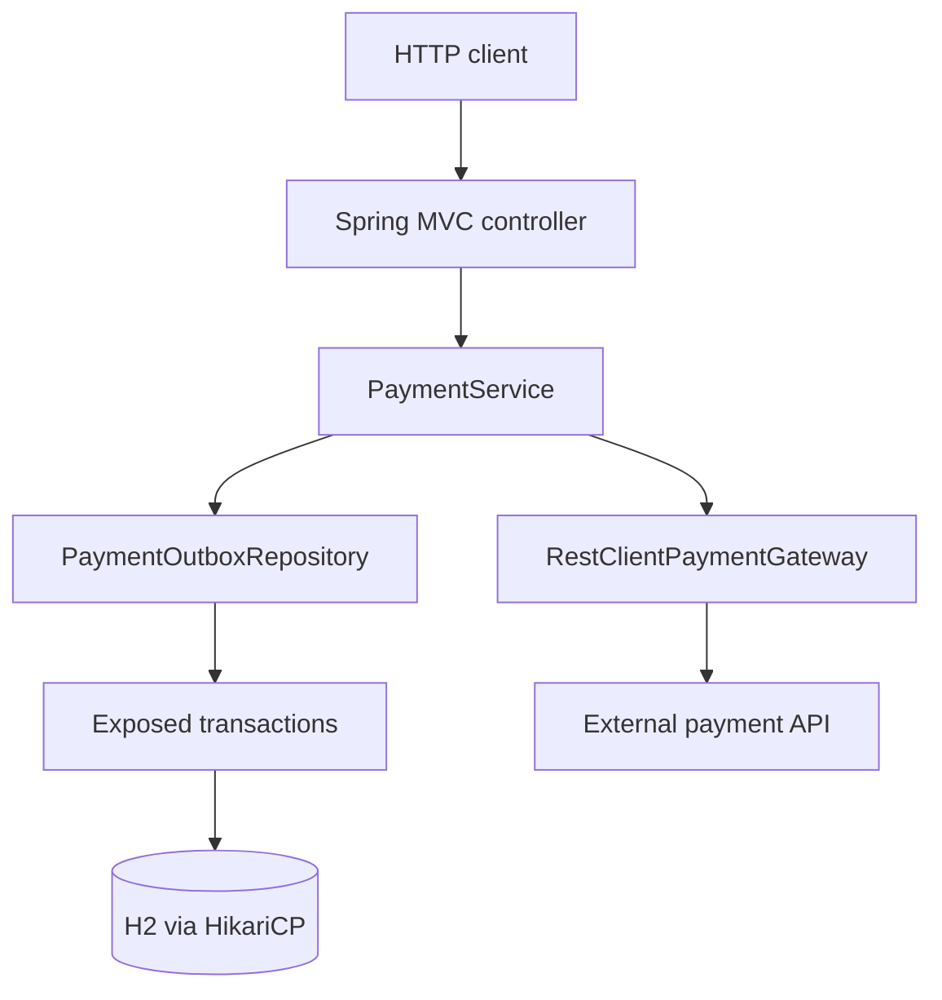

# Spring HTTP Outbox and Idempotency

[English](README.md) | [한국어](README.ko.md)

This module is the Spring Boot 4 implementation for the chapter 12 HTTP client
outbox/idempotency topic. It persists an outbound payment intent before calling
an external HTTP service and uses the idempotency key as the duplicate boundary.



## What This Shows

- Spring Boot 4 MVC endpoints for creating, retrying, and listing payments.
- Repository-owned Exposed JDBC transactions for the outbound request record.
- A unique idempotency key that returns the existing record on duplicate submit.
- Retryable external failures separated from permanent failures.
- Tests that use a fake gateway instead of a real external HTTP service.

## HTTP Contract

| Method | Path | Behavior |
|---|---|---|
| `POST` | `/payments` | Inserts a pending outbox record, calls the gateway, and returns `201`; duplicate idempotency keys return the existing record with `200`. |
| `POST` | `/payments/{id}/retry` | Retries only records in `RETRYABLE_FAILED`. |
| `GET` | `/payments/{id}` | Returns one payment/outbox record. |
| `GET` | `/payments` | Returns all payment/outbox records. |

## Run

```bash
./gradlew :03-spring-http-outbox-idempotency:bootRun
```

```bash
curl -X POST http://localhost:8080/payments \
  -H 'Content-Type: application/json' \
  -d '{"orderId":"order-100","amountCents":2500,"idempotencyKey":"payment-key-100"}'
```

The default gateway base URL points to a non-routable example host so the sample
does not accidentally charge a real provider. Tests override the gateway with an
in-memory fake.

## Test

```bash
./gradlew :03-spring-http-outbox-idempotency:test
```

The test suite covers successful dispatch, duplicate idempotency keys,
retryable failure followed by retry success, permanent failure, repository
persistence, and MVC error handling.
