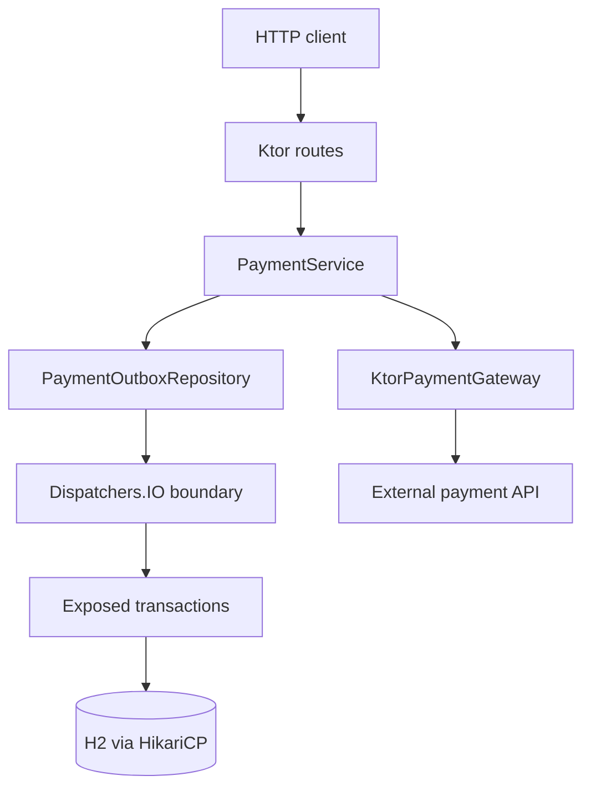

# Ktor HTTP 아웃박스와 멱등성

[English](README.md) | [한국어](README.ko.md)

이 모듈은 chapter 12 HTTP 클라이언트 아웃박스/멱등성 주제의 Ktor 쌍입니다.
Spring Boot 4 예제와 같은 계약을 유지하되, blocking Exposed JDBC 작업은
저장소가 소유한 `Dispatchers.IO` 경계 뒤에 둡니다.



## 학습 내용

- 결제 생성, 재시도, 조회를 제공하는 명시적 Ktor route.
- suspend 저장소 메서드 안에서 격리하는 blocking Exposed JDBC 트랜잭션.
- 멱등성 키 유니크 제약으로 중복 생성 대신 기존 레코드 반환.
- validation, not found, 영구 실패, 예기치 않은 실패를 처리하는
  `StatusPages` 오류 매핑.
- 실제 외부 HTTP 서비스 없이 fake gateway로 검증하는 Ktor client gateway 구조.

## HTTP 계약

| 메서드 | 경로 | 동작 |
|---|---|---|
| `POST` | `/payments` | pending 아웃박스 레코드를 저장하고 gateway를 호출한 뒤 `201`을 반환합니다. 중복 멱등성 키는 기존 레코드와 `200`을 반환합니다. |
| `POST` | `/payments/{id}/retry` | `RETRYABLE_FAILED` 상태의 레코드만 재시도합니다. |
| `GET` | `/payments/{id}` | 단일 결제/아웃박스 레코드를 반환합니다. |
| `GET` | `/payments` | 모든 결제/아웃박스 레코드를 반환합니다. |

## 실행

```bash
./gradlew :04-ktor-http-outbox-idempotency:run
```

```bash
curl -X POST http://localhost:8080/payments \
  -H 'Content-Type: application/json' \
  -d '{"orderId":"order-100","amountCents":2500,"idempotencyKey":"payment-key-100"}'
```

기본 gateway base URL은 실제 결제가 발생하지 않도록 예제용 비라우팅 호스트를
가리킵니다. 테스트에서는 인메모리 fake gateway로 대체합니다.

## 테스트

```bash
./gradlew :04-ktor-http-outbox-idempotency:test
```

테스트는 route 성공, 중복 멱등성 키, 재시도 가능한 실패 후 성공 재시도,
영구 실패, 저장소 영속성, 정제된 Ktor 오류 응답을 검증합니다.
