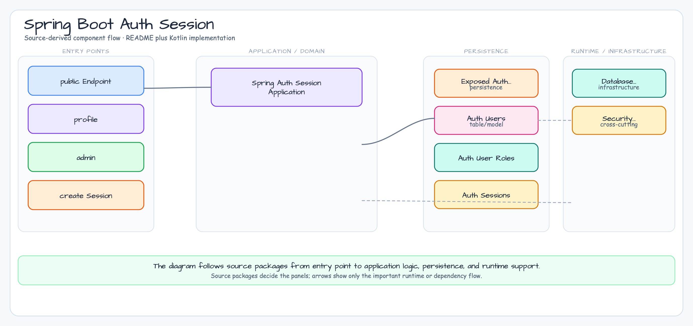

# Spring Boot Auth Session

English | [한국어](README.ko.md)

This module is the Spring Boot 4 half of the chapter 12 authentication/session
example. It uses Spring Security HTTP Basic, database-backed user lookup,
role-based authorization, and Exposed-backed session metadata.

## Architecture



## What This Shows

- `SecurityFilterChain` configuration for anonymous, authenticated, and
  `ADMIN`-only endpoints.
- `UserDetailsService` backed by an Exposed repository instead of in-memory
  users.
- BCrypt password hashes for seeded workshop accounts.
- Session metadata persisted in H2 through Exposed tables with hashed tokens
  and a one-hour expiry.
- HTTP tests for missing credentials, invalid credentials, permission denial,
  authorized profile access, and session creation/listing.

## API Surface

| Endpoint | Authentication | Result |
|---|---|---|
| `GET /api/public` | Anonymous | Public status |
| `GET /api/profile` | HTTP Basic | Current user's profile and roles |
| `GET /api/admin` | HTTP Basic + `ADMIN` role | Admin-only status |
| `POST /api/sessions` | HTTP Basic | Creates persisted session metadata and returns the raw token once |
| `GET /api/sessions` | HTTP Basic | Lists current user's active session metadata without raw tokens |

Seeded accounts:

| Username | Password | Roles |
|---|---|---|
| `alice` | `password` | `USER` |
| `admin` | `password` | `USER`, `ADMIN` |

## Spring Boot 4 vs Ktor

| Concern | Spring Boot 4 module | Ktor module |
|---|---|---|
| Authentication hook | Spring Security filter chain | Ktor `Authentication` plugin |
| User lookup | `UserDetailsService` adapter | Service validation from Ktor Basic provider |
| Authorization | Declarative matcher rules | Service-level role checks |
| Session metadata | Repository writes from MVC controller | Repository writes from Ktor route |
| Password hashing | BCrypt via Spring Security Crypto | BCrypt via Spring Security Crypto |

CSRF is disabled here because the workshop API uses HTTP Basic and returns JSON
without browser form flows. Re-enable CSRF or use token-based protection before
adding cookie-authenticated browser mutations.

## Run

```bash
./gradlew :05-spring-auth-session:bootRun
```

```bash
curl -u alice:password http://localhost:8080/api/profile
curl -u admin:password http://localhost:8080/api/admin
curl -u alice:password -X POST http://localhost:8080/api/sessions
```

## Test

```bash
./gradlew :05-spring-auth-session:test
```
