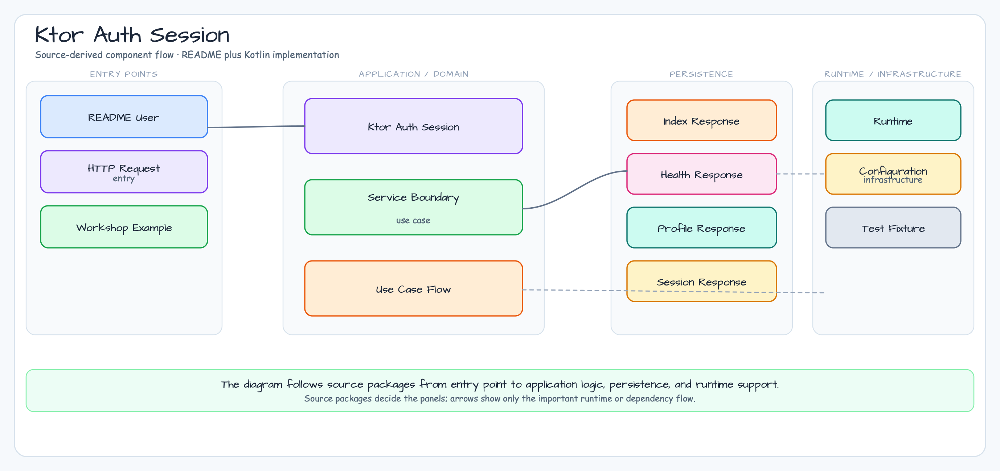

# Ktor 인증 세션

[English](README.md) | 한국어

이 모듈은 12장 인증/세션 예제의 Ktor 구현입니다. Ktor Authentication, Ktor
Sessions, service 계층 역할 검사, Exposed 기반 사용자/세션 메타데이터 저장을
함께 보여줍니다.

## 아키텍처



## 학습 포인트

- service와 Exposed repository를 사용하는 Ktor Basic 인증.
- `authenticate` 블록으로 보호되는 명시적 route 구성.
- 권한 거부를 service 계층의 `ADMIN` 역할 검사로 표현.
- 쿠키에는 세션 토큰을 싣고, H2에는 hash된 세션 메타데이터와 1시간 만료 시각을
  저장하며 쿠키 전용 프로필 endpoint에서 재사용하는 구조.
- 누락 credential, 잘못된 credential, 권한 거부, 프로필 조회, 세션 생성/목록
  조회, 쿠키 재사용을 검증하는 HTTP 테스트.

## API

| Endpoint | 인증 | 결과 |
|---|---|---|
| `GET /api/public` | 익명 | 공개 상태 |
| `GET /api/profile` | HTTP Basic | 현재 사용자 프로필과 역할 |
| `GET /api/admin` | HTTP Basic + `ADMIN` 역할 | 관리자 전용 프로필 |
| `POST /api/sessions` | HTTP Basic | hash된 세션 메타데이터 생성, 원문 token 1회 반환, `auth_session` 설정 |
| `GET /api/sessions` | HTTP Basic | 원문 token 없는 현재 사용자의 활성 세션 메타데이터 목록 |
| `GET /api/session-profile` | `auth_session` cookie | 세션 토큰으로 조회한 현재 프로필 |

Seed 계정:

| Username | Password | Roles |
|---|---|---|
| `alice` | `password` | `USER` |
| `admin` | `password` | `USER`, `ADMIN` |

## Ktor와 Spring Boot 4 비교

| 관심사 | Ktor 모듈 | Spring Boot 4 모듈 |
|---|---|---|
| 인증 hook | Basic provider를 둔 `Authentication` plugin | Spring Security filter chain |
| 사용자 조회 | `AuthService.authenticate` | `UserDetailsService` adapter |
| 인가 | 명시적 service 역할 검사 | matcher 기반 선언형 규칙 |
| 세션 메타데이터 | route가 repository 기록 후 쿠키 설정, `/api/session-profile`에서 쿠키 조회 | MVC controller가 repository 기록 |
| Blocking Exposed 작업 | repository가 `Dispatchers.IO`로 transaction 격리 | blocking MVC request thread에서 repository 실행 |

예제는 Spring Security Crypto의 BCrypt를 사용해 seed password에도 hash별 salt와
adaptive 검증을 적용합니다. 세션 row에는 SHA-256 token hash와 1시간 만료 시각만
저장하고, 원문 token은 생성 응답과 `HttpOnly` 쿠키에만 사용합니다. TLS 뒤에 배포할
때는 `Secure`, 명시적 `SameSite`, rotation 정책을 추가하세요.

## 실행

```bash
./gradlew :06-ktor-auth-session:run
```

```bash
curl -u alice:password http://localhost:8080/api/profile
curl -u admin:password http://localhost:8080/api/admin
curl -i -u alice:password -X POST http://localhost:8080/api/sessions
curl -b 'auth_session=...' http://localhost:8080/api/session-profile
```

## 테스트

```bash
./gradlew :06-ktor-auth-session:test
```
