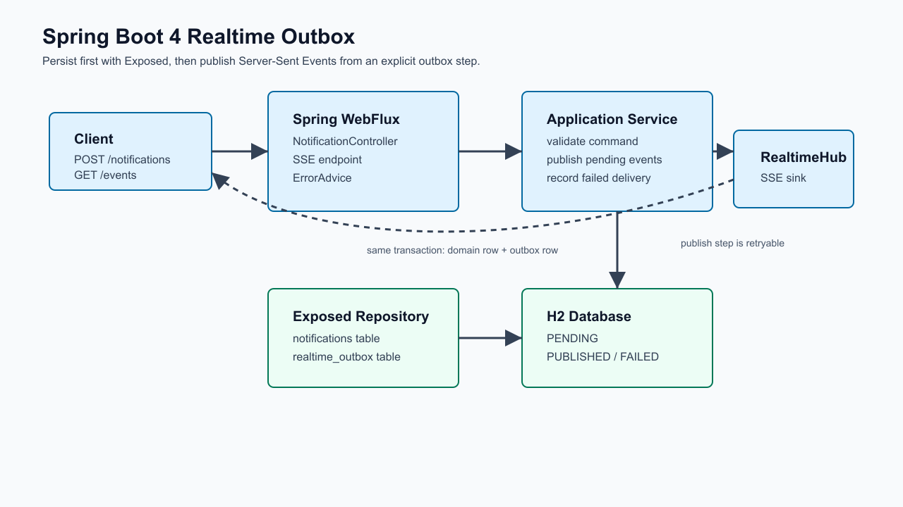

# Spring Boot 4 리얼타임 아웃박스

[English](README.md) | [한국어](README.ko.md)

이 예제는 Spring Boot 4, Spring WebFlux, Exposed로 데이터베이스 기반
리얼타임 알림 흐름을 구성합니다. 알림 요청은 도메인 row와 outbox row를 먼저
저장하고, 별도 publish 단계가 pending outbox row를 읽어 Server-Sent Events로
전달합니다.

## Architecture Diagram



## 흐름

1. `POST /notifications`가 요청을 검증하고 `notifications`,
   `realtime_outbox` row를 하나의 Exposed transaction에 저장합니다.
2. `POST /outbox/publish`가 pending event를 `RealtimeHub`로 전달합니다.
3. 전달 성공 시 row를 `PUBLISHED`로 표시하고, 실패 시 `FAILED`와 오류 경계를
   outbox에 남깁니다.
4. `GET /events?after={eventId}`는 reconnect 기준 이후의 published event를
   replay한 뒤 SSE stream을 유지합니다.

## Spring Boot 4 선택 기준

Spring WebFlux SSE는 브라우저와 HTTP client가 쓰기 쉬운 단방향 알림 스트림에
적합합니다. 양방향 흐름에는 WebSocket이나 broker 기반 프로토콜이 더 알맞습니다.

예제는 Exposed outbox 경계를 쉽게 확인하도록 in-process delivery를 사용합니다.
운영 환경에서는 여러 인스턴스에서 안전하게 outbox row를 claim하는 scheduler나
worker가 필요합니다.

`FAILED` row는 이 작은 예제에서 운영자 개입 대상으로 남겨둡니다. 자동
at-least-once delivery worker로 쓰려면 retry policy, claim lease, attempt limit을
추가해야 합니다.

## 실행

```bash
./gradlew :07-spring-outbox-realtime:bootRun
```

## 검증

```bash
./gradlew :07-spring-outbox-realtime:test
```

테스트는 delivery 전 event persistence, publish 성공, reconnect 경계 이후 SSE
replay와 live streaming, delivery 실패 기록을 검증합니다.
