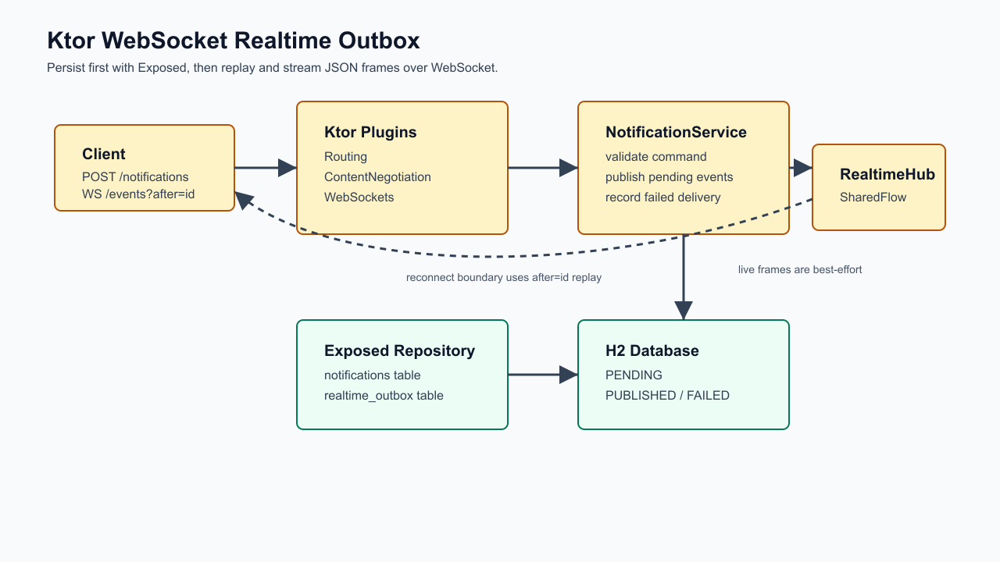

# Ktor WebSocket 리얼타임 아웃박스

[English](README.md) | [한국어](README.ko.md)

이 예제는 Ktor WebSocket과 Exposed로 데이터베이스 기반 리얼타임 알림 흐름을
구성합니다. 알림 요청은 도메인 row와 outbox row를 먼저 저장하고, 별도 publish
단계가 JSON frame을 WebSocket hub로 전달합니다.

## Architecture Diagram



## 흐름

1. `POST /notifications`가 요청을 검증하고 `notifications`,
   `realtime_outbox` row를 하나의 Exposed transaction에 저장합니다.
2. `POST /outbox/publish`가 pending event를 `RealtimeHub`로 전달합니다.
3. 전달 성공 시 row를 `PUBLISHED`로 표시하고, 실패 시 outbox event를 삭제하지
   않고 `FAILED`로 남깁니다.
4. `WS /events?after={eventId}`는 client reconnect 경계 이후의 published event를
   replay한 뒤 live JSON frame을 stream합니다.

## Ktor 선택 기준

Ktor WebSocket은 이후 양방향 메시지, 구독 명령, application-level heartbeat가
필요한 흐름에 SSE보다 적합합니다. 대신 WebSocket 지원 client와 명시적인 reconnect
처리가 필요합니다.

예제는 outbox 패턴을 작게 유지하기 위해 in-process `SharedFlow` hub를 사용합니다.
운영 환경에서는 cross-node delivery를 위해 broker나 multi-instance outbox worker가
필요합니다.

`FAILED` row는 이 작은 예제에서 운영자 개입 대상으로 남겨둡니다. 자동
at-least-once delivery worker로 쓰려면 retry policy, claim lease, attempt limit을
추가해야 합니다.

## 실행

```bash
./gradlew :08-ktor-outbox-realtime:run
```

## 검증

```bash
./gradlew :08-ktor-outbox-realtime:test
```

테스트는 delivery 전 event persistence, reconnect 경계 이후 WebSocket replay와
live streaming, delivery 실패 기록을 검증합니다.
