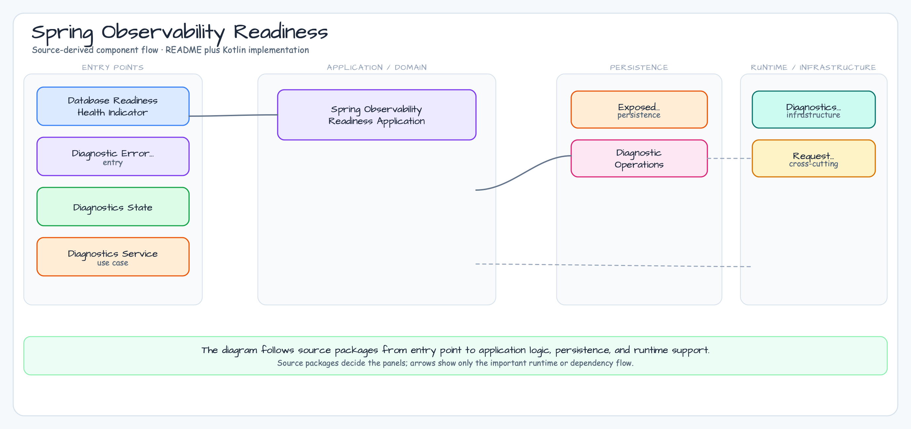

# Spring Observability Readiness

[English](README.md) | 한국어

이 모듈은 Exposed 기반 HTTP 서비스의 Spring Boot 4 운영 진단 예제입니다.
외부 관측성 인프라 없이 readiness, request correlation, structured error,
slow-operation diagnostics 경계를 보여줍니다.

## 아키텍처



## 학습 목표

- Spring Boot 4 Actuator readiness에 database-backed custom health contributor를
  포함합니다.
- `X-Request-ID`를 sanitize한 뒤 echo 또는 생성하고 diagnostic response에
  포함합니다.
- validation/fallback 오류를 structured response로 반환합니다.
- operation diagnostics를 저장해 slow-operation 동작을 테스트합니다.

## 실행

```bash
./gradlew :09-spring-observability-readiness:bootRun
```

주요 엔드포인트:

- `GET /actuator/health/readiness`
- `GET /diagnostics/operations/import?delayMs=15`
- `GET /diagnostics/operations`

## 테스트

```bash
./gradlew :09-spring-observability-readiness:test
```

테스트는 readiness 성공/실패, request-id propagation, structured validation
error, slow-operation persistence를 검증합니다.

## 운영 참고

- `management.endpoint.health.show-details: always`는 workshop test가 readiness
  component detail을 확인하기 위한 설정입니다. 운영에서는 `when-authorized`를
  사용하거나 Actuator endpoint를 보호한 뒤 detail을 노출해야 합니다.
- 들어오는 `X-Request-ID`는 echo/persist 전에 120자 이하이며 문자, 숫자,
  `.`, `_`, `:`, `-`만 포함하도록 제한합니다.

## Spring Boot 4 vs Ktor Tradeoffs

Spring Boot는 Actuator health group과 application availability model로
production readiness를 표준화합니다. 플랫폼 팀에는 익숙하고 간결하지만,
endpoint shape와 lifecycle은 프레임워크가 소유합니다. 짝을 이루는 Ktor
모듈은 `/readyz`를 명시적으로 구현하므로 작고 투명하지만 readiness 의미와
response contract를 애플리케이션이 직접 관리해야 합니다.
