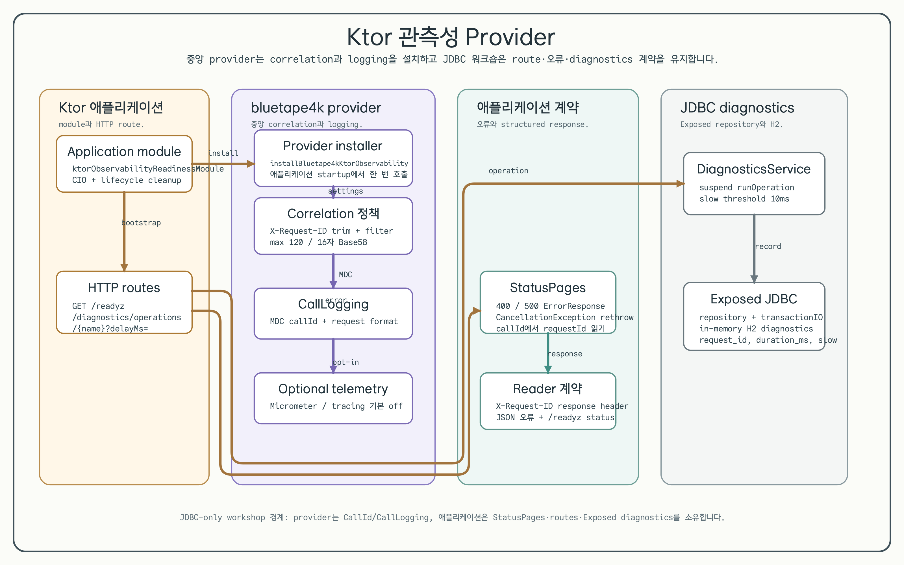

# Ktor Observability Readiness

[English](README.md) | 한국어

이 모듈은 Exposed 기반 HTTP 서비스의 JDBC 전용 Ktor 3 진단 예제입니다. 애플리케이션은
`/readyz`, structured error, slow-operation diagnostics를 명시적으로 유지하고,
공유 `bluetape4k-ktor-observability` provider가 request correlation과 call logging을
소유합니다.

## 아키텍처



성공·검증 오류·취소 분기를 포함한 request lifecycle은
[sequence diagram](../../docs/images/readme-diagrams/12-production-integration-10-ktor-observability-readiness-sequence-02.ko.png)에서
확인할 수 있습니다. 편집 가능한 English/Korean SVG source와 semantic ledger는
렌더링된 PNG 옆에 둡니다.

## 학습 목표

- 애플리케이션 startup에서 `installBluetape4kKtorObservability`를 한 번 설치합니다.
- `CallId`나 `CallLogging` 설정을 중복 구현하지 않고 `X-Request-ID` response propagation과
  `callId` MDC key를 provider에 설정합니다.
- `/readyz`, `StatusPages`, JSON error, `CancellationException` rethrow 동작을
  애플리케이션 소유 코드로 유지합니다.
- Exposed JDBC repository와 in-memory H2 뒤에 slow-operation diagnostics를 저장합니다.
- `testApplication`으로 provider 기본값, 정제·생성 ID, call-log correlation, structured
  route response를 검증합니다.

## Provider 계약

`installBluetape4kKtorObservability`는 공유 provider 기본값으로 correlation과 call logging을
설치합니다. 이 모듈은 request/response header를 `X-Request-ID`로 지정하고 response header를
활성화하며 ID 길이를 120자로 제한합니다. provider는 값을 trim한 뒤
`[A-Za-z0-9._-]` 이외의 문자를 모두 제거하고, header가 없거나 비어 있으면 16자 Base58 ID를
생성합니다. 예를 들어 `trace:with spaces`는 `tracewithspaces`로 echo됩니다.

Micrometer metrics와 tracing은 기본적으로 비활성화됩니다. 두 기능은 provider의 선택 기능이며
이 JDBC workshop의 runtime 계약에는 포함하지 않습니다.

## 오류와 취소 계약

애플리케이션 소유 `StatusPages`는 validation failure를 `400 VALIDATION_FAILED`, malformed
request를 `400 BAD_REQUEST`, 나머지 오류를 `500 INTERNAL_ERROR`로 매핑합니다. 모든 JSON
response와 `X-Request-ID` header에는 provider correlation ID가 포함됩니다.
`CancellationException`은 coroutine 취소가 소비되지 않도록 rethrow합니다.

## 실행

```bash
./gradlew :10-ktor-observability-readiness:run
```

주요 엔드포인트:

- `GET /readyz`
- `GET /diagnostics/operations/import?delayMs=15`
- `GET /diagnostics/operations`

## 테스트와 정적 검사

```bash
USE_FAST_DB=true ./gradlew :10-ktor-observability-readiness:test
./gradlew :10-ktor-observability-readiness:build
./gradlew :10-ktor-observability-readiness:detekt
```

테스트는 readiness 성공/실패, request-ID 정제·생성, response propagation, provider
call-log correlation, structured validation error, cancellation rethrow, repository
persistence, slow-operation classification을 검증합니다.

## JDBC와 R2DBC 범위

이 예제는 Exposed와 H2를 통한 JDBC만 구현합니다. R2DBC 예제와 provider 통합은 별도
[`exposed-r2dbc-workshop`](https://github.com/bluetape4k/exposed-r2dbc-workshop)
repository에서 구현하며, 이 모듈에는 R2DBC dependency나 구현을 추가하지 않습니다.

## Spring Boot 4와 Ktor의 선택

Ktor는 readiness response shape, degraded state, provider installation, error mapping을
일반 route/plugin 코드로 드러내 production contract를 쉽게 조정할 수 있습니다. 대신 Actuator
health-group convention은 기본 제공하지 않습니다. 짝을 이루는 Spring Boot 모듈은 플랫폼
convention을 사용해 custom code를 줄이고 Kubernetes probe 기본값에 맞춥니다.
