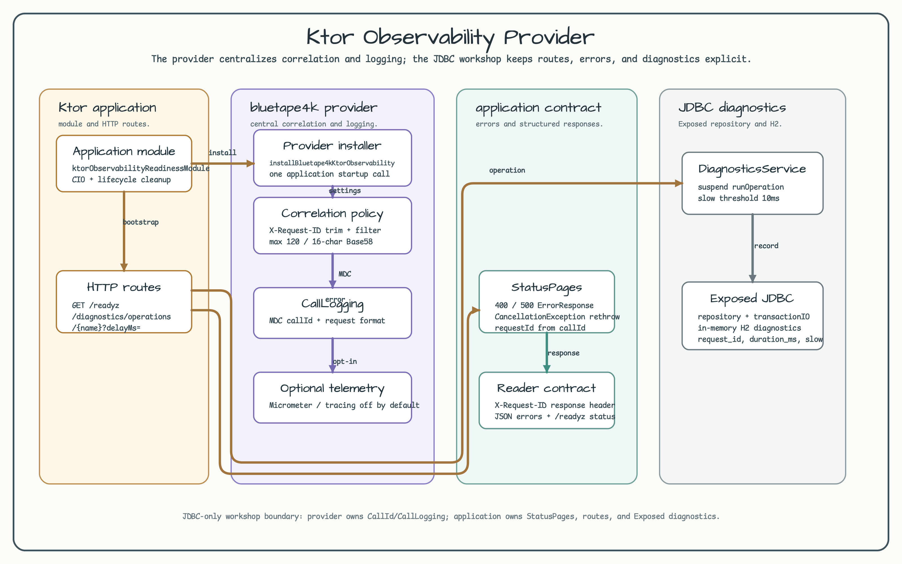

# Ktor Observability Readiness

English | [한국어](README.ko.md)

This module is a JDBC-only Ktor 3 diagnostics slice for an Exposed-backed HTTP
service. The application keeps `/readyz`, structured errors, and slow-operation
diagnostics explicit, while the shared `bluetape4k-ktor-observability` provider
owns request correlation and call logging.

## Architecture



The request lifecycle, including success, validation-error, and cancellation
branches, is shown in the [sequence diagram](../../docs/images/readme-diagrams/12-production-integration-10-ktor-observability-readiness-sequence-02.png).
The editable English and Korean SVG sources and semantic ledgers live beside
the rendered PNG assets.

## Learning Goals

- Install `installBluetape4kKtorObservability` once at application startup.
- Configure the provider for `X-Request-ID` response propagation and a
  `callId` MDC key without duplicating `CallId` or `CallLogging` setup.
- Keep `/readyz`, `StatusPages`, JSON errors, and `CancellationException`
  rethrow behavior in application-owned code.
- Persist slow-operation diagnostics behind an Exposed JDBC repository and
  in-memory H2 setup.
- Test provider defaults, sanitized/generated IDs, call-log correlation, and
  structured route responses with `testApplication`.

## Provider Contract

`installBluetape4kKtorObservability` installs correlation and call logging with
the shared provider defaults. This module customizes the request and response
header to `X-Request-ID`, keeps the response header enabled, and caps IDs at
120 characters. The provider trims the value, removes every character outside
`[A-Za-z0-9._-]`, and generates a 16-character Base58 ID when the header is
missing or becomes blank. For example, `trace:with spaces` is echoed as
`tracewithspaces`.

Micrometer metrics and tracing are disabled by default. They are optional
provider features and are not part of this JDBC workshop's runtime contract.

## Error and Cancellation Contract

Application-owned `StatusPages` maps validation failures to `400
VALIDATION_FAILED`, malformed requests to `400 BAD_REQUEST`, and other failures
to `500 INTERNAL_ERROR`, always carrying the provider's correlation ID in the
JSON response and `X-Request-ID` header. A `CancellationException` is rethrown
so structured error handling does not consume coroutine cancellation.

## Run

```bash
./gradlew :10-ktor-observability-readiness:run
```

Useful endpoints:

- `GET /readyz`
- `GET /diagnostics/operations/import?delayMs=15`
- `GET /diagnostics/operations`

## Test and Static Checks

```bash
USE_FAST_DB=true ./gradlew :10-ktor-observability-readiness:test
./gradlew :10-ktor-observability-readiness:build
./gradlew :10-ktor-observability-readiness:detekt
```

The tests cover readiness success/failure, request-ID sanitization and
generation, response propagation, provider call-log correlation, structured
validation errors, cancellation rethrow, repository persistence, and
slow-operation classification.

## JDBC and R2DBC Scope

This example deliberately implements JDBC through Exposed and H2. R2DBC
examples and provider integration belong in the separate
[`exposed-r2dbc-workshop`](https://github.com/bluetape4k/exposed-r2dbc-workshop)
repository; no R2DBC dependency or implementation is introduced here.

## Spring Boot 4 vs Ktor Tradeoffs

Ktor keeps the production contract visible: readiness response shape, degraded
state, provider installation, and error mapping are ordinary route/plugin code.
That makes the example easy to adapt, but there is no built-in Actuator
health-group convention. The paired Spring Boot module uses the platform
convention instead, reducing custom code and aligning with Kubernetes probe
defaults.
