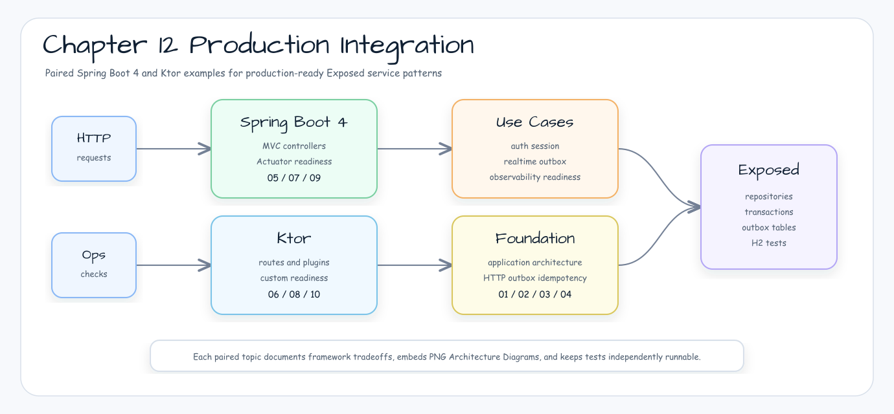

# 12장 - 운영 통합

이 장은 데이터베이스 기반 서비스의 운영형 패턴을 Spring Boot 4와 Ktor로
나란히 비교합니다. 각 예제는 HTTP 계층, 서비스 유스케이스, Exposed 영속성,
테스트, 운영 문서화 경계를 작게 유지하면서도 실제 서비스 구조를 보여줍니다.

## 아키텍처 다이어그램



Foundation 예제 01-04는 Spring/Ktor 애플리케이션 아키텍처와 HTTP
아웃박스/멱등성 기준선을 쌍으로 다룹니다. Use-case 예제 05-10은 그 위에
인증/세션, 리얼타임 아웃박스, 관측성/준비 상태 패턴을 올립니다.

이 장의 완료된 예제 README는 모두 `docs/images/readme-diagrams/` 아래에
커밋된 PNG Architecture Diagram을 포함해야 합니다. Mermaid는 중간 소스로
사용할 수 있지만, 최종 README에는 GitHub, IDE, 오프라인 리더에서 안정적으로
보이는 PNG 다이어그램을 임베드합니다.

## 모듈

| 주제 | Spring Boot 4 | Ktor |
|---|---|---|
| 애플리케이션 아키텍처 | [02-spring-application-architecture](02-spring-application-architecture/README.ko.md) | [01-ktor-application-architecture](01-ktor-application-architecture/README.ko.md) |
| 인증/세션 | [05-spring-auth-session](05-spring-auth-session/README.ko.md) | [06-ktor-auth-session](06-ktor-auth-session/README.ko.md) |
| 리얼타임 아웃박스 | [07-spring-outbox-realtime](07-spring-outbox-realtime/README.ko.md) | [08-ktor-outbox-realtime](08-ktor-outbox-realtime/README.ko.md) |
| HTTP 클라이언트 아웃박스/멱등성 | [03-spring-http-outbox-idempotency](03-spring-http-outbox-idempotency/README.ko.md) | [04-ktor-http-outbox-idempotency](04-ktor-http-outbox-idempotency/README.ko.md) |
| 관측성/준비 상태 | [09-spring-observability-readiness](09-spring-observability-readiness/README.ko.md) | [10-ktor-observability-readiness](10-ktor-observability-readiness/README.ko.md) |

## 검증

```bash
./gradlew :01-ktor-application-architecture:test
./gradlew :02-spring-application-architecture:test
./gradlew :03-spring-http-outbox-idempotency:test
./gradlew :04-ktor-http-outbox-idempotency:test
./gradlew :05-spring-auth-session:test
./gradlew :06-ktor-auth-session:test
./gradlew :07-spring-outbox-realtime:test
./gradlew :08-ktor-outbox-realtime:test
./gradlew :09-spring-observability-readiness:test
./gradlew :10-ktor-observability-readiness:test
```

완료된 주제는 Spring/Ktor 쌍, 집중 테스트, README의 트레이드오프 설명,
PNG Architecture Diagram 자산, 실제 외부 서비스에 의존하지 않는 예제 구조를
같은 형태로 유지합니다.

## 검증 범위

- `settings.gradle.kts`는 `includeModules("12-production-integration", false,
  false)`로 chapter module을 포함하므로, 새 예제 디렉터리는 모듈별 settings
  수정 없이 발견됩니다.
- `.github/workflows/examples.yml`은 12장 변경과 일일 schedule에서 선택된
  12장 모듈 01-10을 build합니다.
- `.github/workflows/ci.yml`은 비문서 변경이 full CI를 요구할 때 H2,
  PostgreSQL, MySQL 8, MariaDB test matrix를 실행합니다.
- `.github/workflows/nightly.yml`은 이미 full H2 test task와 선택된 DB shard를
  실행합니다. 이 self-contained 예제들은 향후 외부 인프라가 필요한 예제가
  추가되지 않는 한 별도 nightly override가 필요하지 않습니다.
