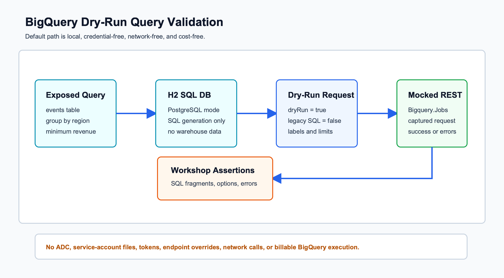

# BigQuery Dry-Run Query Validation

[English](README.md) | 한국어

이 예제는 Exposed가 생성한 분석용 query를 실제 비용이 발생하는 BigQuery 실행 전에
dry-run 방식으로 검증하는 흐름을 보여줍니다.



다이어그램은 local-only 경로를 보여줍니다. Exposed가 query를 만들고, H2는 SQL 생성용
dialect로만 사용되며, `BigQueryContext.validateQuery`가 dry-run request를 생성합니다.
테스트는 mocked BigQuery REST response로 workshop assertion을 검증합니다.

## 목적

이 모듈은 Exposed SQL 생성과 BigQuery `jobs.query` request 사이의 경계를 다룹니다.
애플리케이션이 warehouse read model을 실제 BigQuery job으로 실행하기 전에 parser 오류,
option mapping, 예상 안전 한도를 확인해야 할 때 참고할 수 있습니다.

## Dry Run vs Execution

BigQuery dry run은 result row를 만들거나 query execution 비용을 발생시키지 않고 query
request를 검증합니다. 이 workshop은 `BigQueryContext.validateQuery`를 호출합니다. 이
함수는 Exposed `Query`를 SQL로 변환하고 outgoing `QueryRequest`에 `dryRun=true`를
설정합니다.

이 모듈은 실제 BigQuery query를 실행하지 않습니다.

## Credential-Free Command

예제 테스트를 실행합니다.

```bash
./gradlew :01-bigquery-dry-run:test
```

예상 결과: 이 명령은 H2 SQL-generation database와 mocked BigQuery REST call만 사용하며
`GOOGLE_APPLICATION_CREDENTIALS` 없이 통과해야 합니다.

## No Cloud Credential Guarantee

기본 경로는 Application Default Credentials, service-account file, project secret,
endpoint override, token, API key, environment variable, system property를 읽지 않습니다.
테스트는 mocked `Bigquery` service를 만들고 `Bigquery.Jobs.query`로 전달되는
`QueryRequest`를 capture합니다.

placeholder project/dataset ID는 request mapping 검증용 test constant일 뿐입니다.

## Tested Behavior

테스트는 다음 동작을 검증합니다.

- Exposed가 `events` table에 대한 grouped analytical SQL을 생성합니다.
- `dryRun=true`와 `useLegacySql=false`가 적용됩니다.
- default dataset의 project ID와 dataset ID가 매핑됩니다.
- maximum billed bytes, labels, priority, location, timeout이 매핑됩니다.
- 성공한 dry run은 mocked response를 반환합니다.
- BigQuery validation error는 `BigQueryQueryException`으로 노출됩니다.

## Real BigQuery Out of Scope

실제 BigQuery 실행, ADC 설정, service-account file, endpoint override, manual opt-in
cloud test는 issue #138 범위 밖입니다. 향후 명시적 real-service lane이 필요하면 별도
이슈로 다룹니다.
