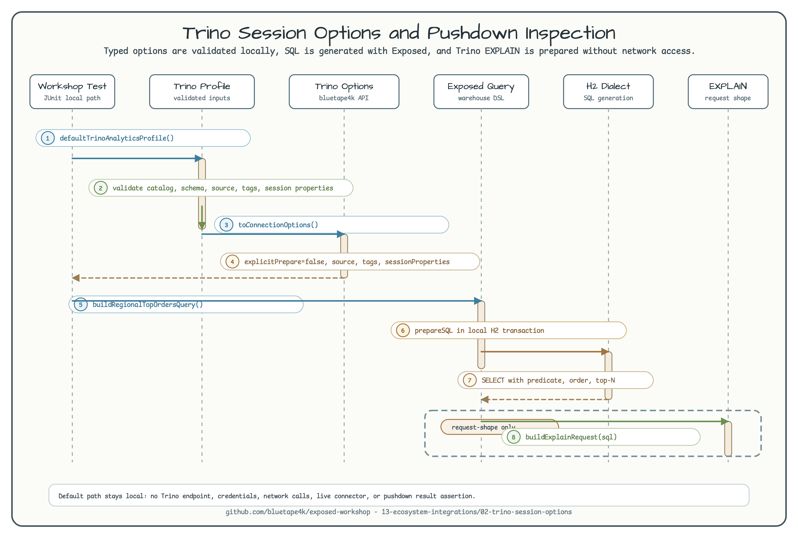

# Trino Session Options and Pushdown Verification

English | [한국어](README.ko.md)

This example shows how to keep Trino JDBC session configuration typed in
application code and how to prepare an Exposed-generated analytical query for
Trino `EXPLAIN` inspection without contacting a live Trino cluster.



The diagram shows the local-only path: a validated workshop profile maps to
`TrinoConnectionOptions`, Exposed builds a warehouse query, H2 provides only a
SQL-generation transaction context, and the generated SQL is wrapped in an
`EXPLAIN` request shape for later pushdown inspection.

## Purpose

The module focuses on the boundary between application configuration and Trino
JDBC driver properties. It is useful when an application wants a stable place to
own catalog, schema, `source`, `clientTags`, and `sessionProperties` before
opening a real warehouse connection.

It also demonstrates a pushdown-friendly query shape with projection,
predicate, ordering, and top-N clauses. The workshop verifies the request shape
only, because real pushdown support depends on the selected Trino connector and
catalog configuration.

## Session Options

`TrinoWorkshopConnectionProfile` validates user-facing values and converts them
to the bluetape4k-exposed `TrinoConnectionOptions` API:

- `explicitPrepare=false`
- `encoding=json+zstd`
- `validateConnection=true`
- `source=exposed-workshop`
- `clientTags=exposed,analytics,workshop`
- `sessionProperties=join_distribution_type=AUTOMATIC,query_max_execution_time=5m`

The helper `jdbcPropertyPreview(user)` is intentionally a local preview for
tests and documentation. The actual JDBC property conversion remains inside
`TrinoConnectionOptions` in the bluetape4k-exposed library.

## Credential-Free Command

Run the example tests:

```bash
./gradlew :02-trino-session-options:test
```

Expected result: the command uses only public option objects plus an in-memory
H2 transaction for SQL generation. It passes without a Trino coordinator URL,
catalog credentials, environment variables, endpoint overrides, or network
access.

## Tested Behavior

The tests verify that:

- default profile values map to typed `TrinoConnectionOptions`.
- a stable JDBC-property preview is available for documentation and assertions.
- blank catalog, schema, source, tag, and session property values fail before a
  JDBC connection can be attempted.
- generated SQL keeps the `SELECT`, `WHERE`, `ORDER BY`, and `LIMIT 10` signals
  needed for later Trino `EXPLAIN` inspection.

## Real Trino Out of Scope

This module does not start Trino, connect to a coordinator, authenticate to a
catalog, or assert connector-specific pushdown results. A future real-service
lane should use an explicit opt-in test profile and should compare stable
`EXPLAIN` signals instead of snapshotting the entire Trino plan.
