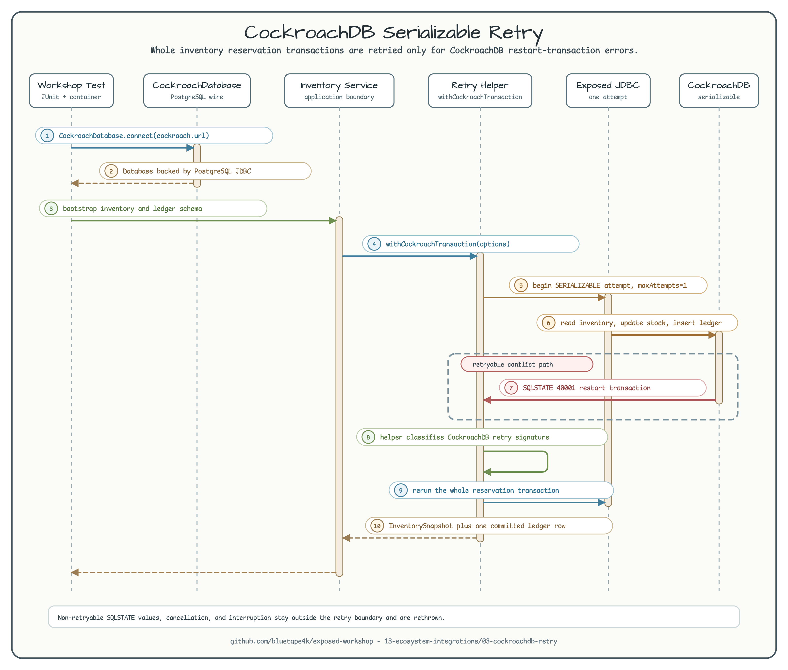

# CockroachDB Serializable Retry

[English](README.md) | 한국어

이 예제는 `bluetape4k-exposed-cockroachdb` helper surface로 Exposed를
CockroachDB에 연결하고, 작은 inventory reservation을 CockroachDB 전용 serializable
retry 경계로 감싸는 방법을 보여줍니다.



다이어그램의 핵심은 retry 경계입니다. application code는
`withCockroachTransaction`을 호출하고, helper가 retry classification을 소유합니다.
Exposed는 한 번에 하나의 JDBC transaction attempt만 실행하며, CockroachDB가 retryable
serializable conflict를 반환할 때만 client가 전체 transaction을 다시 시작합니다.

## 목적

CockroachDB transaction의 기본 isolation은 serializable입니다. 경합이 있는
multi-statement transaction은 SQLSTATE `40001`과 `restart transaction`으로 시작하는
message를 반환하며 실패할 수 있습니다. 올바른 application code는 마지막 SQL statement만
다시 실행하는 것이 아니라 전체 transaction을 다시 실행해야 합니다.

이 workshop은 예제를 작게 유지합니다. inventory reservation은 inventory row를 갱신하고
ledger row를 같은 transaction에 기록합니다. CockroachDB가 retryable serialization
conflict를 보고하면 retry helper가 두 작업을 함께 다시 실행합니다.

## Connection Boundary

테스트는 public helper를 통해 연결합니다.

```kotlin
val db = CockroachDatabase.connect(
    jdbcUrl = cockroach.url,
    user = cockroach.username ?: CockroachServer.USERNAME,
    password = cockroach.password ?: CockroachServer.PASSWORD,
)
```

`CockroachDatabase`는 CockroachDB의 PostgreSQL wire protocol을 사용합니다. 이 모듈은
별도의 Exposed CockroachDB dialect를 등록하지 않습니다.

## Retry Boundary

`CockroachInventoryService.reserve`는 retry 소유권을 `withCockroachTransaction`에
맡깁니다.

```kotlin
withCockroachTransaction(db = db, options = workshopRetryOptions()) {
    // read inventory
    // update inventory
    // insert ledger row
}
```

내부 Exposed transaction은 한 번만 시도합니다. 따라서 Exposed의 generic
`SQLException` retry loop가 아니라 CockroachDB helper가 어떤 실패를 retry할지
판단합니다.

## Testcontainers Command

예제 테스트를 실행합니다.

```bash
./gradlew :03-cockroachdb-retry:test
```

예상 결과: 이 명령은 single-node CockroachDB Testcontainers instance를 시작하고,
workshop schema를 다시 만든 뒤, 정상 reservation과 한 번의 retryable serializable
conflict, 그리고 retry하지 않아야 하는 non-retryable SQL error를 검증합니다.

## Tested Behavior

테스트는 다음 동작을 검증합니다.

- schema bootstrap이 inventory와 ledger table을 생성합니다.
- 정상 reservation은 inventory update와 ledger row 하나를 commit합니다.
- retryable SQLSTATE `40001` conflict가 발생하면 전체 reservation을 한 번 다시 실행합니다.
- non-retryable SQLSTATE `23505` 실패는 retry하지 않고 데이터를 변경하지 않습니다.
- retry predicate가 CockroachDB의 documented retry signature를 인식합니다.

## Out of Scope

이 모듈은 custom CockroachDB dialect, R2DBC retry, savepoint 기반 advanced retry,
실제 multi-node CockroachDB cluster를 구현하지 않습니다. 그런 범위가 필요해지면 별도
예제로 다루는 편이 낫습니다.
