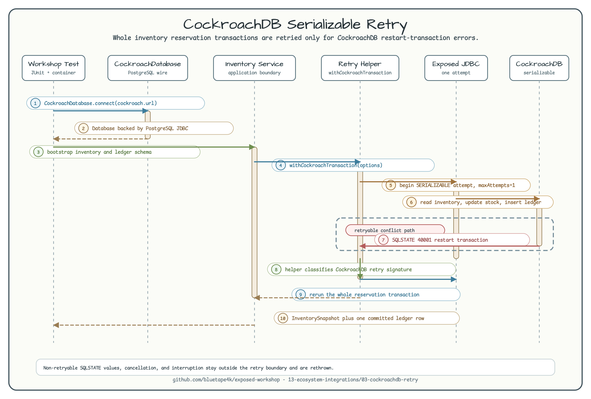

# CockroachDB Serializable Retry

English | [한국어](README.ko.md)

This example shows how to connect Exposed to CockroachDB through the
`bluetape4k-exposed-cockroachdb` helper surface and how to wrap a small
inventory reservation in a CockroachDB-specific serializable retry boundary.



The diagram shows the important boundary: application code calls
`withCockroachTransaction`, the helper owns retry classification, Exposed runs
one JDBC transaction attempt at a time, and CockroachDB asks the client to
restart the whole transaction only for retryable serializable conflicts.

## Purpose

CockroachDB defaults to serializable transactions. Under contention, a
multi-statement transaction can fail with SQLSTATE `40001` and a message that
starts with `restart transaction`. Correct application code must rerun the whole
transaction, not only the last SQL statement.

This workshop keeps the example small: reserving inventory updates an inventory
row and writes a ledger entry in the same transaction. The retry helper replays
both operations together when CockroachDB reports a retryable serialization
conflict.

## Connection Boundary

Tests connect through the public helper:

```kotlin
val db = CockroachDatabase.connect(
    jdbcUrl = cockroach.url,
    user = cockroach.username ?: CockroachServer.USERNAME,
    password = cockroach.password ?: CockroachServer.PASSWORD,
)
```

`CockroachDatabase` still uses CockroachDB's PostgreSQL wire protocol. The
module does not register a custom Exposed CockroachDB dialect.

## Retry Boundary

`CockroachInventoryService.reserve` delegates retry ownership to
`withCockroachTransaction`:

```kotlin
withCockroachTransaction(db = db, options = workshopRetryOptions()) {
    // read inventory
    // update inventory
    // insert ledger row
}
```

The inner Exposed transaction uses one attempt so the CockroachDB helper, not
Exposed's generic `SQLException` retry loop, decides what is retryable.

## Testcontainers Command

Run the example tests:

```bash
./gradlew :03-cockroachdb-retry:test
```

Expected result: the command starts a single-node CockroachDB Testcontainers
instance, recreates the workshop schema, verifies a successful reservation,
simulates one retryable serializable conflict, and proves that a non-retryable
SQL error is not retried.

## Tested Behavior

The tests verify that:

- schema bootstrap creates the inventory and ledger tables.
- a normal reservation commits the inventory update and exactly one ledger row.
- a retryable SQLSTATE `40001` conflict reruns the whole reservation once.
- a non-retryable SQLSTATE `23505` failure is not retried and leaves data
  unchanged.
- the retry predicate recognizes CockroachDB's documented retry signature.

## Out of Scope

This module does not implement a custom CockroachDB dialect, R2DBC retries,
savepoint-based advanced retry, or a real multi-node CockroachDB cluster. Those
belong in separate examples if the workshop needs them later.
