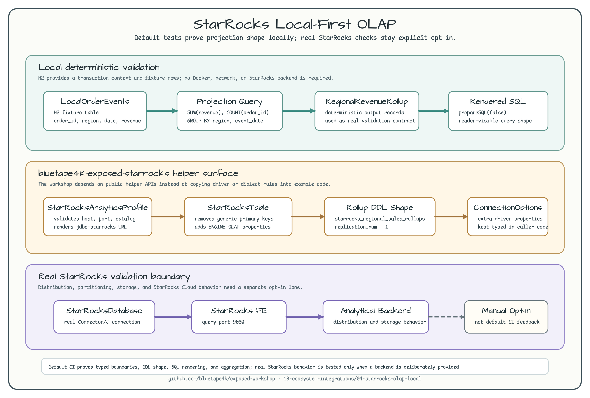

# StarRocks Local-First OLAP

English | [한국어](README.ko.md)

This example shows how to keep StarRocks-oriented OLAP projection code testable
without starting a StarRocks cluster by default. It uses the
`bluetape4k-exposed-starrocks` helper surface for the StarRocks JDBC boundary and
table DDL shape, while local tests verify SQL generation and aggregation with H2.



The diagram separates three concerns:

- local deterministic projection tests that run in CI without StarRocks.
- StarRocks helper APIs that own JDBC options and OLAP table DDL shape.
- real StarRocks validation that remains explicit opt-in.

## Purpose

OLAP connectors often need a real analytical backend before performance,
distribution, and storage behavior can be trusted. That does not mean every
workshop test must start that backend. This module keeps the default feedback
loop local and deterministic:

- `StarRocksAnalyticsProfile` validates the Connector/J boundary before opening
  any network connection.
- `StarRocksRegionalSalesRollups` extends `StarRocksTable` so generated DDL keeps
  the StarRocks `ENGINE=OLAP` and replication options visible.
- `LocalOrderEvents` uses H2 only as a local fixture store for projection and SQL
  rendering.
- `projectDailyRegionalRevenue` proves the aggregation shape before a real
  StarRocks smoke test is enabled elsewhere.

## Local Validation Boundary

Run the default tests:

```bash
./gradlew :04-starrocks-olap-local:test
```

Expected result: the command does not start Docker or contact StarRocks. It
validates typed connection options, renders the StarRocks rollup DDL, generates
the regional aggregation SQL, and executes the aggregation against an H2 fixture.

## Real StarRocks Boundary

Use the rendered profile URL when a real StarRocks validation lane is needed:

```kotlin
val profile = defaultStarRocksAnalyticsProfile()

val jdbcUrl = profile.jdbcUrl()
val options = profile.toConnectionOptions()
```

The default URL is:

```text
jdbc:starrocks://localhost:9030/default_catalog.analytics
```

Create the StarRocks database first, then run a separate opt-in validation that
connects through `StarRocksDatabase`. The local workshop intentionally does not
hide this requirement behind the default CI path.

## Projection Example

```kotlin
val db = createLocalProjectionDatabase()

seedLocalOrderEvents(
    db = db,
    events = listOf(
        OrderEvent(1001L, "apac", "2026-06-29", BigDecimal("42.50")),
        OrderEvent(1002L, "apac", "2026-06-29", BigDecimal("17.25")),
    ),
)

val rollups = projectDailyRegionalRevenue(db)
```

The same projection query can be rendered without executing it:

```kotlin
val sql = generateDailyRegionalRevenueSql()
```

Use that SQL as the contract to compare against a real StarRocks validation
query later.

## Tested Behavior

The tests verify that:

- connection profile validation catches blank host, catalog, database, user, and
  out-of-range ports before network access.
- StarRocks rollup DDL includes `ENGINE=OLAP` and `replication_num = 1`.
- generated SQL keeps projection, `SUM`, `COUNT`, `GROUP BY`, and `ORDER BY`
  visible.
- local fixture data aggregates into deterministic regional revenue rollups.

## Out of Scope

This module does not verify StarRocks distribution keys, partitioning, stream
load, external catalogs, storage engine performance, or StarRocks Cloud behavior.
Those require a real StarRocks lane and should remain explicit opt-in.
