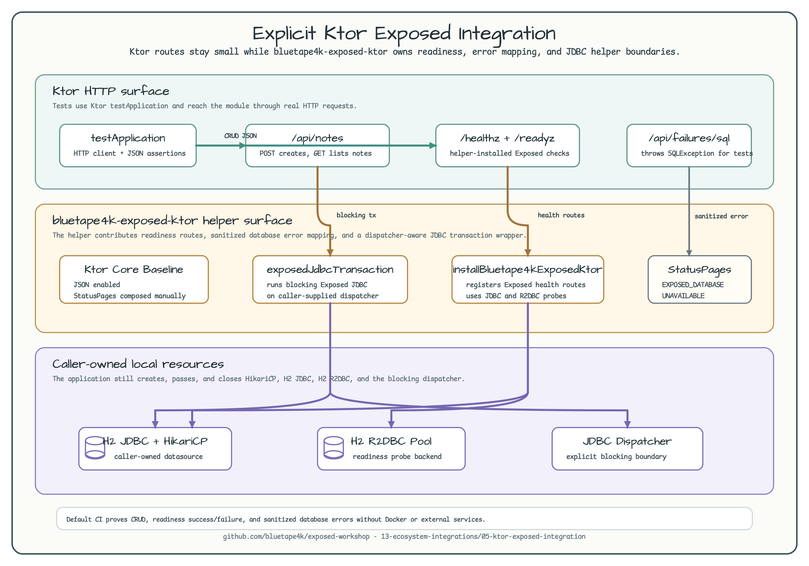

# Explicit Ktor Exposed Integration

[English](README.md) | 한국어

이 예제는 Ktor 애플리케이션이 모든 Exposed transaction과 readiness 경계를 직접 소유하는
대신, `bluetape4k-exposed-ktor`의 명시적 통합 helper를 사용하는 방법을 보여줍니다.
12장의 기존 Ktor 예제는 여전히 production service 구조를 설명하는 위치로 두고, 이
모듈은 Exposed 1.11 계열에서 추가된 helper surface에 집중합니다.



다이어그램은 세 가지 관심사를 분리합니다.

- HTTP로 애플리케이션을 검증하는 Ktor route와 test.
- exposed health route, database failure mapping, caller-supplied dispatcher 위의
  blocking JDBC 실행을 담당하는 `bluetape4k-exposed-ktor` helper.
- 애플리케이션이 명시적으로 소유하는 local-first JDBC/R2DBC 리소스.

## 목적

Ktor 애플리케이션에는 반복되는 데이터베이스 통합 규칙이 있습니다.

- JDBC transaction을 위한 blocking dispatcher.
- JDBC와 R2DBC 리소스가 모두 사용 가능한지 확인하는 readiness check.
- SQL, JDBC URL, credential을 노출하지 않는 database error response.
- connection pool과 lifecycle cleanup에 대한 명시적 애플리케이션 소유권.

이 모듈은 그런 규칙을 숨기지 않으면서 반복적인 Ktor glue는
`bluetape4k-exposed-ktor`에 위임합니다.

## Helper 기반 Ktor 설정

애플리케이션은 기본 Ktor JSON 지원을 설치하고, `StatusPages`를 합성한 뒤,
Exposed 전용 Ktor helper를 설치합니다.

```kotlin
installBluetape4kKtorCore(
    Bluetape4kKtorCoreConfig(
        installStatusPages = false,
        installHealthRoutes = false,
    )
)
install(StatusPages) {
    bluetape4kErrorResponses()
    bluetape4kExposedErrors()
}
installBluetape4kExposedKtor(
    Bluetape4kExposedKtorConfig(
        jdbcDatabase = resources.jdbcDatabase,
        jdbcBlockingDispatcher = resources.jdbcDispatcher,
        r2dbcDatabase = resources.r2dbcDatabase,
        installHealthRoutes = true,
    )
)
```

HikariCP, H2 JDBC, R2DBC pool, dispatcher 리소스는 여전히 caller가 만들고 소유합니다.
helper가 lifecycle ownership을 숨기지는 않습니다.

## CRUD Route

note route는 `call.exposedJdbcTransaction`을 통해 JDBC 작업을 실행합니다.

```kotlin
val note = call.exposedJdbcTransaction(
    db = resources.jdbcDatabase,
    blockingDispatcher = resources.jdbcDispatcher,
) {
    val id = WorkshopNotes.insertAndGetId {
        it[title] = request.title.trim()
        it[body] = request.body.trim()
    }
    WorkshopNotes.selectAll()
        .where { WorkshopNotes.id eq id }
        .single()
        .toNoteResponse()
}
```

route 코드는 짧게 유지하면서도 중요한 경계는 남깁니다. blocking JDBC 작업은
애플리케이션이 선택한 dispatcher 위에서 실행됩니다.

## Health And Error Mapping

helper는 다음 route를 제공합니다.

| Route | Behavior |
|---|---|
| `/healthz/exposed` | Static Exposed liveness response. |
| `/readyz/exposed` | Configured JDBC/R2DBC resource를 `SELECT 1`로 probe합니다. |

테스트는 `SQLException`을 던지는 `/api/failures/sql`도 호출합니다. 합성된
`StatusPages` block은 이를 `EXPOSED_DATABASE_UNAVAILABLE`로 매핑하되 raw SQL, JDBC
URL, password를 응답에 포함하지 않습니다.

## 실행

```bash
./gradlew :05-ktor-exposed-integration:test
```

예상 결과: 테스트는 Ktor `testApplication`, in-memory H2 JDBC, in-memory H2 R2DBC를
사용합니다. Docker를 시작하지 않고 외부 서비스에도 접속하지 않습니다.

## 검증 동작

테스트는 다음을 검증합니다.

- `POST /api/notes`와 `GET /api/notes`가 helper-backed JDBC transaction을 사용합니다.
- `/healthz/exposed`가 helper liveness response를 반환합니다.
- `/readyz/exposed`가 JDBC와 R2DBC 리소스가 모두 사용 가능할 때 readiness를 반환합니다.
- caller-owned JDBC datasource가 닫히면 `/readyz/exposed`가 `503 Service Unavailable`을
  반환합니다.
- exposed database error가 structured response로 변환되고 민감한 정보를 노출하지 않습니다.

## Chapter 12와의 관계

12장의 Ktor 모듈은 layered routing, domain service, repository, outbox flow, auth
session, observability 같은 production-service pattern을 학습하는 위치로 유지합니다.
이 모듈은 의도적으로 작게 유지합니다. 새 Ktor Exposed helper를 격리해서, 학습자가
hand-owned Ktor database wiring 대신 helper를 사용할 시점을 판단할 수 있게 합니다.
