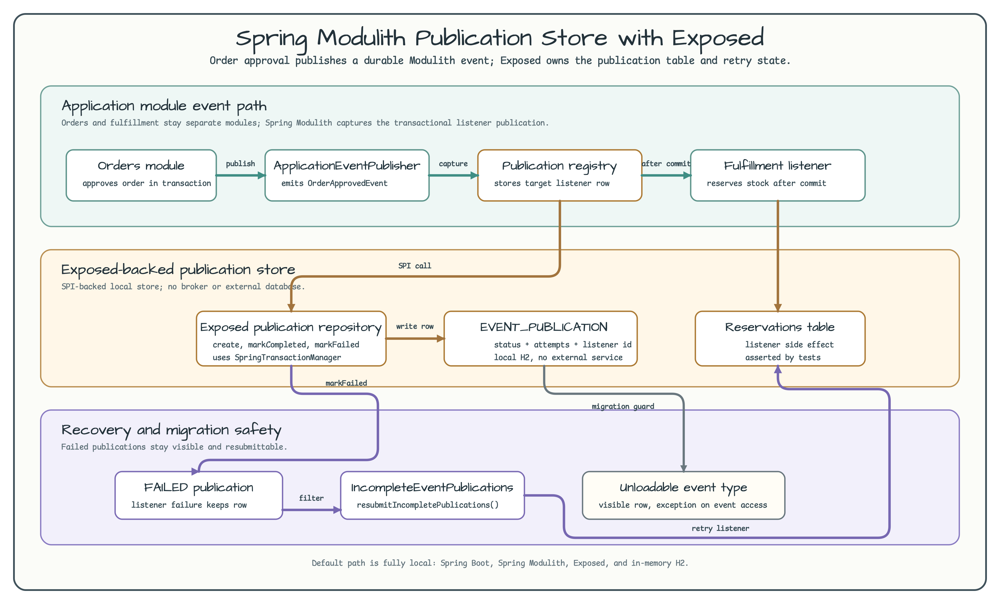

# Spring Modulith Publication Store with Exposed

[English](README.md) | 한국어

이 예제는 Spring Modulith 애플리케이션이 공식 JDBC store 대신
`bluetape4k-exposed-spring-modulith`로 event publication을 저장하는 방법을
보여줍니다. 기본 경로는 완전히 로컬입니다. Spring Boot는 in-memory H2를 사용하고,
Exposed가 워크숍 테이블을 만들며, 테스트는 Docker나 외부 서비스 없이 publication
lifecycle을 검증합니다.



그림은 정상 애플리케이션 이벤트 흐름과 publication store, 복구 흐름을 분리합니다.

- orders 모듈은 Spring transaction 안에서 `OrderApprovedEvent`를 발행합니다.
- Spring Modulith는 `@ApplicationModuleListener`에 대한 publication row를 저장합니다.
- `ExposedEventPublicationRepository`는 status, listener id, attempts, serialized
  event를 `EVENT_PUBLICATION`에 기록합니다.
- fulfillment listener가 stock reservation을 끝내면 publication이 completed로
  바뀝니다.
- 실패한 row는 조회 가능한 상태로 남고 `IncompleteEventPublications`로 다시 전송할 수
  있습니다.

## 목적

Spring Modulith publications는 같은 Spring Boot 애플리케이션 안의 모듈 간 이벤트를
위한 로컬 내구성 계층입니다. 한 모듈이 이벤트를 발행하고 다른 모듈이 원래 transaction
commit 이후 비동기로 처리할 때 유용합니다. publication table은 어떤 listener가 아직
이 이벤트를 처리해야 하는지 기록합니다.

모든 outbox 패턴을 대체하는 것은 아닙니다.

| Spring Modulith publications가 맞는 경우 | outbox가 맞는 경우 |
|---|---|
| consumer가 같은 Spring Boot 애플리케이션 안의 다른 모듈입니다. | 다른 프로세스, 서비스, broker, 다른 언어 runtime이 이벤트를 소비해야 합니다. |
| listener retry가 같은 애플리케이션 배포 단위 안에서 가능하면 충분합니다. | Kafka, RabbitMQ, SNS/SQS 같은 외부 채널로 전달해야 합니다. |
| 주된 위험이 commit 이후 로컬 async listener 작업 유실입니다. | 주된 위험이 서비스 간 전달, backpressure, integration replay입니다. |

## 애플리케이션 흐름

orders 모듈은 로컬 주문을 저장하고 같은 transaction 안에서 serializable event를
발행합니다.

```kotlin
val id = WorkshopOrders.insertAndGetId { row ->
    row[orderKey] = command.orderKey
    row[customerId] = command.customerId
    row[status] = "APPROVED"
    row[WorkshopOrders.approvedAt] = approvedAt
}
val summary = WorkshopOrders
    .selectAll()
    .where { WorkshopOrders.id eq id }
    .single()
    .toOrderSummary()

events.publishEvent(
    OrderApprovedEvent(
        orderKey = summary.orderKey,
        customerId = summary.customerId,
        approvedAt = summary.approvedAt ?: approvedAt,
    )
)
```

fulfillment 모듈은 Spring Modulith listener로 이벤트를 받습니다.

```kotlin
@ApplicationModuleListener(id = "fulfillment.reserve-stock")
fun reserveStock(event: OrderApprovedEvent) {
    FulfillmentReservations.insert { row ->
        row[orderKey] = event.orderKey
        row[customerId] = event.customerId
        row[reservedAt] = Instant.now()
    }
}
```

`@ApplicationModuleListener`는 transaction을 가진 비동기 listener입니다. Spring
Modulith는 listener 실행 전에 publication을 먼저 기록하고, listener가 성공적으로
끝난 뒤에만 row를 completed로 표시합니다.

## Exposed Publication Store

이 모듈은 다음 로컬 설정으로 bluetape4k의 Exposed-backed repository를 활성화합니다.

```yaml
bluetape4k:
  spring:
    modulith:
      exposed:
        initialize-schema: true
        completion-mode: UPDATE
```

이 repository는 Spring Modulith의 `EventPublicationRepository` SPI를 구현하고,
애플리케이션의 `springTransactionManager`를 사용합니다. 테이블 구조는 Spring Modulith
JDBC schema v2를 따르므로 listener id, event type, serialized payload, status,
completion attempts, publication date, completion date를 저장합니다.

## 복구 흐름

테스트는 운영에서 중요한 세 가지 경우를 다룹니다.

- listener가 성공하면 fulfillment reservation을 저장하고 incomplete publication을
  남기지 않습니다.
- 의도적으로 listener를 실패시키면 `FAILED` publication row가 남습니다.
  `IncompleteEventPublications.resubmitIncompletePublications(...)`를 호출하면
  이벤트를 다시 전송하고 row가 completed로 바뀝니다.
- event class가 사라진 legacy row는 조회 가능한 상태로 남지만,
  `publication.event`를 읽는 순간 `UnloadableEventPublicationException`이 발생합니다.

## 실행

```bash
./gradlew :06-spring-modulith-publications:test
```

예상 결과: 테스트는 in-memory H2에서 Spring Modulith event를 발행하고, Exposed
repository를 통해 completion과 retry 상태를 검증합니다. 외부 서비스에는 연결하지
않습니다.

## 검증하는 동작

테스트는 다음을 확인합니다.

- Spring Modulith가 fulfillment listener에 대한 durable publication을 만듭니다.
- listener가 성공하면 publication row가 completed로 바뀝니다.
- listener가 실패하면 조회 가능한 failed publication이 남습니다.
- resubmission이 failed publication을 다시 실행하고 completion attempts를 증가시킵니다.
- unloadable event class는 저장된 이벤트를 materialize할 때 명시적인 운영 오류로
  드러납니다.
