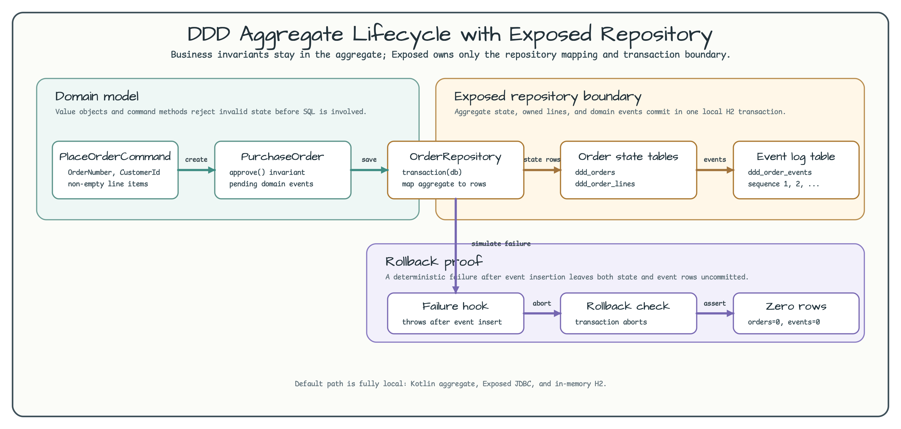

# DDD Aggregate Lifecycle with Exposed Repository

English | [한국어](README.ko.md)

This example keeps the domain model away from Exposed table classes. A
`PurchaseOrder` aggregate owns invariants, command methods, and pending domain
events, while `OrderRepository` maps the aggregate to local H2 tables inside one
Exposed transaction.

The domain uses Bluetape4k Exposed core's `AbstractAggregateRoot<Long>` and
`DomainEvent<Long>`. `Snowflakers.Global.nextId()` assigns a typed Snowflake ID
when the aggregate is placed, and each event carries that aggregate ID plus an
`Instant` timestamp.



The diagram shows the important boundary:

- command objects build a `PurchaseOrder` aggregate.
- the aggregate records `OrderPlaced` and `OrderApproved` events before any SQL
  code is involved.
- the repository persists order state, order lines, and domain event rows in the
  same Exposed transaction.
- rollback tests fail after event insertion and prove that order rows and event
  rows are both uncommitted.

## Why this differs from DAO-first examples

DAO/entity-first examples are useful when the database shape is the main
learning target. A DDD aggregate example starts from business rules instead:

| DAO or table-first code | Aggregate-first code |
|---|---|
| exposes setters around database columns. | exposes command methods such as `approve`. |
| often validates near insert/update calls. | validates in value objects and aggregate methods. |
| treats database rows as the domain model. | maps aggregate state to rows at the repository boundary. |
| usually has no explicit domain event list. | records pending events before persistence. |

## Domain Model

The aggregate is intentionally small:

```kotlin
val order = PurchaseOrder.place(
    PlaceOrderCommand(
        orderNumber = OrderNumber("ORD-1000"),
        customerId = CustomerId("customer-1"),
        lines = listOf(
            OrderLine(Sku("book"), quantity = 2, Money.dollars("15.00")),
            OrderLine(Sku("course"), quantity = 1, Money.dollars("35.00")),
        ),
    )
)

order.approve(OperatorId("ops-1"))
```

Value objects reject blank identifiers. `OrderLine` rejects non-positive
quantities. The aggregate rejects approval when the order is no longer in the
`PLACED` state.

## Repository Boundary

`OrderRepository.save(...)` owns the Exposed transaction. The aggregate already
has its Snowflake ID, so persistence does not invent a second identity:

```kotlin
val savedId = transaction(db) {
    val orderId = aggregate.id
    insertOrderIfAbsent(aggregate)
    replaceOrderLines(orderId, aggregate.lines)
    updateOrder(orderId, aggregate)
    appendDomainEvents(orderId, aggregate.pendingEvents)
    orderId
}

aggregate.markEventsCommitted()
```

The domain event list is cleared only after the transaction succeeds. If a
failure happens after event insertion, H2 rolls back all order, line, and event
rows, and the aggregate still exposes the pending event for retry or inspection.
The event's `occurredAt: Instant` is persisted as epoch milliseconds, while the
aggregate ID is kept as the `Long` primary key generated by
`snowflakeGenerated()`.

## Tables

The example uses three local tables:

| Table | Purpose |
|---|---|
| `ddd_orders` | aggregate identity, customer id, status, version, and total. |
| `ddd_order_lines` | line items owned by the aggregate. |
| `ddd_order_events` | ordered domain event records captured with the same transaction. |

## Run

```bash
./gradlew :07-ddd-aggregate-repository:test
```

Expected result: tests run against in-memory H2 and do not contact external
services.

## Tested Behavior

The test suite verifies that:

- invalid aggregate commands fail before Exposed tables are involved.
- saving a new aggregate persists state and captures the `OrderPlaced` event.
- loading the aggregate, approving it, and saving again appends
  `OrderApproved` after `OrderPlaced`.
- a simulated repository failure rolls back both aggregate rows and event rows.
- approving the same aggregate twice fails through the aggregate invariant.
