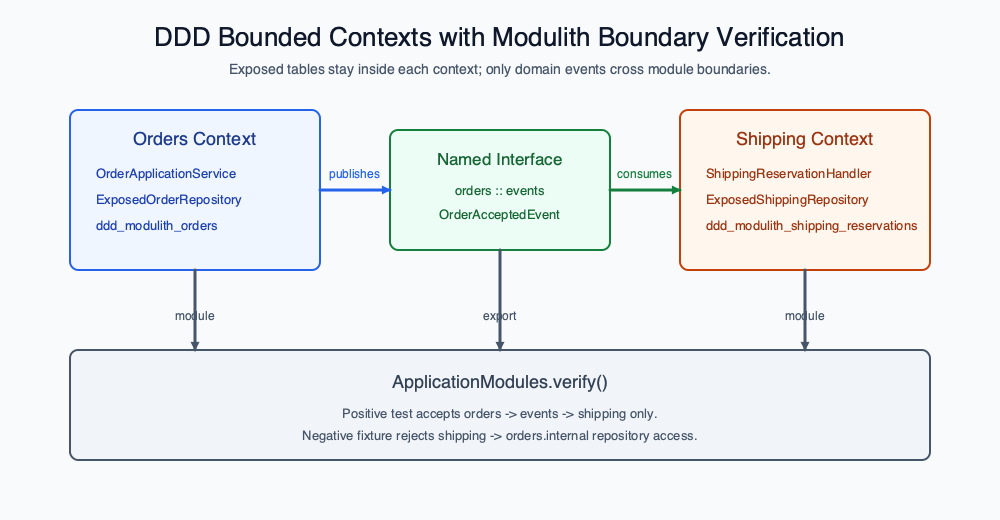

# DDD Bounded Context and Modulith Boundary Verification

English | [한국어](README.ko.md)

This example combines a small DDD flow with Spring Modulith boundary
verification. The order context owns order persistence, exports only an
`OrderAcceptedEvent` named interface, and the shipping context reacts to that
event without importing order repositories or tables.



## What the Example Proves

- `orders` and `shipping` are separate Spring Modulith modules.
- Each context owns its Exposed table and repository in an `internal` package.
- `orders.events` is the only named interface exported by the order context.
- `shipping` declares `allowedDependencies = ["orders :: events"]`.
- `ApplicationModules.verify()` passes for the valid application.
- A negative fixture that imports `orders.internal.LeakyOrderRepository` from
  `shipping` fails with Spring Modulith `Violations`.

## Boundary Shape

The production packages intentionally mirror the architecture:

| Package | Role |
|---|---|
| `orders` | order application service and module metadata. |
| `orders.events` | exported named interface containing `OrderAcceptedEvent`. |
| `orders.internal` | Exposed order table and repository. |
| `shipping` | event listener, read model, and module metadata. |
| `shipping.internal` | Exposed shipping table and repository. |

The root package contains only the Spring Boot entrypoint and shared transaction
manager configuration. Schema initialization lives inside each bounded context
so the root package does not depend on module internals.

## Event Handoff

The order context accepts a command and publishes a domain event after its own
Exposed repository persists the order.

```kotlin
val order = orderService.accept(
    AcceptOrderCommand(orderKey = "order-ddd-001", customerId = "customer-42")
)
```

The shipping context listens to `OrderAcceptedEvent` and writes a reservation
after the order transaction commits. It then writes through its own Exposed
repository and transaction boundary. The handler never imports order tables or
repositories.

## Negative Fixture

The test fixture under `src/test/kotlin/.../invalid` repeats the same module
metadata but adds this forbidden dependency:

```kotlin
import exposed.examples.spring.modulith.boundaries.invalid.orders.internal.LeakyOrderRepository
```

The verifier test includes test classes with ArchUnit's
`ImportOption.Predefined.DO_NOT_INCLUDE_JARS`, then asserts that Spring Modulith
reports the illegal dependency on `orders.internal`.

## Run

```bash
./gradlew :08-ddd-modulith-boundaries:test
```

Expected result: the valid application passes boundary verification and the
negative fixture fails verification inside the test assertion. The module uses
local H2 only and does not contact external services.

## Tested Behavior

The test suite verifies that:

- valid modules pass `ApplicationModules.verify()`.
- a direct dependency from `shipping` to `orders.internal` is rejected.
- accepting an order persists `ddd_modulith_orders`.
- the published domain event creates a row in
  `ddd_modulith_shipping_reservations`.
