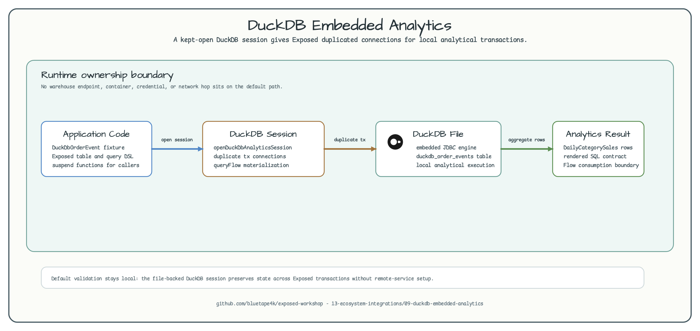
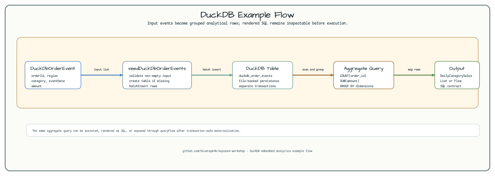
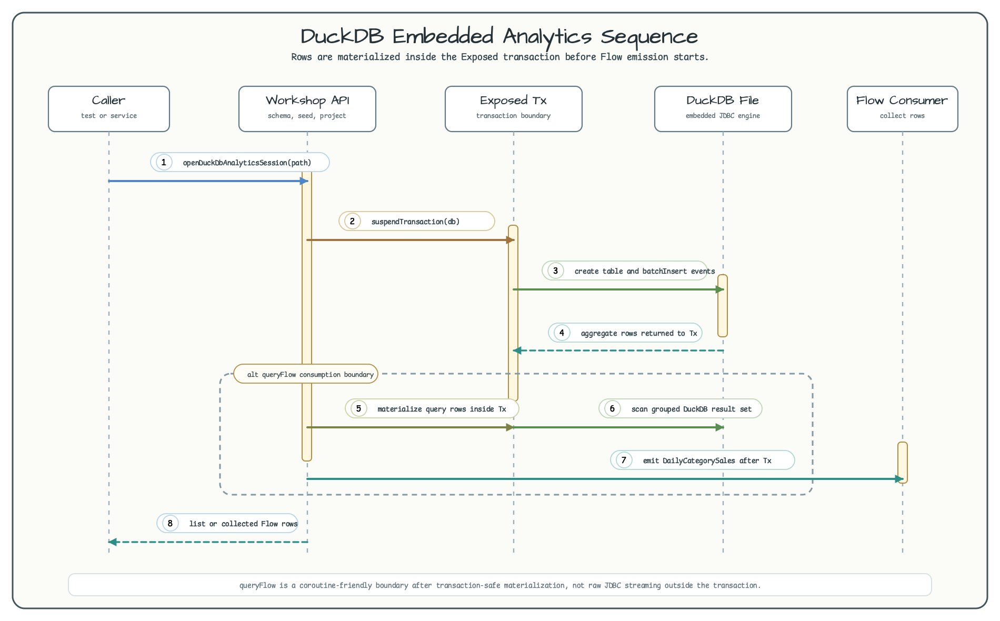

# DuckDB Embedded Analytics with Exposed

English | [한국어](README.ko.md)

This example shows how to run a small analytical workload inside the application
process with DuckDB and Exposed. Unlike the BigQuery, Trino, or StarRocks
examples, DuckDB is not a remote warehouse boundary here. The workshop opens a
file-backed DuckDB database, stores local event rows, runs an aggregate query,
and exposes the result as either a materialized list or a coroutine `Flow`.



The architecture diagram separates three responsibilities:

- application code owns the event fixture and Exposed DSL.
- the workshop session keeps the DuckDB root connection open and gives Exposed
  duplicated transaction connections.
- DuckDB executes analytical SQL in a local file without a server process.

## Purpose

DuckDB is useful when the application needs a local analytical engine for
development, CI, data preparation, or small offline jobs. It is not a replacement
for every warehouse, but it removes the network and credential boundary from
this particular class of example.

This module demonstrates:

- file-backed DuckDB setup with `openDuckDbAnalyticsSession(path)`.
- schema creation and batch inserts through Exposed.
- an aggregate query using `COUNT`, `SUM`, `GROUP BY`, and `ORDER BY`.
- `suspendTransaction` for blocking DuckDB JDBC work in coroutine code.
- `queryFlow` as an application pipeline boundary after transaction-safe
  materialization.

## Example Flow



The flow starts with deterministic `DuckDbOrderEvent` rows, persists them into a
file-backed DuckDB table, and projects `DailyCategorySales` rows. The same query
can also be rendered as SQL for inspection.

```kotlin
openDuckDbAnalyticsSession(Path.of("/tmp/orders.duckdb")).use { session ->
    val db = session.db

    seedDuckDbOrderEvents(
        db = db,
        events = listOf(
            DuckDbOrderEvent(1001L, "apac", "book", "2026-06-29", BigDecimal("42.50")),
            DuckDbOrderEvent(1002L, "apac", "book", "2026-06-29", BigDecimal("10.00")),
        ),
    )

    val rows = projectDailyCategorySales(db)
    val sql = generateDailyCategorySalesSql(db)
}
```

## Sequence



The sequence diagram highlights the part that usually causes confusion:
`queryFlow` returns a `Flow`, but DuckDB JDBC rows are materialized inside the
transaction first. The Flow is a coroutine-friendly consumption boundary, not a
claim of row-by-row streaming outside the JDBC transaction.

## File-Backed Mode

The example deliberately uses a file-backed database:

```kotlin
openDuckDbAnalyticsSession(Path.of("/tmp/orders.duckdb")).use { session ->
    val db = session.db
    // use db across separate Exposed transactions
}
```

`DuckDBDatabase.inMemory()` creates an independent in-memory database for each
JDBC connection. That is fine for one transaction, but it is the wrong default
when the example needs rows to survive across Exposed transactions. A file-backed
DuckDB database plus a kept-open root connection keeps the workshop behavior
predictable. Exposed receives duplicated transaction connections, and the
session closes the root connection at the end of the example.

## Local Validation Boundary

Run the module test:

```bash
./gradlew :09-duckdb-embedded-analytics:test
```

The command does not start Docker, does not use credentials, and does not connect
to a remote service. It verifies schema creation, file-backed persistence,
aggregate results, rendered SQL shape, validation failures, and the `queryFlow`
consumption boundary.

## Tested Behavior

The tests verify that:

- file-backed DuckDB rows remain visible across separate Exposed transactions.
- `DailyCategorySales` aggregation is deterministic.
- `streamDailyCategorySales` emits the materialized aggregate rows through
  `Flow`.
- rendered SQL keeps `COUNT`, `SUM`, `GROUP BY`, and `ORDER BY` visible.
- blank event fields and empty fixture input fail before the DuckDB insert
  boundary.

## Out of Scope

This module does not cover Parquet/CSV scans, Arrow integration, extension
loading, vectorized execution tuning, multi-process file locking, or large
result pagination. Those are useful DuckDB topics, but this example stays
focused on the Exposed + embedded analytics boundary.
