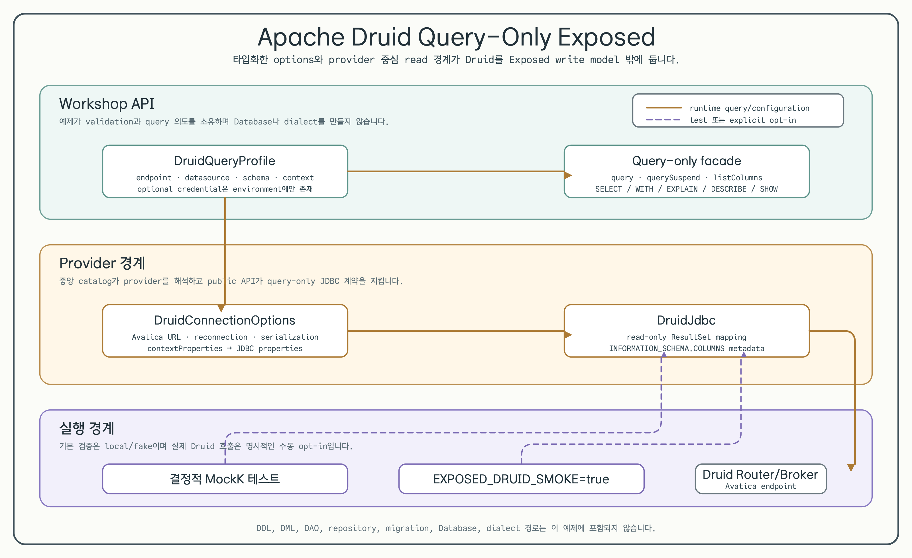

# Apache Druid Query-Only Exposed

[English](README.md) | 한국어



이 예제는 `bluetape4k-exposed:1.12.1`이 제공하는 query-only JDBC surface
뒤에 Apache Druid를 둡니다. 타입화한 `DruidQueryProfile`이
`DruidConnectionOptions`를 만들고, workshop은 동기 query, suspend query,
column metadata 조회를 `DruidJdbc`에 위임합니다.

## 목적

일반적인 Exposed DDL/DML/DAO 흐름을 Druid가 지원한다고 가정하지 않고,
Avatica Router 또는 Broker 연결을 사용하는 분석 read model을 참고할 때
사용합니다. 기본 테스트는 MockK를 사용하며 Druid connection을 열지
않습니다.

## Profile과 provider options

의존성은 중앙 `bluetape4k-dependencies:1.4.0` catalog alias
`libs.exposed.druid`로 해석됩니다.

```kotlin
val profile = DruidQueryProfile(
    avaticaEndpoint = "http://localhost:8888/druid/v2/sql/avatica/",
    datasource = "wikipedia",
    schema = "druid",
    contextProperties = mapOf("sqlTimeZone" to "Etc/UTC"),
)

val options: DruidConnectionOptions = profile.toConnectionOptions()
```

`DruidConnectionOptions`는 HTTP(S) Avatica endpoint를 검증하고 transparent
reconnection, JSON/Protocol Buffers serialization, optional authentication,
Druid context property를 전달합니다. credential은 optional이며 이 저장소에
저장하지 않습니다.

## Query 예제

workshop은 provider 동작이 보이는 세 가지 작은 함수를 제공합니다.

```kotlin
val rows: List<Long> = queryDatasourceRowCount(profile)
val suspendedRows: List<Long> = queryDatasourceRowCountSuspend(profile)
val columns: List<DruidColumnMetadata> = listDatasourceColumns(profile)
```

`queryDatasourceRowCount`는 `DruidJdbc.query`를 사용합니다. suspend 버전은
`DruidJdbc.querySuspend`를 사용하고 기본 dispatcher는 `Dispatchers.IO`입니다.
호출자는 테스트 또는 애플리케이션 경계에서 dispatcher를 전달할 수 있습니다.
`listDatasourceColumns`는 provider의 parameterized
`INFORMATION_SCHEMA.COLUMNS` query를 사용하며 profile의 datasource와 schema를
그대로 전달합니다.

## Query-only 계약

provider는 `SELECT`, `WITH`, `EXPLAIN`, `DESCRIBE`, `SHOW`로 시작하는 SQL을
허용합니다. metadata 조회는 `DruidJdbc.listColumns`로 노출합니다. sample count
query는 quoted SQL identifier로 interpolation하기 전에 datasource를 단순
identifier인지 검증합니다.

다음 범위는 의도적으로 제외합니다.

- `CREATE`, `INSERT`, `UPDATE`, `DELETE`를 포함한 DDL·DML statement.
- Exposed `Database`, dialect, table DSL, DAO, repository, migration, batch
  abstraction.
- 저장소에 기록하는 Druid endpoint, token, password, service account, test data.

이 경계는 provider 계약이며 임의의 SQL text가 안전하다는 보장은 아닙니다.
사용자 입력을 SQL에 넣지 말고 parameterized 가능한 값은 provider metadata
API를 사용합니다.

## 결정적 테스트

Druid server나 credential 없이 module test를 실행합니다.

```bash
./gradlew :10-druid-query-only:test
```

테스트는 MockK로 `DruidJdbc` 호출을 capture하여 URL/property mapping, sync와
suspend 결과 경로, metadata 인자를 검증하고, network connection을 시도하기
전에 blank 또는 non-query 입력이 실패하는지 확인합니다.

## 명시적인 real-service smoke test

smoke test는 `EXPOSED_DRUID_SMOKE=true`일 때만 활성화됩니다. endpoint와
datasource를 명시하고 optional credential은 process environment에서만
전달합니다.

```bash
EXPOSED_DRUID_SMOKE=true \
EXPOSED_DRUID_AVATICA_ENDPOINT='https://<router>/druid/v2/sql/avatica/' \
EXPOSED_DRUID_DATASOURCE='<datasource>' \
EXPOSED_DRUID_SCHEMA='druid' \
EXPOSED_DRUID_USER='<optional-user>' \
EXPOSED_DRUID_PASSWORD='<optional-password>' \
./gradlew :10-druid-query-only:test --tests '*DruidQueryOnlySmokeTest'
```

이 명령은 network와 service 비용이 발생할 수 있고 읽을 수 있는 metadata가
있는 datasource가 필요할 수 있습니다. 수동 opt-in 경로이며 기본 Examples
gate에는 포함하지 않습니다.

