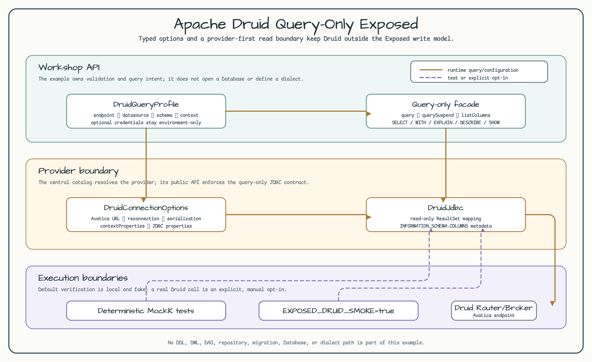

# Apache Druid Query-Only Exposed

English | [한국어](README.ko.md)



This example keeps Apache Druid behind the query-only JDBC surface provided by
`bluetape4k-exposed:1.12.1`. A typed `DruidQueryProfile` creates
`DruidConnectionOptions`, then the workshop delegates synchronous queries,
suspend queries, and column metadata reads to `DruidJdbc`.

## Purpose

Use this module when an analytical read model needs an Avatica connection to a
Druid Router or Broker without pretending that Druid supports the normal
Exposed DDL/DML/DAO workflow. The default tests use MockK and never open a
Druid connection.

## Profile and provider options

The dependency is resolved through the central `bluetape4k-dependencies:1.4.0`
catalog alias `libs.exposed.druid`.

```kotlin
val profile = DruidQueryProfile(
    avaticaEndpoint = "http://localhost:8888/druid/v2/sql/avatica/",
    datasource = "wikipedia",
    schema = "druid",
    contextProperties = mapOf("sqlTimeZone" to "Etc/UTC"),
)

val options: DruidConnectionOptions = profile.toConnectionOptions()
```

`DruidConnectionOptions` validates the HTTP(S) Avatica endpoint and carries
transparent reconnection, JSON/Protocol Buffers serialization, optional
authentication, and Druid context properties. Credentials are optional and
are never stored in this repository.

## Query examples

The workshop exposes three small functions that keep provider behavior visible:

```kotlin
val rows: List<Long> = queryDatasourceRowCount(profile)
val suspendedRows: List<Long> = queryDatasourceRowCountSuspend(profile)
val columns: List<DruidColumnMetadata> = listDatasourceColumns(profile)
```

`queryDatasourceRowCount` uses `DruidJdbc.query`. The suspend equivalent uses
`DruidJdbc.querySuspend` and defaults to `Dispatchers.IO`; a caller can supply a
dispatcher in tests or an application boundary. `listDatasourceColumns` uses
the provider's parameterized `INFORMATION_SCHEMA.COLUMNS` query and preserves
the datasource and schema values from the profile.

## Query-only contract

The provider accepts SQL beginning with `SELECT`, `WITH`, `EXPLAIN`,
`DESCRIBE`, or `SHOW`. Metadata reads are exposed through
`DruidJdbc.listColumns`. The sample count query validates the datasource as a
simple identifier before interpolating it into a quoted SQL identifier.

The following are intentionally out of scope:

- DDL and DML statements, including `CREATE`, `INSERT`, `UPDATE`, and `DELETE`.
- Exposed `Database`, dialect, table DSL, DAO, repository, migration, and batch
  abstractions.
- A checked-in Druid endpoint, token, password, service account, or test data.

This boundary is a provider contract, not a promise that arbitrary SQL text is
safe. Keep user input out of SQL and use provider metadata APIs for values that
can be parameterized.

## Deterministic tests

Run the module tests without a Druid server or credentials:

```bash
./gradlew :10-druid-query-only:test
```

The tests capture `DruidJdbc` calls with MockK, verify URL/property mapping,
cover sync and suspend result paths, check metadata arguments, and prove blank
or non-query inputs fail before a network connection is attempted.

## Explicit real-service smoke test

The smoke test is disabled unless `EXPOSED_DRUID_SMOKE=true`. Supply the
endpoint and datasource explicitly; optional credentials are read only from
the process environment:

```bash
EXPOSED_DRUID_SMOKE=true \
EXPOSED_DRUID_AVATICA_ENDPOINT='https://<router>/druid/v2/sql/avatica/' \
EXPOSED_DRUID_DATASOURCE='<datasource>' \
EXPOSED_DRUID_SCHEMA='druid' \
EXPOSED_DRUID_USER='<optional-user>' \
EXPOSED_DRUID_PASSWORD='<optional-password>' \
./gradlew :10-druid-query-only:test --tests '*DruidQueryOnlySmokeTest'
```

This command can incur network and service costs and may require a datasource
with readable metadata. It is a manual opt-in path and is not part of the
default Examples gate.

