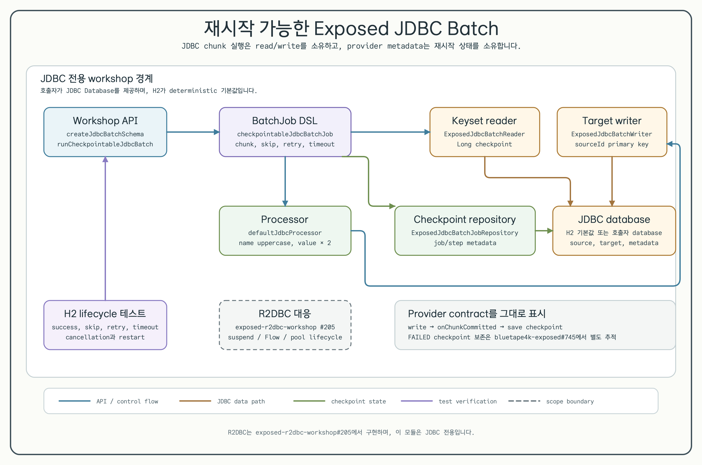
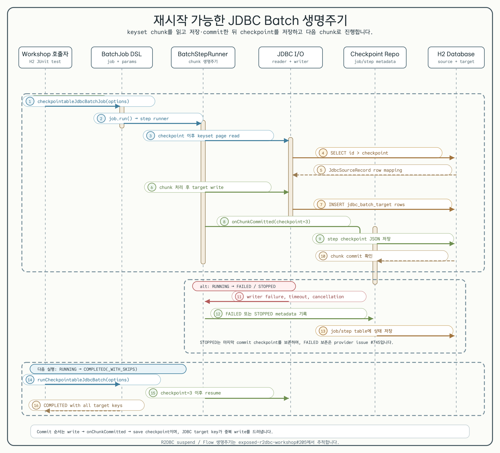

# 재시작 가능한 Exposed JDBC Batch

[English](README.md) | 한국어

이 workshop은 의도적으로 JDBC만 다룹니다. `bluetape4k-exposed-batch` provider와
Exposed JDBC를 조합해 keyset으로 chunk를 읽고, row를 변환·저장한 뒤 재시작 checkpoint를
기록합니다.



[Architecture SVG source](../../docs/images/readme-diagrams/13-checkpointable-jdbc-batch-architecture-01.ko.svg)

아키텍처는 public workshop API, provider `BatchJob` DSL, Exposed reader/writer,
checkpoint metadata repository, 호출자가 제공하는 JDBC database 책임을 분리합니다.
Deterministic H2 테스트는 Docker, credential, remote service 없이 같은 경계를 실행합니다.

## 목적

명시적인 chunk 경계와 재시작 가능한 keyset checkpoint가 필요한 blocking JDBC batch에 이
모듈을 사용합니다. 의존성은 중앙 catalog alias `libs.exposed.batch`로 해석하며,
`bluetape4k-dependencies:2.0.0-SNAPSHOT` BOM을 통해 현재
`io.github.bluetape4k.exposed:bluetape4k-exposed-batch:1.12.1`을 사용합니다.

이 예제는 다음을 보여줍니다.

- source-key primary key를 가진 `JdbcBatchSourceTable`과 `JdbcBatchTargetTable`.
- `Long` checkpoint를 사용하는 `ExposedJdbcBatchReader` keyset read.
- `defaultJdbcProcessor`와 `ExposedJdbcBatchWriter` 조합.
- `ExposedJdbcBatchJobRepository`를 통한 provider metadata table.
- skip, bounded retry, commit timeout, cancellation, restart 동작.

## Public API

```kotlin
val database = Database.connect(
    url = "jdbc:h2:mem:checkpointable-jdbc-workshop;DB_CLOSE_DELAY=-1;MODE=PostgreSQL",
    driver = "org.h2.Driver",
)

createJdbcBatchSchema(database)

val report = runCheckpointableJdbcBatch(
    database = database,
    options = JdbcBatchOptions(chunkSize = 3),
)
```

`jdbcBatchMetadataTables`는 provider job/step execution table과 source/target table을
함께 생성합니다. target primary key는 `sourceId`이므로 restart 중 중복 write를 드러내지만,
exactly-once를 보장하지는 않습니다.

## Chunk와 checkpoint 생명주기



[Lifecycle SVG source](../../docs/images/readme-diagrams/13-checkpointable-jdbc-batch-lifecycle-01.ko.svg)

provider는 각 chunk에 대해 다음 순서로 실행합니다.

1. 마지막으로 저장한 `Long` checkpoint 이후를 keyset predicate로 읽습니다.
2. row를 처리한 뒤 JDBC writer를 호출합니다.
3. chunk를 commit한 다음 마지막 commit key의 checkpoint를 저장합니다.

Cancellation은 provider가 `STOPPED`를 기록한 뒤 `CancellationException`으로 다시
전달됩니다. 같은 job name과 parameter로 다시 실행하면 저장된 checkpoint 이후부터
재개하며, H2 테스트가 이 동작을 검증합니다.

전체 성공은 `BatchStatus.COMPLETED`를 반환하고, processor 또는 writer item을
skip한 실행은 skip count와 함께 `BatchStatus.COMPLETED_WITH_SKIPS`를 반환합니다.

현재 provider에는 중요한 `FAILED` 경계가 있습니다. failed-step report에는 checkpoint가
포함되지 않으며, JDBC repository가 해당 report를 저장할 때 기존 checkpoint를 지울 수
있습니다. failure test는 이 provider 동작을 그대로 드러내며 workshop workaround를
추가하지 않습니다. 후속 수정은
[`bluetape4k-exposed#745`](https://github.com/bluetape4k/bluetape4k-exposed/issues/745)에서
추적합니다.

Skip policy, retry policy, commit timeout은 provider가 소유하는 제어입니다. timeout
예제는 H2에서 timeout된 chunk가 partial target row 없이 skip되는지 검증합니다.

## 검증

Deterministic JDBC 테스트를 실행합니다.

```bash
USE_FAST_DB=true ./gradlew :11-checkpointable-batch:test --no-daemon
```

모듈을 빌드하고 coverage report를 갱신합니다.

```bash
./gradlew :11-checkpointable-batch:build --no-daemon
./gradlew :11-checkpointable-batch:koverXmlReport --no-daemon
```

기본 경로는 H2를 사용하며 Docker를 시작하거나 credential을 사용하거나 remote database에
접속하지 않습니다. 호출자는 같은 API에 다른 JDBC `Database`(예: PostgreSQL connection)를
넘길 수 있지만, 이 workshop은 remote-service smoke test를 구성하지 않습니다.

## 범위 경계

R2DBC는 이 모듈에서 의도적으로 제외합니다. `suspendTransaction`, `Flow`, connection-pool
lifecycle 예제는
[`exposed-r2dbc-workshop#205`](https://github.com/bluetape4k/exposed-r2dbc-workshop/issues/205)에서
구현합니다. JDBC 구현은
[`exposed-workshop#236`](https://github.com/bluetape4k/exposed-workshop/issues/236)에서
추적합니다.

Exactly-once delivery, provider checkpoint repair, distributed scheduling,
large-result pagination, R2DBC API는 이 예제의 범위가 아닙니다.
