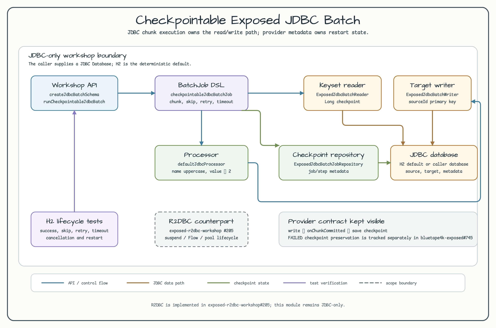
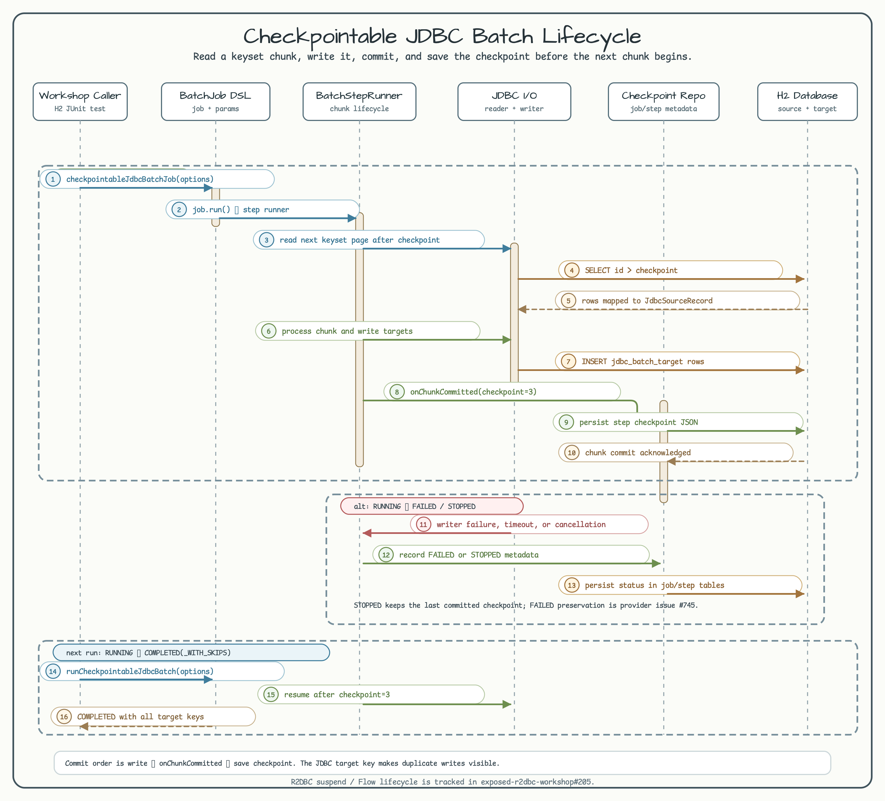

# Checkpointable Exposed JDBC Batch

English | [한국어](README.ko.md)

This workshop is intentionally JDBC-only. It composes the
`bluetape4k-exposed-batch` provider with Exposed JDBC so a chunked job can read
by keyset, transform rows, write them, and persist a restart checkpoint.



[Architecture SVG source](../../docs/images/readme-diagrams/13-checkpointable-jdbc-batch-architecture-01.svg)

The architecture keeps the public workshop API, provider `BatchJob` DSL,
Exposed reader/writer, checkpoint metadata repository, and caller-supplied JDBC
database as separate responsibilities. Deterministic H2 tests exercise the
same boundaries without Docker, credentials, or a remote service.

## Purpose

Use this module when a blocking JDBC batch needs explicit chunk boundaries and a
restartable keyset checkpoint. The dependency is resolved through the central
catalog alias `libs.exposed.batch` and currently uses
`io.github.bluetape4k.exposed:bluetape4k-exposed-batch:1.12.1` through the
`bluetape4k-dependencies:1.4.0` BOM.

The example demonstrates:

- `JdbcBatchSourceTable` and `JdbcBatchTargetTable` with a source-key primary key.
- `ExposedJdbcBatchReader` keyset reads with a `Long` checkpoint.
- `defaultJdbcProcessor` and `ExposedJdbcBatchWriter` composition.
- provider metadata tables through `ExposedJdbcBatchJobRepository`.
- skip, bounded retry, commit timeout, cancellation, and restart behavior.

## Public API

```kotlin
val database = Database.connect(
    url = "jdbc:h2:mem:checkpointable-jdbc-workshop;DB_CLOSE_DELAY=-1;MODE=PostgreSQL",
    driver = "org.h2.Driver",
)

createJdbcBatchSchema(database)

val report = runCheckpointableJdbcBatch(
    database = database,
    options = JdbcBatchOptions(chunkSize = 3),
)
```

`jdbcBatchMetadataTables` creates the provider's job/step execution tables plus
the source and target tables. The target primary key is `sourceId`, which makes
duplicate writes visible during a restart; it is not an exactly-once guarantee.

## Chunk and checkpoint lifecycle



[Lifecycle SVG source](../../docs/images/readme-diagrams/13-checkpointable-jdbc-batch-lifecycle-01.svg)

For each chunk the provider performs the following order:

1. Read rows with the keyset predicate after the last saved `Long` checkpoint.
2. Process the rows and call the JDBC writer.
3. Commit the chunk, then persist the checkpoint for the last committed key.

Cancellation is rethrown as `CancellationException` after the provider records
`STOPPED`. A subsequent run with the same job name and parameters resumes after
the saved checkpoint, as covered by the H2 test.

The provider currently has an important `FAILED` boundary: its failed-step
report does not carry a checkpoint, and the JDBC repository may clear an
existing checkpoint when it writes that report. The failure test intentionally
surfaces this provider behavior and does not add a workshop workaround. The
follow-up fix is tracked in
[`bluetape4k-exposed#745`](https://github.com/bluetape4k/bluetape4k-exposed/issues/745).

Skip policy, retry policy, and commit timeout remain provider-owned controls.
The timeout example proves that a timed-out chunk is skipped without partial
target rows under H2.

## Verification

Run the deterministic JDBC tests:

```bash
USE_FAST_DB=true ./gradlew :11-checkpointable-batch:test --no-daemon
```

Build the module and refresh its coverage report:

```bash
./gradlew :11-checkpointable-batch:build --no-daemon
./gradlew :11-checkpointable-batch:koverXmlReport --no-daemon
```

The default path uses H2 and does not start Docker, access credentials, or call
a remote database. A caller can pass another JDBC `Database` (for example a
PostgreSQL connection) to the same API, but this workshop does not configure a
remote-service smoke test.

## Scope boundary

R2DBC is deliberately excluded from this module. Its `suspendTransaction`,
`Flow`, and connection-pool lifecycle example belongs in
[`exposed-r2dbc-workshop#205`](https://github.com/bluetape4k/exposed-r2dbc-workshop/issues/205).
The JDBC implementation is tracked by
[`exposed-workshop#236`](https://github.com/bluetape4k/exposed-workshop/issues/236).

Exactly-once delivery, provider checkpoint repair, distributed scheduling,
large-result pagination, and R2DBC APIs are outside this example.
