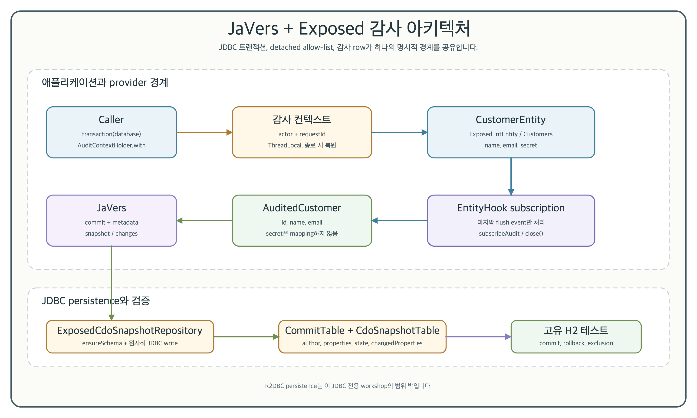
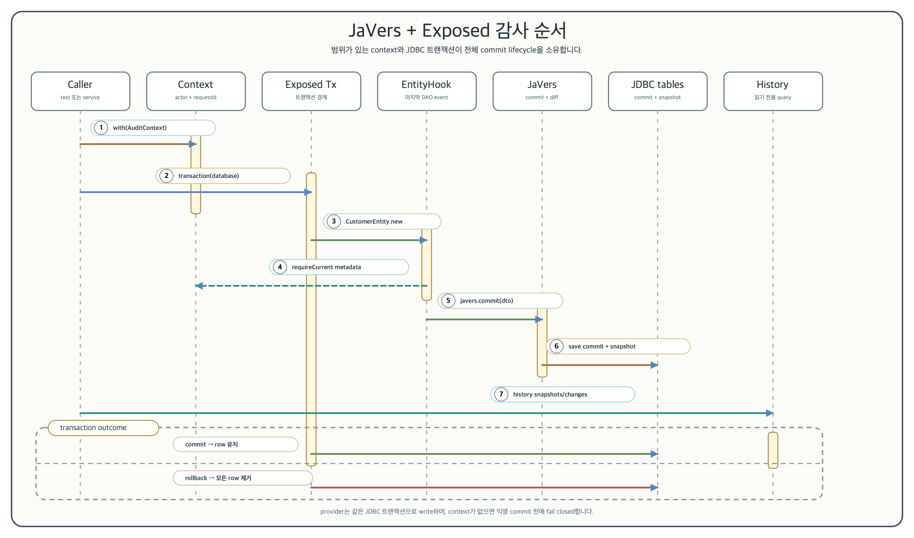
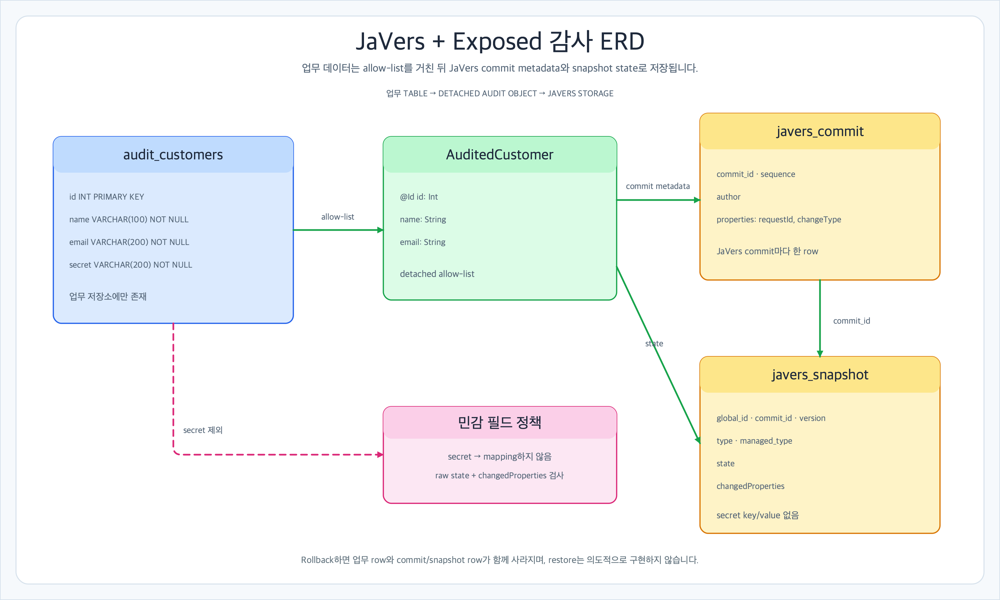

# JaVers + Exposed 감사 이력

[English](README.md) | 한국어

이 workshop은 의도적으로 JDBC만 다룹니다. `bluetape4k-javers:0.3.0`의 Exposed
provider를 사용해 Exposed DAO lifecycle을 JaVers에 연결하고 업무 트랜잭션과 감사
row를 원자적으로 처리합니다.



[아키텍처 SVG 원본](../../docs/images/readme-diagrams/13-javers-exposed-architecture-01.ko.svg)

구현은 detached 감사 DTO를 allow-list로 사용합니다. 따라서 영속
`CustomerEntity.secret` 값은 업무 테이블에만 남고 JaVers state나 changed properties에는
들어가지 않습니다.

## 목적

이 모듈에서는 Exposed DAO에 필요한 최소 감사 경계를 학습합니다.

- `Customers`와 `CustomerEntity`가 JDBC 업무 row를 모델링합니다.
- `AuditContextHolder`가 트랜잭션마다 비어 있지 않은 actor와 request ID를 제공하고,
  중첩 scope가 끝나면 이전 값을 복원합니다.
- `subscribeAudit`이 provider의 전역 `EntityHook`을 명시적인
  `CustomerEntity` → `AuditedCustomer` mapping과 함께 등록합니다.
- `JaversAuditHistory`가 고객별 `snapshot`, `changes`, 통합 `history`를 조회합니다.

catalog는 안정 `bluetape4k-dependencies:2.0.0` BOM을 통해 provider를 해석합니다. 예제는
`io.bluetape4k.javers:javers-exposed:0.3.0`과 Exposed JDBC를 사용합니다.

## Public API

```kotlin
val database = Database.connect(
    url = "jdbc:h2:mem:javers-audit;MODE=PostgreSQL;DB_CLOSE_DELAY=-1",
    driver = "org.h2.Driver",
)

val javers = createJavers(database) // ensureSchema()는 교육용 편의 기능입니다
transaction(database) { SchemaUtils.create(Customers) }
val subscription = subscribeAudit(database, javers)
val customerId = try {
    AuditContextHolder.with(AuditContext("alice", "request-123")) {
        transaction(database) {
            CustomerEntity.new {
                name = "Alice"
                email = "alice@example.com"
                secret = "business-only"
            }.id.value
        }
    }
} finally {
    subscription.close()
}

val history = JaversAuditHistory(javers).history(customerId)
```

`subscription.close()`은 멱등적이며 provider의 전역 hook을 제거합니다. 애플리케이션
lifecycle 경계에서 subscription을 보관하고, 테스트나 단기 process에서는 위와 같이
`try/finally`로 닫는 방식을 사용합니다.
subscription은 전달한 정확한 `Database` 인스턴스에 결합됩니다. provider hook은 전역이므로
다른 database에서 DAO를 변경하면 이 감사 저장소에 기록하지 않고 fail closed로 즉시
실패합니다. 전역 hook의 소유자는 한 번에 하나의 subscription/database만 허용하므로
소유자를 바꾸려면 기존 subscription을 먼저 닫아야 합니다. subscription은 애플리케이션
lifecycle이 소유하며, 이 예제는 multi-tenant 전역 hook registry를 제공하지 않습니다.

## Commit과 조회 lifecycle



[순서 SVG 원본](../../docs/images/readme-diagrams/13-javers-exposed-sequence-01.ko.svg)



[ERD SVG 원본](../../docs/images/readme-diagrams/13-javers-exposed-erd-01.ko.svg)

provider는 한 트랜잭션에서 마지막으로 등록된 DAO event만 관찰합니다. 고객 생성은
initial 기준 데이터를 만들고, 변경된 고객은 `author`, `requestId`, `changeType` commit
property와 함께 update 기준 데이터를 만듭니다. 같은 값을 다시 대입하면 중복 commit을
만들지 않습니다. 업무 트랜잭션이 rollback되면 commit과 `snapshot` row도 함께 rollback됩니다.
`AuditContext`가 없으면 익명 기록을 만들지 않고 fail closed합니다.

### 삭제 lifecycle

`CustomerEntity.delete()`를 호출하면 업무 row가 삭제되고 provider가 같은 트랜잭션에서
id 기반 `terminal` 기준 데이터를 commit합니다. 최신 기준 데이터는 `SnapshotType.TERMINAL`이며
`changeType=Removed`를 포함하고, 감사 row는 history 조회를 위해 남으므로
`history.current == null`이 됩니다. 업무 row 삭제는 감사 이력 삭제를 의미하지 않습니다.

`JaversAuditHistory.history`는 읽기 전용 교육용 조회입니다. 운영 pagination, retention,
restore, source of truth 교체 정책은 의도적으로 포함하지 않았으며 감사 저장소를 소유한
애플리케이션이 결정해야 합니다. 인증·인가·tenant filter가 없으므로 production endpoint로
직접 노출하면 안 됩니다. 호출 전에 customer/tenant 경계를 애플리케이션이 검사해야 합니다.

`createJavers`는 provider wiring을 보여주기 위해 낮은 수준의 JaVers 인스턴스를 노출합니다.
이 entity에 `javers.commit`을 직접 호출하면 `AuditedCustomer` allow-list와 `secret` 제외
경로를 우회할 수 있으므로 사용하면 안 됩니다. 직접 commit이 필요한 애플리케이션은 별도
allow-list mapping과 테스트를 정의하고 두 경로를 섞지 않아야 합니다.

## Schema 소유권과 검증

`createJavers(database)`는 결정적인 local workshop을 위해 provider의 `ensureSchema()`를
호출합니다. 실제 애플리케이션에서는 provider schema를 migration 도구로 관리하고,
startup이 테이블을 만들지 않도록
`ExposedCdoSnapshotRepositoryOptions(createSchemaOnEnsure = false)`를 사용합니다.

결정적인 H2 테스트와 모듈 검사를 실행합니다.

```bash
./gradlew :12-javers-exposed-audit:test --no-daemon --no-configuration-cache
./gradlew :12-javers-exposed-audit:detekt :12-javers-exposed-audit:build --no-daemon --no-configuration-cache
./gradlew :12-javers-exposed-audit:koverXmlReport --no-daemon --no-configuration-cache
```

기본 경로는 테스트마다 고유한 in-memory H2 database를 사용하며 Docker, credential,
remote database가 필요하지 않습니다. Nightly H2 matrix와 root test discovery가 동적으로
등록된 이 모듈을 포함하므로 local 예제를 위해 별도의 PostgreSQL 또는 remote-service row를
추가하지 않았습니다.

## 범위 경계

이 모듈은
[`exposed-workshop#239`](https://github.com/bluetape4k/exposed-workshop/issues/239)가 요청한
JDBC 예제만 구현합니다. R2DBC persistence 예제는
[`exposed-r2dbc-workshop#235`](https://github.com/bluetape4k/exposed-r2dbc-workshop/issues/235)에서
구현합니다.

실제 애플리케이션의 `AuditContext.actor`는 신뢰할 수 있는 인증 주체에서 공급해야 합니다.
이 workshop은 비어 있지 않은지만 검사하고 인증하지 않습니다. `secret` column은 감사
allow-list를 보여주기 위한 가짜 workshop field이며 업무 데이터에 평문으로 저장합니다.
실제 credential에는 암호화와 별도 보호가 필요합니다. 분산 context 전파, 감사 retention,
pagination, restore/rollback command, 전역 hook의 동시 소유권은 이 workshop의 범위가
아닙니다.
