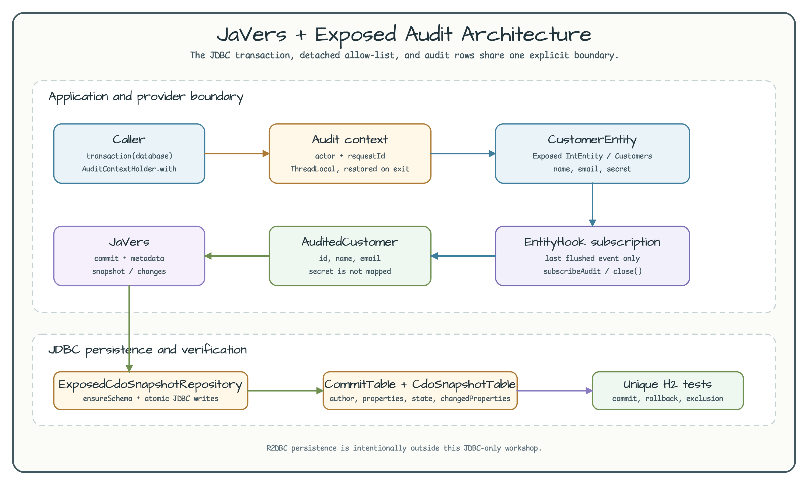
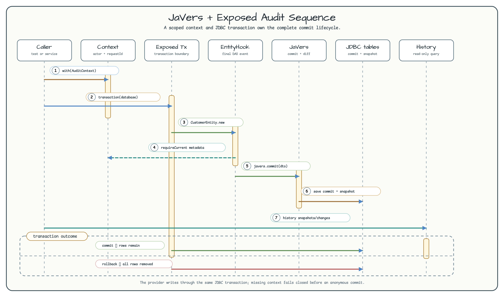
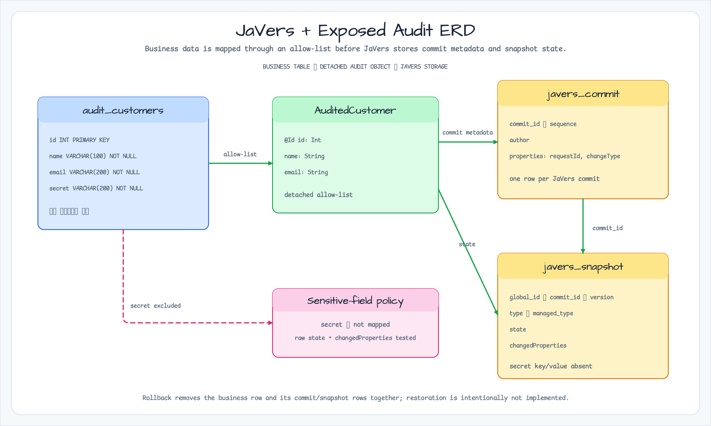

# JaVers + Exposed Audit History

English | [한국어](README.ko.md)

This workshop is intentionally JDBC-only. It connects an Exposed DAO lifecycle
to JaVers with the `bluetape4k-javers:0.3.0` Exposed provider and keeps the
business transaction and audit rows atomic.



[Architecture SVG source](../../docs/images/readme-diagrams/13-javers-exposed-architecture-01.svg)

The implementation uses a detached audit DTO as an allow-list. The persisted
`CustomerEntity.secret` value therefore stays in the business table and never
enters JaVers state or changed properties.

## Purpose

Use this module to learn the smallest useful audit boundary for an Exposed DAO:

- `Customers` and `CustomerEntity` model the JDBC business row.
- `AuditContextHolder` supplies a non-blank actor and request ID for each
  transaction and restores nested scopes on exit.
- `subscribeAudit` registers the provider's global `EntityHook` with an explicit
  `CustomerEntity` to `AuditedCustomer` mapping.
- `JaversAuditHistory` reads snapshots, changes, or the combined history for a
  customer.

The catalog resolves the provider through the
`bluetape4k-dependencies:1.4.0` BOM. The example uses
`io.bluetape4k.javers:javers-exposed:0.3.0` and Exposed JDBC.

## Public API

```kotlin
val database = Database.connect(
    url = "jdbc:h2:mem:javers-audit;MODE=PostgreSQL;DB_CLOSE_DELAY=-1",
    driver = "org.h2.Driver",
)

val javers = createJavers(database) // ensureSchema() is an education convenience
val subscription = subscribeAudit(javers)
try {
    AuditContextHolder.with(AuditContext("alice", "request-123")) {
        transaction(database) {
            CustomerEntity.new {
                name = "Alice"
                email = "alice@example.com"
                secret = "business-only"
            }
        }
    }
} finally {
    subscription.close()
}

val history = JaversAuditHistory(javers).history(customerId)
```

`subscription.close()` is idempotent and removes the provider's global hook.
Always keep the subscription in an application lifecycle boundary; the
`try/finally` form makes the example safe for a test or a short-lived process.

## Commit and query lifecycle



[Sequence SVG source](../../docs/images/readme-diagrams/13-javers-exposed-sequence-01.svg)



[ERD SVG source](../../docs/images/readme-diagrams/13-javers-exposed-erd-01.svg)

The provider observes only the final registered DAO event in one transaction.
Creating a customer produces an initial snapshot; a changed customer produces
one update snapshot with `author`, `requestId`, and `changeType` commit
properties. Reassigning the same values produces no duplicate commit. If the
business transaction rolls back, its commit and snapshot rows roll back with
it. A missing `AuditContext` fails closed instead of creating an anonymous
record.

`JaversAuditHistory.history` is a read-only teaching query. It intentionally
does not add production pagination, retention, restore, or source-of-truth
replacement policy; those decisions belong to the application that owns the
audit store.

## Schema ownership and verification

`createJavers(database)` calls the provider's `ensureSchema()` for a deterministic
local workshop. In a real application, run the provider schema through the
application's migration tool and configure
`ExposedCdoSnapshotRepositoryOptions(createSchemaOnEnsure = false)` instead of
letting startup create tables.

Run the deterministic H2 tests and module checks:

```bash
./gradlew :12-javers-exposed-audit:test --no-daemon --no-configuration-cache
./gradlew :12-javers-exposed-audit:detekt :12-javers-exposed-audit:build --no-daemon --no-configuration-cache
./gradlew :12-javers-exposed-audit:koverXmlReport --no-daemon --no-configuration-cache
```

The default path uses one unique in-memory H2 database per test and does not
start Docker, require credentials, or call a remote database. The Nightly H2
matrix and root test discovery include this dynamically registered module; no
separate PostgreSQL or remote-service row is added for this local example.

## Scope boundary

This module implements only the JDBC example requested by
[`exposed-workshop#239`](https://github.com/bluetape4k/exposed-workshop/issues/239).
The R2DBC persistence example belongs in
[`exposed-r2dbc-workshop#235`](https://github.com/bluetape4k/exposed-r2dbc-workshop/issues/235).

Production actor authentication, distributed context propagation, audit
retention, pagination, restore/rollback commands, and concurrent global-hook
ownership are outside this workshop.
