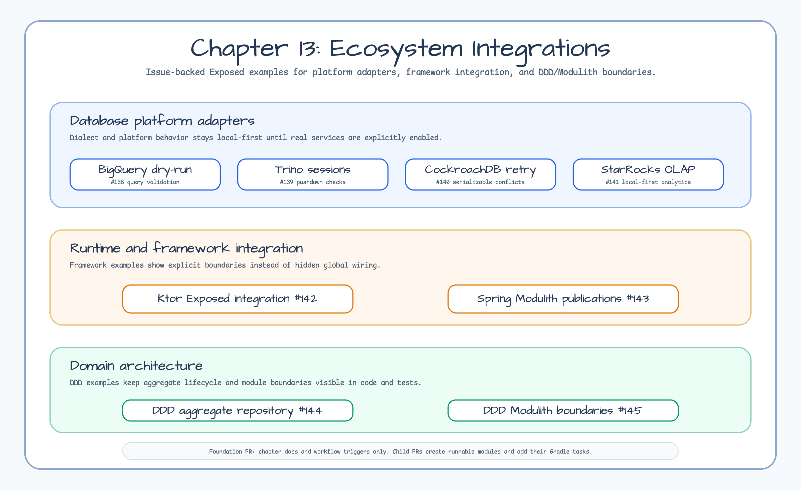

# Chapter 13 - Ecosystem Integrations

English | [한국어](README.ko.md)

This chapter is the foundation for issue
[#137](https://github.com/bluetape4k/exposed-workshop/issues/137): Exposed 1.11
and adjacent ecosystem examples that do not belong in the production-service
chapter. It is intentionally README-only until the child issues add runnable
modules.

## Learning Goals

- Keep database platform adapters separate from chapter 12 service patterns.
- Give Ktor, Spring Modulith, DDD, and dialect-oriented examples a durable
  chapter boundary.
- Make future child module order and verification expectations explicit before
  implementation starts.
- Keep every external-service example local, fake, or opt-in by default.

## Planned Examples

| Issue | Status | Planned directory | Gradle task | README title | Lane |
|---|---|---|---|---|---|
| [#138](https://github.com/bluetape4k/exposed-workshop/issues/138) | Planned | `13-ecosystem-integrations/01-bigquery-dry-run` | `:01-bigquery-dry-run:build` | BigQuery Dry-Run Query Validation | Database platform adapters |
| [#139](https://github.com/bluetape4k/exposed-workshop/issues/139) | Planned | `13-ecosystem-integrations/02-trino-session-options` | `:02-trino-session-options:build` | Trino Session Options and Pushdown Verification | Database platform adapters |
| [#140](https://github.com/bluetape4k/exposed-workshop/issues/140) | Planned | `13-ecosystem-integrations/03-cockroachdb-retry` | `:03-cockroachdb-retry:build` | CockroachDB Serializable Retry | Database platform adapters |
| [#141](https://github.com/bluetape4k/exposed-workshop/issues/141) | Planned | `13-ecosystem-integrations/04-starrocks-olap-local` | `:04-starrocks-olap-local:build` | StarRocks Local-First OLAP | Database platform adapters |
| [#142](https://github.com/bluetape4k/exposed-workshop/issues/142) | Planned | `13-ecosystem-integrations/05-ktor-exposed-integration` | `:05-ktor-exposed-integration:build` | Explicit Ktor Exposed Integration | Runtime and framework integration |
| [#143](https://github.com/bluetape4k/exposed-workshop/issues/143) | Planned | `13-ecosystem-integrations/06-spring-modulith-publications` | `:06-spring-modulith-publications:build` | Spring Modulith Publication Store with Exposed | Runtime and framework integration |
| [#144](https://github.com/bluetape4k/exposed-workshop/issues/144) | Planned | `13-ecosystem-integrations/07-ddd-aggregate-repository` | `:07-ddd-aggregate-repository:build` | DDD Aggregate Lifecycle with Exposed Repository | Domain architecture |
| [#145](https://github.com/bluetape4k/exposed-workshop/issues/145) | Planned | `13-ecosystem-integrations/08-ddd-modulith-boundaries` | `:08-ddd-modulith-boundaries:build` | DDD Bounded Context and Modulith Boundary Verification | Domain architecture |

## External Service And Credential Policy

Future child modules must follow these defaults:

- No checked-in credentials, tokens, service-account files, project IDs, or endpoint secrets.
- No default ADC or local credential file use.
- Fake, local, Testcontainers, or emulator-style defaults.
- Real-service execution is explicit opt-in and skipped by default in CI.
- README warnings for cost, network, and credentials before any real-service command.

## Child Module Handoff

Each child issue should create the module directory and `build.gradle.kts`, prove
Gradle project discovery, then add chapter/root README links only after files
exist. The same PR must add the runnable Gradle task to the Examples or Nightly
workflow when the module is ready for automated coverage.

Before opening a child PR, record these lane decisions:

| Field | Required decision |
|---|---|
| Default path | Local, fake, Testcontainers, emulator, or documentation-only |
| Real-service opt-in | Environment variable, Gradle property, test tag, or not applicable |
| Workflow lane | Weekly Examples, full Nightly, or manual opt-in |
