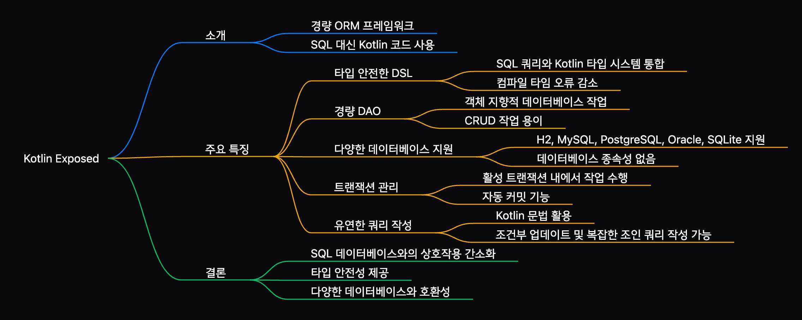
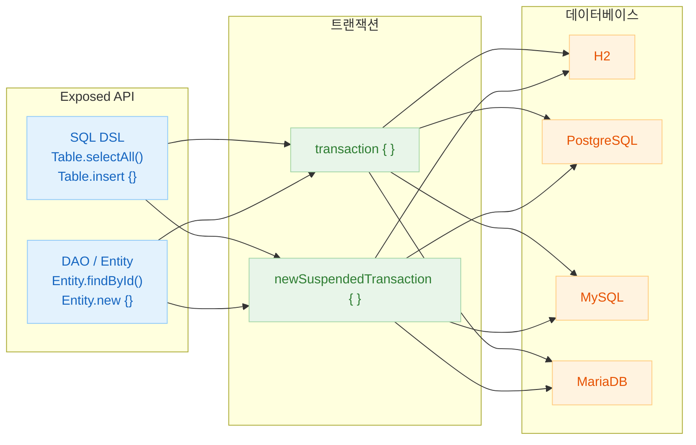
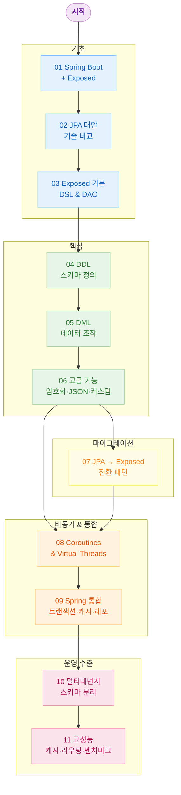
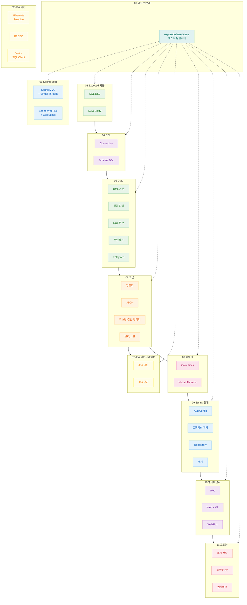

# Exposed Workshop (Kotlin Exposed 학습 자료)

[English](./README.md) | 한국어

이 저장소는 Kotlin Exposed 프레임워크의 사용법을 단계별로 학습할 수 있는 예제와 워크샵 모음입니다. 초보자부터 고급 사용자까지 Exposed의 다양한 기능을 실습하며 익힐 수 있도록 구성되어 있습니다.

## Kotlin Exposed 란?

Kotlin Exposed는 JetBrains에서 개발한 Kotlin 언어 전용 SQL 프레임워크입니다. Kotlin의 강력한 타입 시스템을 활용하여 컴파일 타임에 SQL 쿼리의 안전성을 보장하며, DSL(Domain Specific Language)과 DAO(Data Access Object) 두 가지 스타일을 모두 지원합니다.

### Exposed의 주요 특징

| 특징            | 설명                                                   |
|---------------|------------------------------------------------------|
| **타입 안전성**    | 컴파일 타임에 SQL 오류 감지                                    |
| **DSL & DAO** | SQL 스타일과 ORM 스타일 모두 지원                               |
| **코루틴 지원**    | 비동기 프로그래밍 완벽 지원                                      |
| **경량화**       | JPA 대비 적은 메모리 사용량                                    |
| **다양한 DB 지원** | H2, MySQL, PostgreSQL, MariaDB, Oracle, SQL Server 등 |



### Exposed API 구조



## 기술 스택

| 기술                 | 버전     |
|--------------------|--------|
| Kotlin             | 2.3.20 |
| Java               | 21     |
| Exposed            | 1.1.1  |
| Spring Boot        | 3.5.11 |
| Kotlinx Coroutines | 1.10.2 |
| Bluetape4k         | 1.6.0  |
| Gradle Wrapper     | 9.4.1  |

## 학습 가이드

이 워크샵은 다음과 같은 순서로 학습하는 것을 권장합니다:

1. **기본**: Spring Boot + Exposed 기본 통합
2. **대안 기술**: JPA 대안 기술들 비교
3. **Exposed 기본**: DSL과 DAO 패턴 익히기
4. **DDL/DML**: 스키마 정의와 데이터 조작
5. **고급 기능**: 암호화, JSON, 커스텀 타입 등
6. **JPA 마이그레이션**: JPA 코드를 Exposed로 변환
7. **비동기 처리**: Coroutines, Virtual Threads
8. **Spring 통합**: 트랜잭션, 캐시, 리포지토리 패턴
9. **멀티테넌시**: 다중 테넌트 아키텍처
10. **고성능**: 캐시 전략, 라우팅 데이터소스

### 학습 경로



## 상세 문서

모든 예제의 상세 설명은 [Kotlin Exposed Book](https://debop.notion.site/Kotlin-Exposed-Book-1ad2744526b080428173e9c907abdae2)에서 확인할 수 있습니다.

---

## 모듈 구조



## 모듈 목록

### 공유 라이브러리

#### [Exposed Shared Tests](00-shared/exposed-shared-tests/README.ko.md)

`exposed-workshop` 프로젝트 전반에서 사용되는 공통 테스트 유틸리티와 리소스를 제공합니다. 다양한 데이터베이스 환경에서 일관된 테스트를 수행할 수 있도록 지원합니다.

---

### Spring Boot 통합

#### [Spring MVC with Exposed](01-spring-boot/spring-mvc-exposed/README.ko.md)

Spring MVC + Virtual Threads + Exposed를 이용하여 동기식 REST API를 구축하는 방법을 학습합니다. 영화와 배우 데이터를 다루며 다대다 관계 매핑을 실습합니다.

#### [Spring WebFlux with Exposed](01-spring-boot/spring-webflux-exposed/README.ko.md)

Spring WebFlux + Kotlin Coroutines + Exposed를 이용하여 비동기 REST API를 구축하는 방법을 학습합니다. 반응형 프로그래밍 모델과 Exposed의 통합 방법을 익힙니다.

---

### JPA 대안 기술

#### [Hibernate Reactive Example](02-alternatives-to-jpa/hibernate-reactive-example/README.ko.md)

Hibernate Reactive를 이용한 반응형 Spring Boot 애플리케이션 구축 예제입니다.

#### [R2DBC Example](02-alternatives-to-jpa/r2dbc-example/README.ko.md)

Spring Data R2DBC를 이용한 반응형 데이터베이스 접근 예제입니다.

#### [Vert.x SQL Client Example](02-alternatives-to-jpa/vertx-sqlclient-example/README.ko.md)

Vert.x SQL Client를 이용한 이벤트 기반 비동기 데이터베이스 작업 예제입니다.

---

### Exposed 기본

#### [Exposed DAO Example](03-exposed-basic/exposed-dao-example/README.ko.md)

Exposed의 DAO(Data Access Object) 패턴을 학습합니다. Entity와 EntityClass를 사용하여 객체지향적으로 데이터베이스 작업을 수행하는 방법을 익힙니다.

#### [Exposed SQL DSL Example](03-exposed-basic/exposed-sql-example/README.ko.md)

Exposed의 SQL DSL(Domain Specific Language)을 학습합니다. 타입 안전한 SQL 쿼리 작성 방법과 DSL의 장점을 익힙니다.

---

### Exposed DDL (스키마 정의)

#### [Connection Management](04-exposed-ddl/01-connection/README.ko.md)

데이터베이스 연결 설정, 예외 처리, 타임아웃, 커넥션 풀링 등 연결 관리의 핵심 개념을 학습합니다.

#### [Schema Definition Language (DDL)](04-exposed-ddl/02-ddl/README.ko.md)

Exposed의 DDL 기능을 학습합니다. 테이블, 컬럼, 인덱스, 시퀀스 정의 방법을 익힙니다.

---

### Exposed DML (데이터 조작)

#### [DML 기본 연산](05-exposed-dml/01-dml/README.ko.md)

SELECT, INSERT, UPDATE, DELETE의 기본 패턴을 학습합니다. 조건식, 서브쿼리, 페이징, Batch Insert/Update, CTE(Common Table Expression) 등 실무에서 자주 사용하는 패턴을 익힙니다.

#### [컬럼 타입](05-exposed-dml/02-types/README.ko.md)

Exposed에서 제공하는 다양한 컬럼 타입을 학습합니다. 기본 타입부터 배열, BLOB, UUID, unsigned 수형까지 폭넓게 다룹니다.

#### [SQL 함수](05-exposed-dml/03-functions/README.ko.md)

Exposed 쿼리에서 다양한 SQL 함수를 사용하는 방법을 학습합니다. 집계 함수, 윈도우 함수, 수학/삼각 함수 등을 다룹니다.

#### [트랜잭션 관리](05-exposed-dml/04-transactions/README.ko.md)

Exposed의 트랜잭션 관리 기능을 학습합니다. 격리 수준, 중첩 트랜잭션, 롤백, 코루틴 통합 등을 다룹니다.

#### [Entity API](05-exposed-dml/05-entities/README.ko.md)

Exposed의 강력한 Entity API를 학습합니다. 다양한 기본키 전략, 관계 매핑, 라이프사이클 훅, 캐싱 등을 다룹니다.

---

### 고급 기능

#### [Exposed Crypt (투명한 컬럼 암호화)](06-advanced/01-exposed-crypt/README.ko.md)

`exposed-crypt` 확장을 사용하여 데이터베이스 컬럼을 투명하게 암호화/복호화하는 방법을 학습합니다.

#### [Exposed JavaTime (java.time 통합)](06-advanced/02-exposed-javatime/README.ko.md)

Java 8의 `java.time` API와 Exposed의 통합 방법을 학습합니다.

#### [Exposed Kotlinx-Datetime](06-advanced/03-exposed-kotlin-datetime/README.ko.md)

`kotlinx.datetime` 라이브러리와 Exposed의 통합 방법을 학습합니다. 멀티플랫폼 프로젝트에 적합합니다.

#### [Exposed Json (JSON/JSONB 지원)](06-advanced/04-exposed-json/README.ko.md)

`exposed-json` 모듈을 사용하여 JSON/JSONB 컬럼을 다루는 방법을 학습합니다.

#### [Exposed Money (금융 데이터 처리)](06-advanced/05-exposed-money/README.ko.md)

`exposed-money` 모듈을 사용하여 통화 값을 안전하게 처리하는 방법을 학습합니다.

#### [커스텀 컬럼 타입](06-advanced/06-custom-columns/README.ko.md)

사용자 정의 컬럼 타입을 구현하는 방법을 학습합니다. 암호화, 압축(GZIP/LZ4/Snappy/ZSTD), 직렬화(Kryo/Fury) 등의 투명한 변환을 구현합니다.

#### [커스텀 Entity (ID 생성 전략)](06-advanced/07-custom-entities/README.ko.md)

Snowflake, KSUID, Time-based UUID, Base62 encoded UUID 등 다양한 ID 생성 전략을 가진 커스텀 Entity를 구현합니다.

#### [Exposed Jackson (Jackson 기반 JSON)](06-advanced/08-exposed-jackson/README.ko.md)

Jackson 라이브러리를 사용하여 JSON/JSONB 컬럼을 처리하는 방법을 학습합니다.

#### [Exposed Fastjson2](06-advanced/09-exposed-fastjson2/README.ko.md)

Alibaba Fastjson2 라이브러리를 사용하여 JSON 컬럼을 처리하는 방법을 학습합니다.

#### [Exposed Jasypt (결정적 암호화)](06-advanced/10-exposed-jasypt/README.ko.md)

Jasypt를 사용하여 검색 가능한(결정적) 암호화를 구현하는 방법을 학습합니다.

#### [Exposed Jackson 3](06-advanced/11-exposed-jackson3/README.ko.md)

Jackson 3.x 버전을 사용하여 JSON/JSONB 컬럼을 처리하는 방법을 학습합니다.

#### [Exposed Tink (Google Tink 기반 컬럼 암호화)](06-advanced/12-exposed-tink/README.ko.md)

Google Tink 라이브러리를 사용하여 AEAD(비결정적) 및 DAEAD(결정적) 방식으로 컬럼 데이터를 암호화하는 방법을 학습합니다. DAEAD 방식은 암호화된 상태로 WHERE 절 검색이 가능합니다.

---

### JPA 마이그레이션

#### [JPA 기본 기능 변환](07-jpa/01-convert-jpa-basic/README.ko.md)

JPA의 기본 기능을 Exposed로 구현하는 방법을 학습합니다. Entity, 연관관계(One-to-One, One-to-Many, Many-to-Many), 기본키, 복합키 등을 다룹니다.

#### [JPA 고급 기능 변환](07-jpa/02-convert-jpa-advanced/README.ko.md)

JPA의 고급 기능을 Exposed로 구현하는 방법을 학습합니다. 상속 매핑(Single Table, Table Per Class, Joined Table), Self-Reference, Auditable, 낙관적 잠금 등을 다룹니다.

---

### 코루틴 & 가상 스레드

#### [Coroutines 기본](08-coroutines/01-coroutines-basic/README.ko.md)

Exposed를 Kotlin Coroutines 환경에서 사용하는 방법을 학습합니다.
`newSuspendedTransaction`, `suspendedTransactionAsync` 등을 다룹니다.

#### [Virtual Threads 기본](08-coroutines/02-virtualthreads-basic/README.ko.md)

Exposed를 Java 21 Virtual Threads 환경에서 사용하는 방법을 학습합니다. 블로킹 코드 스타일을 유지하면서 고성능 비동기 처리를 구현합니다.

---

### Spring 통합

#### [Spring Boot AutoConfiguration](09-spring/01-springboot-autoconfigure/README.ko.md)

Spring Boot의 자동 설정을 활용하여 Exposed를 설정하는 방법을 학습합니다.

#### [TransactionTemplate 활용](09-spring/02-transactiontemplate/README.ko.md)

Spring의 `TransactionTemplate`으로 프로그래밍 방식 트랜잭션을 관리하는 방법을 학습합니다.

#### [Spring Transaction 통합](09-spring/03-spring-transaction/README.ko.md)

`@Transactional` 어노테이션으로 선언적 트랜잭션을 관리하는 방법을 학습합니다.

#### [ExposedRepository (동기)](09-spring/04-exposed-repository/README.ko.md)

Spring Data Repository 패턴을 적용한 Exposed 리포지토리 구현 방법을 학습합니다.

#### [ExposedRepository (코루틴)](09-spring/05-exposed-repository-coroutines/README.ko.md)

코루틴 환경에서 Repository 패턴을 사용하여 비동기 데이터 접근을 구현합니다.

#### [Spring Boot Cache](09-spring/06-spring-cache/README.ko.md)

Spring Boot Cache를 Exposed와 함께 사용하는 방법을 학습합니다.

#### [Suspended Cache](09-spring/07-spring-suspended-cache/README.ko.md)

Lettuce를 활용한 Suspended Cache를 코루틴 환경에서 Exposed와 함께 사용하는 방법을 학습합니다.

---

### 멀티테넌시

#### [Spring Web + Multitenant](10-multi-tenant/01-multitenant-spring-web/README.ko.md)

Spring Web Application에서 Schema-based Multi-tenancy를 구현하는 방법을 학습합니다.

#### [Spring Web + VirtualThreads + Multitenant](10-multi-tenant/02-mutitenant-spring-web-virtualthread/README.ko.md)

Virtual Threads 환경에서 멀티테넌시를 구현하는 방법을 학습합니다.

#### [Spring WebFlux + Multitenant](10-multi-tenant/03-multitenant-spring-webflux/README.ko.md)

WebFlux와 Coroutines를 이용하여 반응형 멀티테넌시를 구현하는 방법을 학습합니다.

---

### 고성능

#### [캐시 전략 (동기)](11-high-performance/01-cache-strategies/README.ko.md)

Redisson + Exposed로 다양한 캐시 전략(Read Through, Write Through, Write Behind)을 구현합니다.

#### [캐시 전략 (코루틴)](11-high-performance/02-cache-strategies-coroutines/README.ko.md)

코루틴 환경에서 비동기로 작동하는 캐시 전략을 구현합니다.

#### [RoutingDataSource 구성](11-high-performance/03-routing-datasource/README.ko.md)

Multi-Tenant 또는 Read Replica 구조를 위한 유연한 DataSource 라우팅 구성 방법을 학습합니다.

#### [벤치마크](11-high-performance/04-benchmark/README.ko.md)

`kotlinx-benchmark` 기반 마이크로벤치마크로 캐시/라우팅 예제의 성능을 측정합니다. smoke 프로파일과 main 프로파일을 제공하며 Markdown 리포트를 생성할 수 있습니다.

---

## 시작하기

### 사전 요구사항

- JDK 21 이상 (Virtual Threads 및 Preview 기능 사용)
- Gradle Wrapper 9.4.1 포함 (`./gradlew` 사용 권장)
- Docker (Testcontainers 사용 시)

### 빠른 시작

```bash
# 빠른 로컬 검증 (H2만 사용)
./gradlew test -PuseFastDB=true

# 전체 프로젝트 빌드 및 테스트
./gradlew clean build

# 특정 모듈 테스트 실행
./gradlew :03-routing-datasource:test
./gradlew :01-dml:test
./gradlew :spring-mvc-exposed:test
```

루트 `settings.gradle.kts` 에서 Gradle project path 를 모듈의 마지막 디렉터리 이름으로 생성하므로, 경로가 헷갈리면 `./gradlew projects` 로 확인하세요.

### 테스트 대상 DB 선택

기본값은 **H2, PostgreSQL, MySQL V8** 3가지를 대상으로 테스트합니다. Gradle 프로퍼티로 테스트 범위를 조절할 수 있습니다.

```bash
# H2 만 테스트 (빠른 로컬 개발용)
./gradlew test -PuseFastDB=true

# 특정 DB만 지정해서 테스트
./gradlew test -PuseDB=H2,POSTGRESQL
./gradlew test -PuseDB=H2,POSTGRESQL,MYSQL_V8,MARIADB

# 기본값으로 테스트 (H2 + PostgreSQL + MySQL V8)
./gradlew test
```

`-PuseDB`에 사용 가능한 값 (`TestDB` enum 이름):

| 값               | 설명                               |
|-----------------|----------------------------------|
| `H2`            | H2 (인메모리, 기본 모드)                 |
| `H2_V1`         | H2 1.x 호환 모드                     |
| `H2_MYSQL`      | H2 (MySQL 호환 모드)                 |
| `H2_MARIADB`    | H2 (MariaDB 호환 모드)               |
| `H2_PSQL`       | H2 (PostgreSQL 호환 모드)            |
| `MARIADB`       | MariaDB (Testcontainers)         |
| `MYSQL_V5`      | MySQL 5.x (Testcontainers)       |
| `MYSQL_V8`      | MySQL 8.x (Testcontainers)       |
| `POSTGRESQL`    | PostgreSQL (Testcontainers)      |
| `POSTGRESQLNG`  | PostgreSQL NG 드라이버               |
| ~~`COCKROACH`~~ | ~~CockroachDB (Testcontainers)~~ |

> [!NOTE]
> 우선순위: `-PuseDB` > `-PuseFastDB` > 기본값 (H2, POSTGRESQL, MYSQL_V8)

### 개발 환경

- 저장소에 포함된 Gradle Wrapper(`./gradlew`) 사용을 권장합니다.
- IntelliJ IDEA에서 열면 멀티 모듈이 자동 인식됩니다.
- Docker가 있으면 Testcontainers 기반 PostgreSQL/MySQL/Redis 테스트를 그대로 실행할 수 있습니다.

## 기여하기

이 프로젝트는 학습 목적으로 제작되었습니다. 오타 수정, 예제 추가, 번역 개선 등 모든 기여를 환영합니다.

## 라이선스

Apache License 2.0
