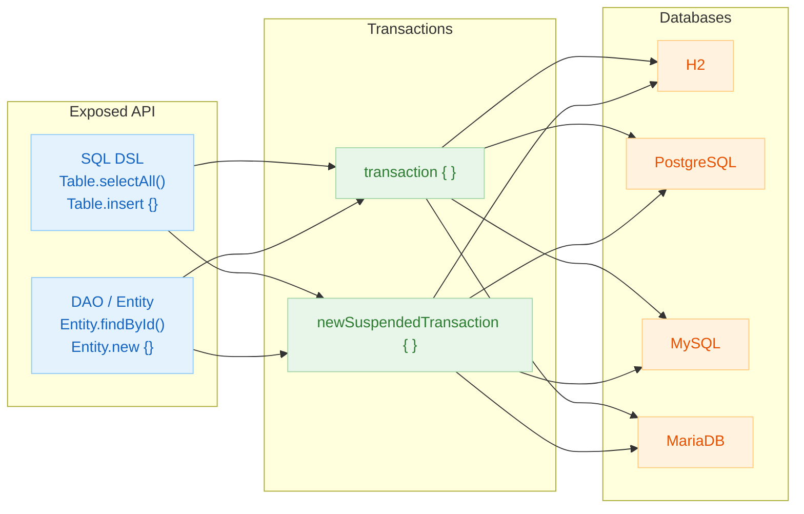
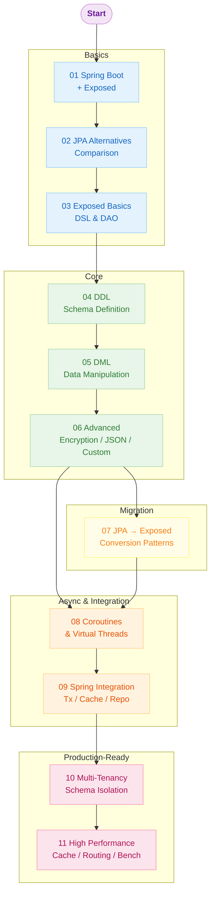
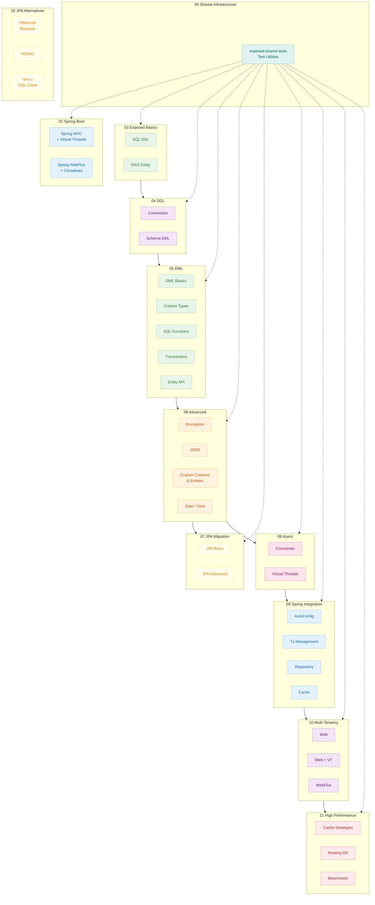

# Exposed Workshop (Kotlin Exposed Tutorial)

English | [한국어](./README.ko.md)

A hands-on workshop collection for learning the Kotlin Exposed SQL framework step by step. Designed for beginners through advanced users to practice and master the various features of Exposed.

## What is Kotlin Exposed?

Kotlin Exposed is a Kotlin-specific SQL framework developed by JetBrains. It leverages Kotlin's powerful type system to guarantee SQL query safety at compile time and supports both DSL (Domain Specific Language) and DAO (Data Access Object) styles.

### Key Features

| Feature              | Description                                          |
|----------------------|------------------------------------------------------|
| **Type Safety**      | Catches SQL errors at compile time                   |
| **DSL & DAO**        | Supports both SQL-style and ORM-style access         |
| **Coroutines**       | Full async programming support                       |
| **Lightweight**      | Lower memory footprint compared to JPA               |
| **Multi-DB Support** | H2, MySQL, PostgreSQL, MariaDB, Oracle, SQL Server   |


### Exposed API Structure



## Tech Stack

| Technology           | Version |
|----------------------|---------|
| Kotlin               | 2.3.20  |
| Java                 | 21      |
| Exposed              | 1.1.1   |
| Spring Boot          | 3.5.11  |
| Kotlinx Coroutines   | 1.10.2  |
| Bluetape4k           | 1.6.0   |
| Gradle Wrapper       | 9.4.1   |

## Learning Guide

The recommended learning order for this workshop:

1. **Basics**: Spring Boot + Exposed integration
2. **Alternatives**: Comparing JPA alternatives
3. **Exposed Basics**: DSL and DAO patterns
4. **DDL/DML**: Schema definition and data manipulation
5. **Advanced**: Encryption, JSON, custom types
6. **JPA Migration**: Converting JPA code to Exposed
7. **Async**: Coroutines, Virtual Threads
8. **Spring Integration**: Transactions, cache, repository patterns
9. **Multi-Tenancy**: Multi-tenant architecture
10. **High Performance**: Cache strategies, routing datasource

### Learning Path



## Detailed Documentation

Full explanations for all examples are available at [Kotlin Exposed Book](https://debop.notion.site/Kotlin-Exposed-Book-1ad2744526b080428173e9c907abdae2).

---

## Module Structure



## Module List

### Shared Library

#### [Exposed Shared Tests](00-shared/exposed-shared-tests/README.md)

Provides common test utilities and resources used across the entire `exposed-workshop` project. Supports consistent testing across different database environments.

---

### Spring Boot Integration

#### [Spring MVC with Exposed](01-spring-boot/spring-mvc-exposed/README.md)

Learn how to build synchronous REST APIs using Spring MVC + Virtual Threads + Exposed. Practice many-to-many relationship mapping with movie and actor data.

#### [Spring WebFlux with Exposed](01-spring-boot/spring-webflux-exposed/README.md)

Learn how to build asynchronous REST APIs using Spring WebFlux + Kotlin Coroutines + Exposed. Master the integration between reactive programming and Exposed.

---

### JPA Alternatives

#### [Hibernate Reactive Example](02-alternatives-to-jpa/hibernate-reactive-example/README.md)

Example of building a reactive Spring Boot application using Hibernate Reactive.

#### [R2DBC Example](02-alternatives-to-jpa/r2dbc-example/README.md)

Example of reactive database access using Spring Data R2DBC.

#### [Vert.x SQL Client Example](02-alternatives-to-jpa/vertx-sqlclient-example/README.md)

Example of event-driven asynchronous database operations using Vert.x SQL Client.

---

### Exposed Basics

#### [Exposed DAO Example](03-exposed-basic/exposed-dao-example/README.md)

Learn the Exposed DAO (Data Access Object) pattern. Master object-oriented database operations using Entity and EntityClass.

#### [Exposed SQL DSL Example](03-exposed-basic/exposed-sql-example/README.md)

Learn the Exposed SQL DSL (Domain Specific Language). Master type-safe SQL query construction and DSL benefits.

---

### Exposed DDL (Schema Definition)

#### [Connection Management](04-exposed-ddl/01-connection/README.md)

Learn core concepts of connection management including database connection setup, exception handling, timeouts, and connection pooling.

#### [Schema Definition Language (DDL)](04-exposed-ddl/02-ddl/README.md)

Learn Exposed DDL features. Master table, column, index, and sequence definitions.

---

### Exposed DML (Data Manipulation)

#### [DML Basic Operations](05-exposed-dml/01-dml/README.md)

Learn basic SELECT, INSERT, UPDATE, DELETE patterns. Practice conditions, subqueries, paging, Batch Insert/Update, CTE (Common Table Expression), and other common production patterns.

#### [Column Types](05-exposed-dml/02-types/README.md)

Learn the various column types provided by Exposed. Covers basic types through arrays, BLOB, UUID, and unsigned integers.

#### [SQL Functions](05-exposed-dml/03-functions/README.md)

Learn how to use various SQL functions in Exposed queries. Covers aggregate functions, window functions, math/trigonometric functions, and more.

#### [Transaction Management](05-exposed-dml/04-transactions/README.md)

Learn Exposed transaction management features. Covers isolation levels, nested transactions, rollback, and coroutine integration.

#### [Entity API](05-exposed-dml/05-entities/README.md)

Learn the powerful Exposed Entity API. Covers various primary key strategies, relationship mapping, lifecycle hooks, and caching.

---

### Advanced Features

#### [Exposed Crypt (Transparent Column Encryption)](06-advanced/01-exposed-crypt/README.md)

Learn how to transparently encrypt/decrypt database columns using the `exposed-crypt` extension.

#### [Exposed JavaTime (java.time Integration)](06-advanced/02-exposed-javatime/README.md)

Learn how to integrate Java 8's `java.time` API with Exposed.

#### [Exposed Kotlinx-Datetime](06-advanced/03-exposed-kotlin-datetime/README.md)

Learn how to integrate the `kotlinx.datetime` library with Exposed. Ideal for multiplatform projects.

#### [Exposed Json (JSON/JSONB Support)](06-advanced/04-exposed-json/README.md)

Learn how to work with JSON/JSONB columns using the `exposed-json` module.

#### [Exposed Money (Financial Data Processing)](06-advanced/05-exposed-money/README.md)

Learn how to safely handle monetary values using the `exposed-money` module.

#### [Custom Column Types](06-advanced/06-custom-columns/README.md)

Learn how to implement custom column types. Build transparent transformations for encryption, compression (GZIP/LZ4/Snappy/ZSTD), and serialization (Kryo/Fury).

#### [Custom Entities (ID Generation Strategies)](06-advanced/07-custom-entities/README.md)

Implement custom entities with various ID generation strategies including Snowflake, KSUID, Time-based UUID, and Base62 encoded UUID.

#### [Exposed Jackson (Jackson-based JSON)](06-advanced/08-exposed-jackson/README.md)

Learn how to process JSON/JSONB columns using the Jackson library.

#### [Exposed Fastjson2](06-advanced/09-exposed-fastjson2/README.md)

Learn how to process JSON columns using the Alibaba Fastjson2 library.

#### [Exposed Jasypt (Deterministic Encryption)](06-advanced/10-exposed-jasypt/README.md)

Learn how to implement searchable (deterministic) encryption using Jasypt.

#### [Exposed Jackson 3](06-advanced/11-exposed-jackson3/README.md)

Learn how to process JSON/JSONB columns using Jackson 3.x.

#### [Exposed Tink (Google Tink Column Encryption)](06-advanced/12-exposed-tink/README.md)

Learn how to encrypt column data using AEAD (non-deterministic) and DAEAD (deterministic) modes with the Google Tink library. DAEAD mode allows WHERE clause searches on encrypted data.

---

### JPA Migration

#### [JPA Basic Feature Conversion](07-jpa/01-convert-jpa-basic/README.md)

Learn how to implement JPA basic features with Exposed. Covers Entity, relationships (One-to-One, One-to-Many, Many-to-Many), primary keys, and composite keys.

#### [JPA Advanced Feature Conversion](07-jpa/02-convert-jpa-advanced/README.md)

Learn how to implement JPA advanced features with Exposed. Covers inheritance mapping (Single Table, Table Per Class, Joined Table), Self-Reference, Auditable, and optimistic locking.

---

### Coroutines & Virtual Threads

#### [Coroutines Basics](08-coroutines/01-coroutines-basic/README.md)

Learn how to use Exposed in a Kotlin Coroutines environment. Covers `newSuspendedTransaction`, `suspendedTransactionAsync`, and more.

#### [Virtual Threads Basics](08-coroutines/02-virtualthreads-basic/README.md)

Learn how to use Exposed with Java 21 Virtual Threads. Achieve high-performance async processing while maintaining a blocking code style.

---

### Spring Integration

#### [Spring Boot AutoConfiguration](09-spring/01-springboot-autoconfigure/README.md)

Learn how to configure Exposed using Spring Boot auto-configuration.

#### [TransactionTemplate Usage](09-spring/02-transactiontemplate/README.md)

Learn how to manage programmatic transactions with Spring's `TransactionTemplate`.

#### [Spring Transaction Integration](09-spring/03-spring-transaction/README.md)

Learn how to manage declarative transactions with the `@Transactional` annotation.

#### [ExposedRepository (Synchronous)](09-spring/04-exposed-repository/README.md)

Learn how to implement Exposed repositories using the Spring Data Repository pattern.

#### [ExposedRepository (Coroutines)](09-spring/05-exposed-repository-coroutines/README.md)

Implement asynchronous data access using the Repository pattern in a coroutine environment.

#### [Spring Boot Cache](09-spring/06-spring-cache/README.md)

Learn how to use Spring Boot Cache with Exposed.

#### [Suspended Cache](09-spring/07-spring-suspended-cache/README.md)

Learn how to use Lettuce-based Suspended Cache with Exposed in a coroutine environment.

---

### Multi-Tenancy

#### [Spring Web + Multitenant](10-multi-tenant/01-multitenant-spring-web/README.md)

Learn how to implement schema-based multi-tenancy in a Spring Web application.

#### [Spring Web + VirtualThreads + Multitenant](10-multi-tenant/02-mutitenant-spring-web-virtualthread/README.md)

Learn how to implement multi-tenancy in a Virtual Threads environment.

#### [Spring WebFlux + Multitenant](10-multi-tenant/03-multitenant-spring-webflux/README.md)

Learn how to implement reactive multi-tenancy using WebFlux and Coroutines.

---

### High Performance

#### [Cache Strategies (Synchronous)](11-high-performance/01-cache-strategies/README.md)

Implement various cache strategies (Read Through, Write Through, Write Behind) with Redisson + Exposed.

#### [Cache Strategies (Coroutines)](11-high-performance/02-cache-strategies-coroutines/README.md)

Implement asynchronous cache strategies in a coroutine environment.

#### [RoutingDataSource Configuration](11-high-performance/03-routing-datasource/README.md)

Learn flexible DataSource routing configuration for multi-tenant or read replica architectures.

#### [Benchmark](11-high-performance/04-benchmark/README.md)

Measure performance of cache/routing examples using `kotlinx-benchmark` micro-benchmarks. Provides smoke and main profiles with Markdown report generation.

---

## Getting Started

### Prerequisites

- JDK 21 or higher (for Virtual Threads and Preview features)
- Gradle Wrapper 9.4.1 included (use `./gradlew`)
- Docker (for Testcontainers)

### Quick Start

```bash
# Quick local verification (H2 only)
./gradlew test -PuseFastDB=true

# Full project build and test
./gradlew clean build

# Run tests for a specific module
./gradlew :03-routing-datasource:test
./gradlew :01-dml:test
./gradlew :spring-mvc-exposed:test
```

The root `settings.gradle.kts` generates the Gradle project path from the leaf directory name. If paths are confusing, check with `./gradlew projects`.

### Target DB Selection

By default, tests run against **H2, PostgreSQL, MySQL V8**. Use Gradle properties to control the test scope.

```bash
# Test with H2 only (fast local development)
./gradlew test -PuseFastDB=true

# Test with specific databases
./gradlew test -PuseDB=H2,POSTGRESQL
./gradlew test -PuseDB=H2,POSTGRESQL,MYSQL_V8,MARIADB

# Test with defaults (H2 + PostgreSQL + MySQL V8)
./gradlew test
```

Available `-PuseDB` values (`TestDB` enum names):

| Value             | Description                      |
|-------------------|----------------------------------|
| `H2`              | H2 (in-memory, default mode)     |
| `H2_V1`           | H2 1.x compatibility mode        |
| `H2_MYSQL`        | H2 (MySQL compatibility mode)    |
| `H2_MARIADB`      | H2 (MariaDB compatibility mode)  |
| `H2_PSQL`         | H2 (PostgreSQL compatibility mode)|
| `MARIADB`         | MariaDB (Testcontainers)         |
| `MYSQL_V5`        | MySQL 5.x (Testcontainers)       |
| `MYSQL_V8`        | MySQL 8.x (Testcontainers)       |
| `POSTGRESQL`      | PostgreSQL (Testcontainers)      |
| `POSTGRESQLNG`    | PostgreSQL NG driver             |
| ~~`COCKROACH`~~   | ~~CockroachDB (Testcontainers)~~ |

> [!NOTE]
> Priority: `-PuseDB` > `-PuseFastDB` > default (H2, POSTGRESQL, MYSQL_V8)

### Development Environment

- Use the included Gradle Wrapper (`./gradlew`).
- Opening in IntelliJ IDEA automatically recognizes all multi-modules.
- With Docker, you can run Testcontainers-based PostgreSQL/MySQL/Redis tests directly.

## Contributing

This project is designed for learning purposes. All contributions including typo fixes, example additions, and translation improvements are welcome.

## License

Apache License 2.0
