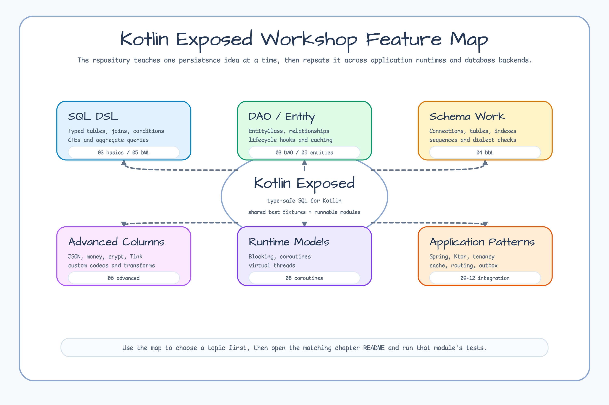
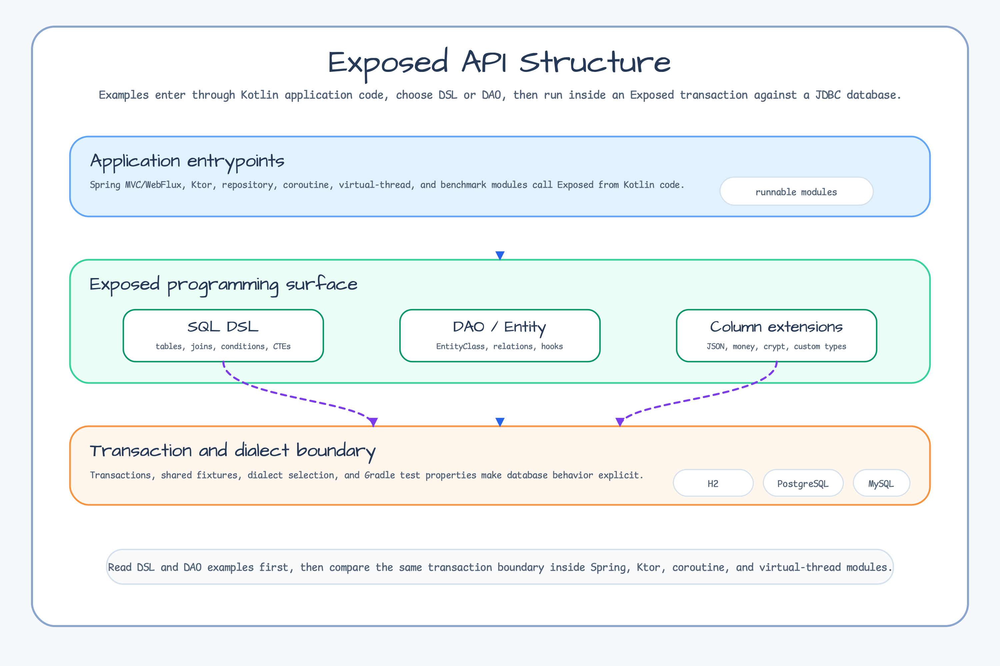
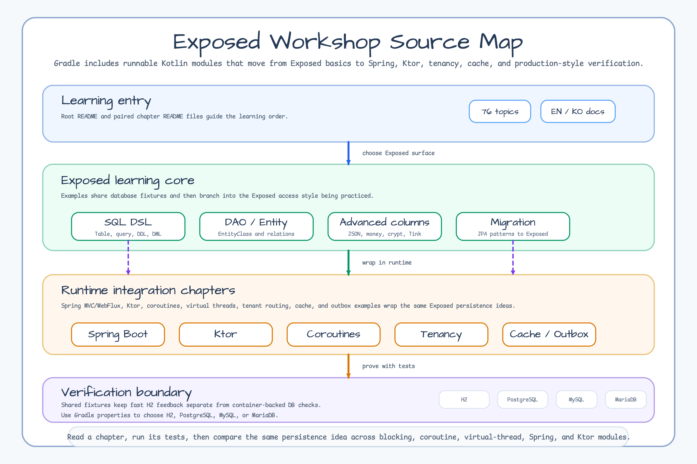
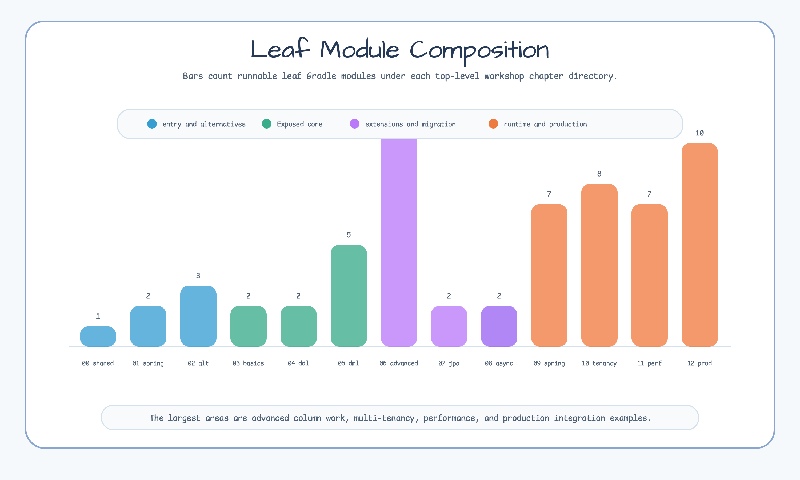
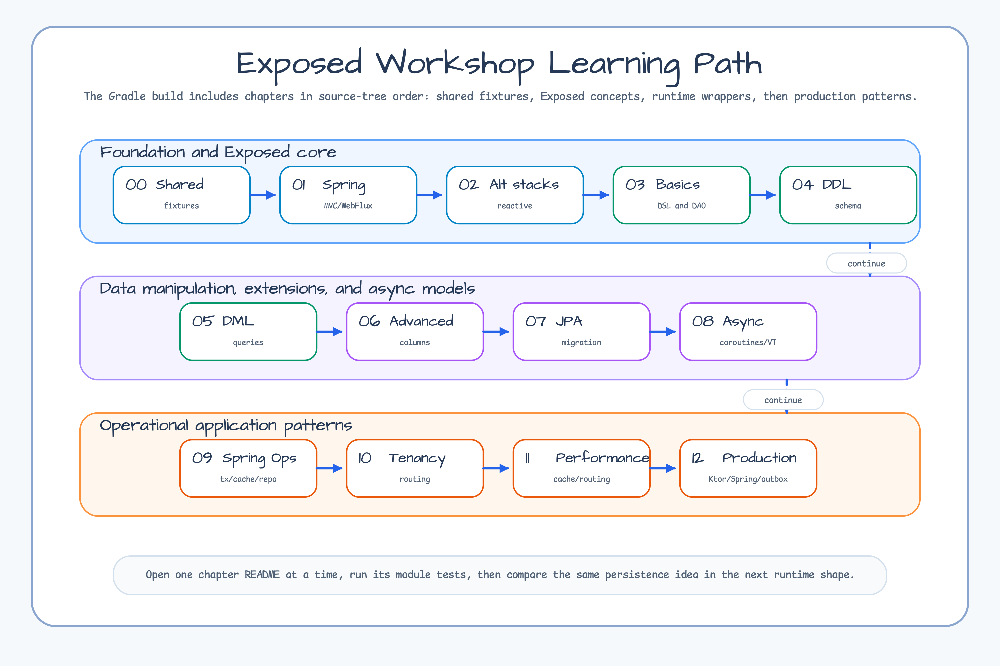
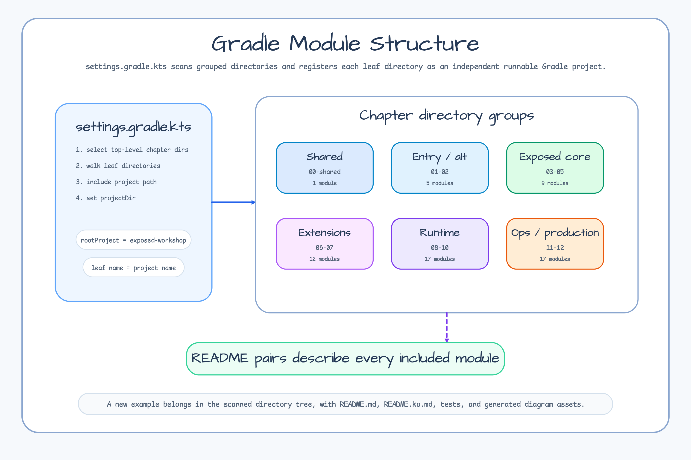

# Exposed Workshop (Kotlin Exposed Tutorial)

[](https://github.com/bluetape4k/exposed-workshop/actions/workflows/ci.yml)
[](https://kotlinlang.org)
[](https://openjdk.org)
[](LICENSE)

English | [한국어](./README.ko.md)


A source-backed workshop for learning Kotlin Exposed through runnable Gradle modules, paired English/Korean documentation, and database tests that move from SQL basics to production-style service patterns.

## Project Purpose

`exposed-workshop` teaches Kotlin Exposed as a sequence of small, executable examples. The repository starts with shared database fixtures and Spring Boot entrypoints, then expands into SQL DSL, DAO, DDL/DML, advanced column types, JPA migration, coroutines, virtual threads, multi-tenancy, cache/routing, and production integration with Spring Boot and Ktor.

## What It Provides

- **Source-ordered learning path** matching `settings.gradle.kts` and the chapter directory layout.
- **DSL, DAO, DDL, and DML examples** that make transaction boundaries and dialect behavior visible.
- **Runtime comparisons** across blocking JDBC, coroutines, virtual threads, Spring MVC/WebFlux, and Ktor.
- **Multi-database verification** with H2 fast paths and Testcontainers-backed PostgreSQL, MySQL, and MariaDB options.

## What is Kotlin Exposed?

Kotlin Exposed is JetBrains' Kotlin-first SQL framework. It lets you model tables and queries with a type-safe DSL, or work with rows through DAO/Entity classes when an object-oriented style is a better fit. This workshop keeps both styles close to real application code so the trade-offs are visible in tests.

### Key Features

| Feature | How this repository demonstrates it |
|---------|-------------------------------------|
| **Type-safe SQL DSL** | Tables, joins, predicates, CTEs, functions, and batch DML examples. |
| **DAO and Entity API** | EntityClass, relationship mapping, lifecycle hooks, and cache behavior. |
| **Explicit transactions** | Blocking, coroutine, Spring `TransactionTemplate`, and `@Transactional` variants. |
| **Runtime choices** | Spring MVC/WebFlux, Ktor, coroutines, virtual threads, and benchmark modules. |
| **Database coverage** | H2 for fast feedback plus PostgreSQL, MySQL, and MariaDB through Testcontainers. |



### Exposed API Structure



<!-- README_VISUAL_OVERVIEW:START -->
## Overview Diagram



## Module Composition Chart


<!-- README_VISUAL_OVERVIEW:END -->

## Tech Stack

| Technology | Version / setting |
|------------|-------------------|
| Kotlin plugin | 2.4.0 |
| Kotlin language/API level | 2.3 |
| Java toolchain | 21 |
| Exposed | 1.3.0 |
| Spring Boot | 4.0.6 |
| Kotlinx Coroutines | 1.11.0 |
| Bluetape4k dependencies BOM | 1.3.1 |
| Gradle Wrapper | 9.5.0 |

## Learning Guide

Read the repository in source-tree order. Start with shared fixtures, then work through Exposed concepts, runtime wrappers, and production-style application patterns:

1. **Shared and entrypoints**: common test fixtures, Spring MVC/WebFlux, and reactive alternatives.
2. **Exposed core**: SQL DSL, DAO, schema definition, DML, functions, transactions, and entities.
3. **Extensions and migration**: JSON, money, encryption, custom columns/entities, Jackson/Fastjson/Tink, and JPA migration.
4. **Runtime models**: coroutines and Java 21 virtual threads.
5. **Operational patterns**: Spring transactions, repositories, cache, multi-tenancy, routing data sources, benchmarks, Ktor, outbox, auth/session, realtime, and observability.

### Learning Path



## Detailed Documentation

Full explanations for all examples are available at [Kotlin Exposed Book](https://debop.notion.site/Kotlin-Exposed-Book-1ad2744526b080428173e9c907abdae2).

---

## Module Structure



## Module List

### Shared Library

#### [Exposed Shared Tests](00-shared/exposed-shared-tests/README.md)

Provides common test utilities and resources used across the entire `exposed-workshop` project. Supports consistent testing across different database environments.

---

### Spring Boot Integration

#### [Spring MVC with Exposed](01-spring-boot/spring-mvc-exposed/README.md)

Learn how to build synchronous REST APIs using Spring MVC + Virtual Threads + Exposed. Practice many-to-many relationship mapping with movie and actor data.

#### [Spring WebFlux with Exposed](01-spring-boot/spring-webflux-exposed/README.md)

Learn how to build asynchronous REST APIs using Spring WebFlux + Kotlin Coroutines + Exposed. Master the integration between reactive programming and Exposed.

---

### JPA Alternatives

#### [Hibernate Reactive Example](02-alternatives-to-jpa/hibernate-reactive-example/README.md)

Example of building a reactive Spring Boot application using Hibernate Reactive.

#### [R2DBC Example](02-alternatives-to-jpa/r2dbc-example/README.md)

Example of reactive database access using Spring Data R2DBC.

#### [Vert.x SQL Client Example](02-alternatives-to-jpa/vertx-sqlclient-example/README.md)

Example of event-driven asynchronous database operations using Vert.x SQL Client.

---

### Exposed Basics

#### [Exposed DAO Example](03-exposed-basic/exposed-dao-example/README.md)

Learn the Exposed DAO (Data Access Object) pattern. Master object-oriented database operations using Entity and EntityClass.

#### [Exposed SQL DSL Example](03-exposed-basic/exposed-sql-example/README.md)

Learn the Exposed SQL DSL (Domain Specific Language). Master type-safe SQL query construction and DSL benefits.

---

### Exposed DDL (Schema Definition)

#### [Connection Management](04-exposed-ddl/01-connection/README.md)

Learn core concepts of connection management including database connection setup, exception handling, timeouts, and connection pooling.

#### [Schema Definition Language (DDL)](04-exposed-ddl/02-ddl/README.md)

Learn Exposed DDL features. Master table, column, index, and sequence definitions.

---

### Exposed DML (Data Manipulation)

#### [DML Basic Operations](05-exposed-dml/01-dml/README.md)

Learn basic SELECT, INSERT, UPDATE, DELETE patterns. Practice conditions, subqueries, paging, Batch Insert/Update, CTE (Common Table Expression), and other common production patterns.

#### [Column Types](05-exposed-dml/02-types/README.md)

Learn the various column types provided by Exposed. Covers basic types through arrays, BLOB, UUID, and unsigned integers.

#### [SQL Functions](05-exposed-dml/03-functions/README.md)

Learn how to use various SQL functions in Exposed queries. Covers aggregate functions, window functions, math/trigonometric functions, and more.

#### [Transaction Management](05-exposed-dml/04-transactions/README.md)

Learn Exposed transaction management features. Covers isolation levels, nested transactions, rollback, and coroutine integration.

#### [Entity API](05-exposed-dml/05-entities/README.md)

Learn the powerful Exposed Entity API. Covers various primary key strategies, relationship mapping, lifecycle hooks, and caching.

---

### Advanced Features

#### [Exposed Crypt (Transparent Column Encryption)](06-advanced/01-exposed-crypt/README.md)

Learn how to transparently encrypt/decrypt database columns using the `exposed-crypt` extension.

#### [Exposed JavaTime (java.time Integration)](06-advanced/02-exposed-javatime/README.md)

Learn how to integrate Java 8's `java.time` API with Exposed.

#### [Exposed Kotlinx-Datetime](06-advanced/03-exposed-kotlin-datetime/README.md)

Learn how to integrate the `kotlinx.datetime` library with Exposed. Ideal for multiplatform projects.

#### [Exposed Json (JSON/JSONB Support)](06-advanced/04-exposed-json/README.md)

Learn how to work with JSON/JSONB columns using the `exposed-json` module.

#### [Exposed Money (Financial Data Processing)](06-advanced/05-exposed-money/README.md)

Learn how to safely handle monetary values using the `exposed-money` module.

#### [Custom Column Types](06-advanced/06-custom-columns/README.md)

Learn how to implement custom column types. Build transparent transformations for encryption, compression (GZIP/LZ4/Snappy/ZSTD), and serialization (Kryo/Fury).

#### [Custom Entities (ID Generation Strategies)](06-advanced/07-custom-entities/README.md)

Implement custom entities with various ID generation strategies including Snowflake, KSUID, Time-based UUID, and Base62 encoded UUID.

#### [Exposed Jackson (Jackson-based JSON)](06-advanced/08-exposed-jackson/README.md)

Learn how to process JSON/JSONB columns using the Jackson library.

#### [Exposed Fastjson2](06-advanced/09-exposed-fastjson2/README.md)

Learn how to process JSON columns using the Alibaba Fastjson2 library.

#### [Exposed Jackson 3](06-advanced/11-exposed-jackson3/README.md)

Learn how to process JSON/JSONB columns using Jackson 3.x.

#### [Exposed Tink (Google Tink Column Encryption)](06-advanced/12-exposed-tink/README.md)

Learn how to encrypt column data using AEAD (non-deterministic) and DAEAD (deterministic) modes with the Google Tink library. DAEAD mode allows WHERE clause searches on encrypted data.

---

### JPA Migration

#### [JPA Basic Feature Conversion](07-jpa/01-convert-jpa-basic/README.md)

Learn how to implement JPA basic features with Exposed. Covers Entity, relationships (One-to-One, One-to-Many, Many-to-Many), primary keys, and composite keys.

#### [JPA Advanced Feature Conversion](07-jpa/02-convert-jpa-advanced/README.md)

Learn how to implement JPA advanced features with Exposed. Covers inheritance mapping (Single Table, Table Per Class, Joined Table), Self-Reference, Auditable, and optimistic locking.

---

### Coroutines & Virtual Threads

#### [Coroutines Basics](08-coroutines/01-coroutines-basic/README.md)

Learn how to use Exposed in a Kotlin Coroutines environment. Covers `newSuspendedTransaction`, `suspendedTransactionAsync`, and more.

#### [Virtual Threads Basics](08-coroutines/02-virtualthreads-basic/README.md)

Learn how to use Exposed with Java 21 Virtual Threads. Achieve high-performance async processing while maintaining a blocking code style.

---

### Spring Integration

#### [Spring Boot AutoConfiguration](09-spring/01-springboot-autoconfigure/README.md)

Learn how to configure Exposed using Spring Boot auto-configuration.

#### [TransactionTemplate Usage](09-spring/02-transactiontemplate/README.md)

Learn how to manage programmatic transactions with Spring's `TransactionTemplate`.

#### [Spring Transaction Integration](09-spring/03-spring-transaction/README.md)

Learn how to manage declarative transactions with the `@Transactional` annotation.

#### [ExposedRepository (Synchronous)](09-spring/04-exposed-repository/README.md)

Learn how to implement Exposed repositories using the Spring Data Repository pattern.

#### [ExposedRepository (Coroutines)](09-spring/05-exposed-repository-coroutines/README.md)

Implement asynchronous data access using the Repository pattern in a coroutine environment.

#### [Spring Boot Cache](09-spring/06-spring-cache/README.md)

Learn how to use Spring Boot Cache with Exposed.

#### [Suspended Cache](09-spring/07-spring-suspended-cache/README.md)

Learn how to use Lettuce-based Suspended Cache with Exposed in a coroutine environment.

---

### Multi-Tenancy

#### [Spring Web + Multitenant](10-multi-tenant/01-multitenant-spring-web/README.md)

Learn how to implement schema-based multi-tenancy in a Spring Web application.

#### [Spring Web + VirtualThreads + Multitenant](10-multi-tenant/02-multitenant-spring-web-virtualthread/README.md)

Learn how to implement multi-tenancy in a Virtual Threads environment.

#### [Spring WebFlux + Multitenant](10-multi-tenant/03-multitenant-spring-webflux/README.md)

Learn how to implement reactive multi-tenancy using WebFlux and Coroutines.

#### [Schema-per-Tenant Spring Web](10-multi-tenant/04-schema-per-tenant-spring-web/README.md)

Use one shared Hikari pool while switching Exposed transactions between whitelisted tenant schemas and resetting connections safely.

#### [Database-per-Tenant Spring Web](10-multi-tenant/05-database-per-tenant-spring-web/README.md)

Route whitelisted tenants to dedicated Hikari pools and Exposed databases with no default datasource fallback.

#### [Spring Security Tenant Authorization Spring Web](10-multi-tenant/06-spring-security-tenant-authorization-spring-web/README.md)

Authorize the requested tenant from JWT, API key, or demo session identity before routing to a tenant database.

---

### High Performance

#### [Cache Strategies (Synchronous)](11-high-performance/01-cache-strategies/README.md)

Implement various cache strategies (Read Through, Write Through, Write Behind) with Redisson + Exposed.

#### [Cache Strategies (Coroutines)](11-high-performance/02-cache-strategies-coroutines/README.md)

Implement asynchronous cache strategies in a coroutine environment.

#### [RoutingDataSource Configuration](11-high-performance/03-routing-datasource/README.md)

Learn flexible DataSource routing configuration for multi-tenant or read replica architectures.

#### [Benchmark](11-high-performance/04-benchmark/README.md)

Measure performance of cache/routing examples using `kotlinx-benchmark` micro-benchmarks. Provides smoke and main profiles with Markdown report generation.

### Production Integration

#### [Chapter 12 Overview](12-production-integration/README.md)

Compare production-grade Spring Boot 4 and Ktor service patterns backed by Exposed.

#### [Ktor Application Architecture](12-production-integration/01-ktor-application-architecture/README.md)

Build a small Ktor service with explicit routing, service validation, sanitized errors, and an Exposed JDBC repository.

#### [Spring Boot Application Architecture](12-production-integration/02-spring-application-architecture/README.md)

Build the Spring Boot 4 pair with MVC controllers, controller advice, service validation, and an Exposed JDBC repository.

#### [Spring HTTP Outbox and Idempotency](12-production-integration/03-spring-http-outbox-idempotency/README.md)

Persist outbound HTTP payment requests before dispatch, enforce duplicate-safe idempotency keys, and separate retryable from permanent gateway failures in Spring Boot 4.

#### [Ktor HTTP Outbox and Idempotency](12-production-integration/04-ktor-http-outbox-idempotency/README.md)

Implement the Ktor pair with suspend route handlers, an Exposed JDBC repository behind `Dispatchers.IO`, and fake-gateway tests for success, retry, duplicate, and permanent-failure paths.

#### [Spring Auth Session](12-production-integration/05-spring-auth-session/README.md)

Build a Spring Boot 4 cookie-session flow with credential validation, Exposed-backed users/sessions, structured errors, and session invalidation tests.

#### [Ktor Auth Session](12-production-integration/06-ktor-auth-session/README.md)

Implement the Ktor pair with explicit auth routes, Exposed-backed persistence, cookie handling, and testApplication coverage for login, current-user, and logout behavior.

#### [Spring Realtime Outbox](12-production-integration/07-spring-outbox-realtime/README.md)

Publish notification events through a database outbox, expose realtime server-sent events, and verify duplicate-safe dispatch in Spring Boot 4.

#### [Ktor Realtime Outbox](12-production-integration/08-ktor-outbox-realtime/README.md)

Implement the Ktor pair with suspend dispatch, SSE streaming, and Exposed-backed outbox state transitions for realtime notifications.

#### [Spring Observability Readiness](12-production-integration/09-spring-observability-readiness/README.md)

Demonstrate Actuator readiness, request correlation, structured errors, and slow-operation diagnostics for a Spring Boot 4 service.

#### [Ktor Observability Readiness](12-production-integration/10-ktor-observability-readiness/README.md)

Implement the Ktor pair with explicit `/readyz`, sanitized `X-Request-ID`, structured `StatusPages`, and Exposed-backed diagnostics.

---

### Ecosystem Integrations

#### [Chapter 13 Overview](13-ecosystem-integrations/README.md)

Track planned Exposed 1.11 ecosystem examples for database platforms, Ktor,
Spring Modulith, and DDD under issue
[#137](https://github.com/bluetape4k/exposed-workshop/issues/137).

#### [BigQuery Dry-Run Query Validation](13-ecosystem-integrations/01-bigquery-dry-run/README.md)

Validate an Exposed-generated analytical query through BigQuery dry-run request
mapping with H2 SQL generation and a mocked BigQuery REST response.

#### [Trino Session Options and Pushdown Verification](13-ecosystem-integrations/02-trino-session-options/README.md)

Map validated Trino session settings to `TrinoConnectionOptions`, generate a
warehouse query locally, and prepare an `EXPLAIN` request shape for later
connector-specific pushdown inspection.

#### [CockroachDB Serializable Retry](13-ecosystem-integrations/03-cockroachdb-retry/README.md)

Connect through `CockroachDatabase`, wrap an inventory reservation in
`withCockroachTransaction`, and verify whole-transaction retry behavior with
CockroachDB Testcontainers.

#### [StarRocks Local-First OLAP](13-ecosystem-integrations/04-starrocks-olap-local/README.md)

Model StarRocks OLAP rollup DDL through `StarRocksTable`, keep projection SQL and
aggregation tests local with H2, and document the real StarRocks validation
boundary.

#### [Explicit Ktor Exposed Integration](13-ecosystem-integrations/05-ktor-exposed-integration/README.md)

Install `bluetape4k-exposed-ktor` in a Ktor application, run CRUD routes through
helper-backed JDBC transactions, and verify helper readiness and sanitized
database errors with local H2 JDBC/R2DBC resources.

#### [Spring Modulith Publication Store with Exposed](13-ecosystem-integrations/06-spring-modulith-publications/README.md)

Persist Spring Modulith module event publications through the Exposed-backed
bluetape4k repository, then verify completion, retry, and unloadable publication
handling with deterministic H2 tests.

#### [DDD Aggregate Lifecycle with Exposed Repository](13-ecosystem-integrations/07-ddd-aggregate-repository/README.md)

Keep business invariants and domain events inside a `PurchaseOrder` aggregate,
map it through an Exposed repository boundary, and verify persistence, rollback,
and event capture order with deterministic H2 tests.

#### [DDD Bounded Context and Modulith Boundary Verification](13-ecosystem-integrations/08-ddd-modulith-boundaries/README.md)

Split orders and shipping into Spring Modulith bounded contexts, expose only an
order event named interface, and verify valid and forbidden dependencies with
deterministic H2-backed Exposed tests.

---

## Example parity with exposed-r2dbc-workshop

Issue [#99](https://github.com/bluetape4k/exposed-workshop/issues/99) tracks concept-level parity with
[`exposed-r2dbc-workshop`](https://github.com/bluetape4k/exposed-r2dbc-workshop), not exact module-name parity. JDBC/blocking
and R2DBC examples keep distinct architecture choices when the database API model differs. The R2DBC-side counterpart is
[exposed-r2dbc-workshop#89](https://github.com/bluetape4k/exposed-r2dbc-workshop/issues/89) (closed; mirrors this decision).

| Topic in `exposed-workshop` | R2DBC counterpart | Decision |
|-----------------------------|-------------------|----------|
| Ktor examples epic `#45` and multi-tenant `#46` | Closed R2DBC issues `#32`, `#33`; module `10-multi-tenant/07-multitenant-ktor` | Covered by counterpart |
| Ktor cache/routing implementation issues `#47`, `#48`, `#49` plus wiring `#50`; JDBC modules `11-high-performance/05-07-*` | Closed R2DBC issues `#34`, `#35`, `#36`, `#69`; R2DBC modules `11-high-performance/04-06-*` | Covered by counterpart; `#50` is docs wiring |
| Spring Boot tenant strategy epic `#51`, implementations `#52`-`#55`, plus wiring `#56`; JDBC modules `10-multi-tenant/04-06-*`, `08-tenant-onboarding-spring-web` | Closed R2DBC issues `#37`-`#42`; R2DBC modules `10-multi-tenant/03-06-*` | Covered by counterpart; `#56` is docs wiring |
| Chapter 12 production integration epic `#57` and split modules `12-production-integration/01-10-*` | Closed R2DBC issues `#43`-`#49`; consolidated modules `12-production-integration/01-spring-production-integration`, `02-ktor-production-integration` | Covered by counterpart |
| R2DBC connection-factory-per-tenant | Closed R2DBC issue `#39`; JDBC uses database-per-tenant `#53` and schema-per-tenant `#52` | Platform-specific, no duplicate issue |
| JDBC DAO/entities, transaction template, Spring cache, benchmark | Blocking/JDBC-only modules in `03-exposed-basic`, `05-exposed-dml`, `09-spring`, and `11-high-performance` | Platform-specific, no duplicate issue |

No new follow-up issues are needed as of 2026-05-24 because the remaining differences are platform-specific.

---

## Getting Started

### Prerequisites

- JDK 21 or higher (for Virtual Threads and Preview features)
- Gradle Wrapper 9.5.0 included (use `./gradlew`)
- Docker (for Testcontainers)

### Quick Start

```bash
# Quick local verification (H2 only)
./gradlew test -PuseFastDB=true

# Full project build and test
./gradlew clean build

# Run tests for a specific module
./gradlew :03-routing-datasource:test
./gradlew :01-dml:test
./gradlew :spring-mvc-exposed:test
```

The root `settings.gradle.kts` generates the Gradle project path from the leaf directory name. If paths are confusing, check with `./gradlew projects`.

### Target DB Selection

By default, tests run against **H2, PostgreSQL, MySQL V8**. Use Gradle properties to control the test scope.

```bash
# Test with H2 only (fast local development)
./gradlew test -PuseFastDB=true

# Test with specific databases
./gradlew test -PuseDB=H2,POSTGRESQL
./gradlew test -PuseDB=H2,POSTGRESQL,MYSQL_V8,MARIADB

# Test with defaults (H2 + PostgreSQL + MySQL V8)
./gradlew test
```

Available `-PuseDB` values (`TestDB` enum names):

| Value             | Description                      |
|-------------------|----------------------------------|
| `H2`              | H2 (in-memory, default mode)     |
| `H2_V1`           | H2 1.x compatibility mode        |
| `H2_MYSQL`        | H2 (MySQL compatibility mode)    |
| `H2_MARIADB`      | H2 (MariaDB compatibility mode)  |
| `H2_PSQL`         | H2 (PostgreSQL compatibility mode)|
| `MARIADB`         | MariaDB (Testcontainers)         |
| `MYSQL_V5`        | MySQL 5.x (Testcontainers)       |
| `MYSQL_V8`        | MySQL 8.x (Testcontainers)       |
| `POSTGRESQL`      | PostgreSQL (Testcontainers)      |
| `POSTGRESQLNG`    | PostgreSQL NG driver             |
| ~~`COCKROACH`~~   | ~~CockroachDB (Testcontainers)~~ |

> [!NOTE]
> Priority: `-PuseDB` > `-PuseFastDB` > default (H2, POSTGRESQL, MYSQL_V8)

### Development Environment

- Use the included Gradle Wrapper (`./gradlew`).
- Opening in IntelliJ IDEA automatically recognizes all multi-modules.
- With Docker, you can run Testcontainers-based PostgreSQL/MySQL/Redis tests directly.

## Contributing

This project is designed for learning purposes. All contributions including typo fixes, example additions, and translation improvements are welcome.

## License

MIT License
