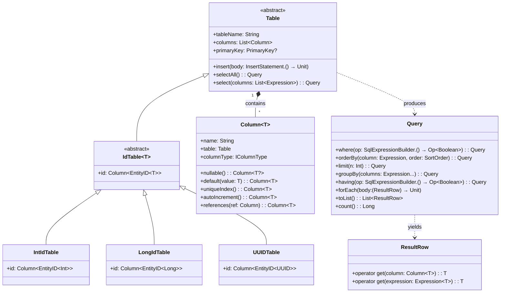
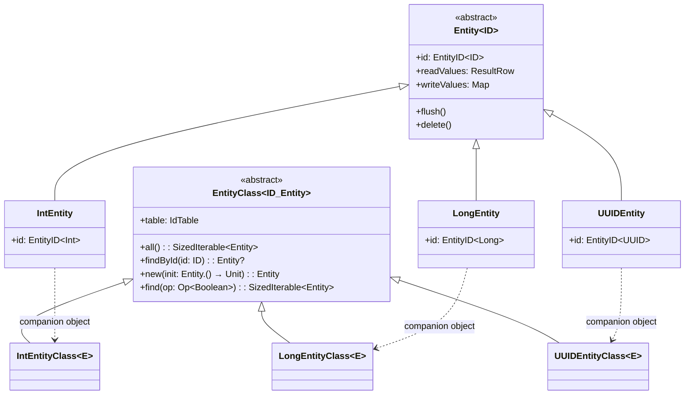
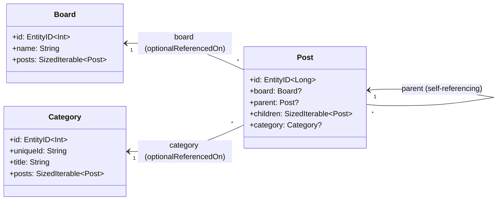
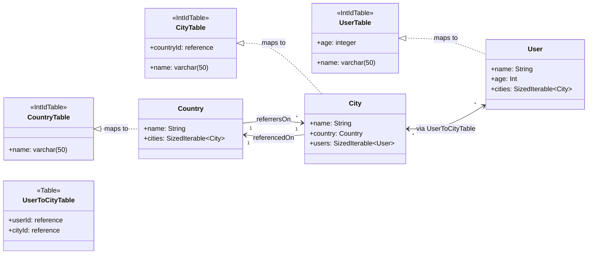
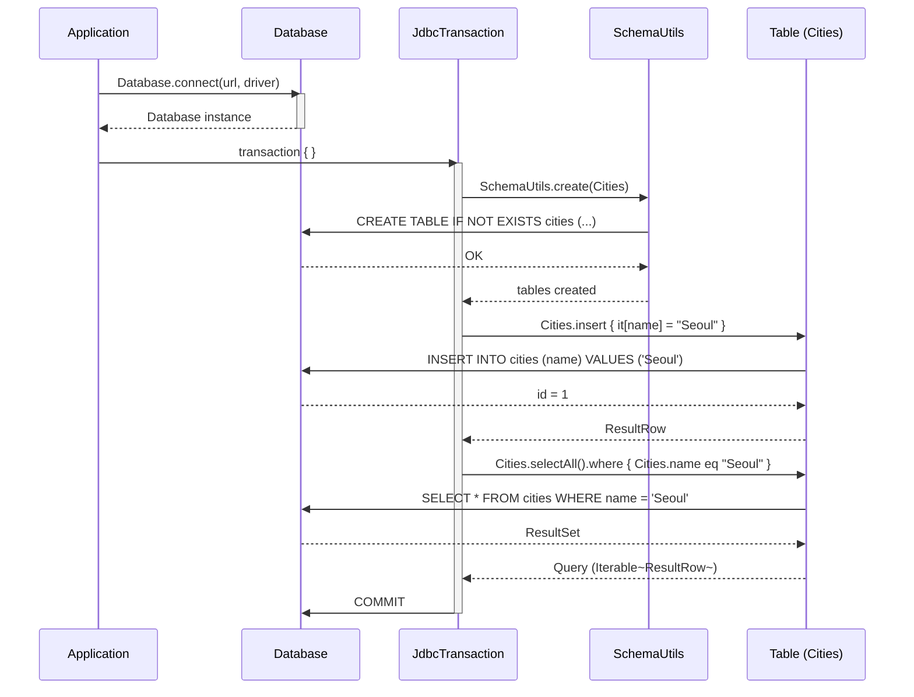
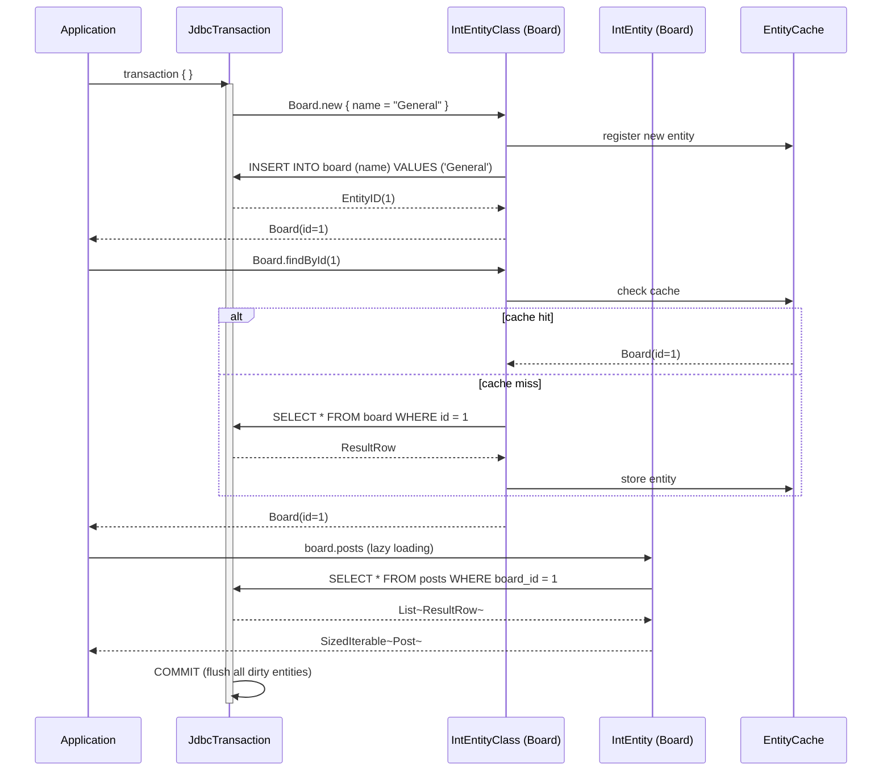
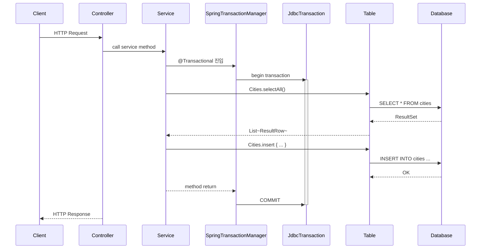
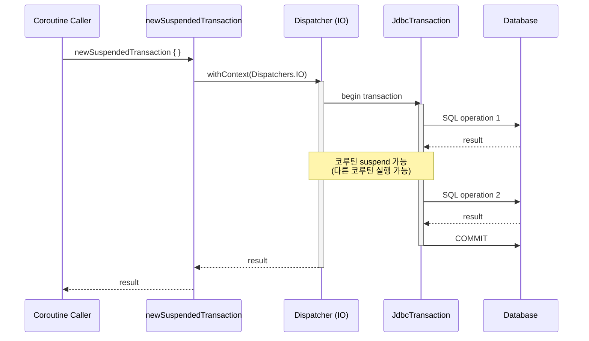
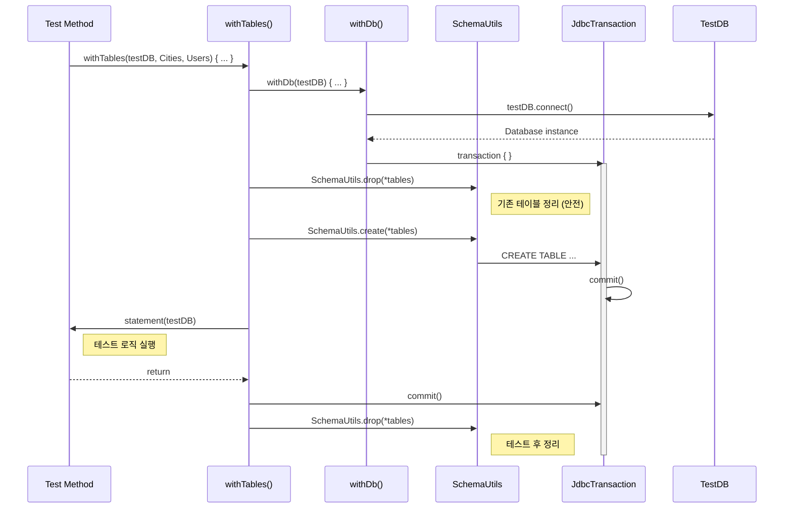

# Exposed 마이그레이션 가이드: 0.61.0 → 1.1.1

> **대상 독자**: Exposed 0.61.0 기반 노션 ebook 을 1.1.1 기준으로 업데이트하기 위한 참고 문서
>
> | 항목 | 이전 | 현재 |
> |------|------|------|
> | Exposed | 0.61.0 | **1.1.1** |
> | Kotlin | 2.0.x | **2.3.20** |
> | Spring Boot | 3.3.x | **3.5.11** |
> | bluetape4k | 1.4.0 | **1.5.0-Beta1** |

---

## 목차

1. [패키지 구조 변경 (Breaking Change)](#1-패키지-구조-변경)
2. [모듈별 import 매핑표](#2-모듈별-import-매핑표)
3. [DSL API 변경사항](#3-dsl-api-변경사항)
4. [DAO API 변경사항](#4-dao-api-변경사항)
5. [Transaction API 변경사항](#5-transaction-api-변경사항)
6. [Dialect Metadata 변경](#6-dialect-metadata-변경)
7. [Spring 통합 변경사항](#7-spring-통합-변경사항)
8. [Coroutine 지원 변경사항](#8-coroutine-지원-변경사항)
9. [신규 모듈](#9-신규-모듈)
10. [Class Diagram](#10-class-diagram)
11. [Sequence Diagram](#11-sequence-diagram)

---

## 1. 패키지 구조 변경

Exposed 1.0.0부터 **전체 패키지 경로에 `v1` 접두사**가 추가되었습니다. 이는 동일 프로젝트에서 구버전과 신버전을 공존시킬 수 있도록 하기 위함입니다.

```
# 이전 (0.61.0)
org.jetbrains.exposed.sql.*
org.jetbrains.exposed.dao.*

# 현재 (1.1.1)
org.jetbrains.exposed.v1.core.*      ← exposed-core
org.jetbrains.exposed.v1.dao.*       ← exposed-dao
org.jetbrains.exposed.v1.jdbc.*      ← exposed-jdbc
org.jetbrains.exposed.v1.javatime.*  ← exposed-java-time
org.jetbrains.exposed.v1.json.*      ← exposed-json
org.jetbrains.exposed.v1.crypt.*     ← exposed-crypt
org.jetbrains.exposed.v1.money.*     ← exposed-money
org.jetbrains.exposed.v1.r2dbc.*     ← exposed-r2dbc
```

**핵심 원칙**: 기존 `org.jetbrains.exposed.sql` → `org.jetbrains.exposed.v1.core` + `org.jetbrains.exposed.v1.jdbc`로 **분리**됨.

---

## 2. 모듈별 import 매핑표

### Core (테이블 정의, 표현식, 컬럼 타입)

| 0.61.0                                                      | 1.1.1                                                           |
|-------------------------------------------------------------|-----------------------------------------------------------------|
| `org.jetbrains.exposed.sql.Table`                           | `org.jetbrains.exposed.v1.core.Table`                           |
| `org.jetbrains.exposed.sql.Column`                          | `org.jetbrains.exposed.v1.core.Column`                          |
| `org.jetbrains.exposed.sql.ResultRow`                       | `org.jetbrains.exposed.v1.core.ResultRow`                       |
| `org.jetbrains.exposed.sql.Expression`                      | `org.jetbrains.exposed.v1.core.Expression`                      |
| `org.jetbrains.exposed.sql.AbstractQuery`                   | `org.jetbrains.exposed.v1.core.AbstractQuery`                   |
| `org.jetbrains.exposed.sql.Query`                           | `org.jetbrains.exposed.v1.core.Query`                           |
| `org.jetbrains.exposed.sql.SortOrder`                       | `org.jetbrains.exposed.v1.core.SortOrder`                       |
| `org.jetbrains.exposed.sql.Op`                              | `org.jetbrains.exposed.v1.core.Op`                              |
| `org.jetbrains.exposed.sql.SqlExpressionBuilder`            | `org.jetbrains.exposed.v1.core.SqlExpressionBuilder`            |
| `org.jetbrains.exposed.sql.DatabaseConfig`                  | `org.jetbrains.exposed.v1.core.DatabaseConfig`                  |
| `org.jetbrains.exposed.sql.StdOutSqlLogger`                 | `org.jetbrains.exposed.v1.core.StdOutSqlLogger`                 |
| `org.jetbrains.exposed.sql.statements.StatementInterceptor` | `org.jetbrains.exposed.v1.core.statements.StatementInterceptor` |
| `org.jetbrains.exposed.sql.Schema`                          | `org.jetbrains.exposed.v1.core.Schema`                          |
| `org.jetbrains.exposed.sql.Key`                             | `org.jetbrains.exposed.v1.core.Key`                             |
| `org.jetbrains.exposed.sql.Transaction`                     | `org.jetbrains.exposed.v1.core.Transaction`                     |
| `org.jetbrains.exposed.sql.ReferenceOption`                 | `org.jetbrains.exposed.v1.core.ReferenceOption`                 |

### ID 테이블 타입

| 0.61.0                                     | 1.1.1                                              |
|--------------------------------------------|----------------------------------------------------|
| `org.jetbrains.exposed.dao.id.IntIdTable`  | `org.jetbrains.exposed.v1.core.dao.id.IntIdTable`  |
| `org.jetbrains.exposed.dao.id.LongIdTable` | `org.jetbrains.exposed.v1.core.dao.id.LongIdTable` |
| `org.jetbrains.exposed.dao.id.UUIDTable`   | `org.jetbrains.exposed.v1.core.dao.id.UUIDTable`   |
| `org.jetbrains.exposed.dao.id.EntityID`    | `org.jetbrains.exposed.v1.core.dao.id.EntityID`    |
| `org.jetbrains.exposed.dao.id.IdTable`     | `org.jetbrains.exposed.v1.core.dao.id.IdTable`     |

### DAO (Entity)

| 0.61.0                                      | 1.1.1                                          |
|---------------------------------------------|------------------------------------------------|
| `org.jetbrains.exposed.dao.IntEntity`       | `org.jetbrains.exposed.v1.dao.IntEntity`       |
| `org.jetbrains.exposed.dao.IntEntityClass`  | `org.jetbrains.exposed.v1.dao.IntEntityClass`  |
| `org.jetbrains.exposed.dao.LongEntity`      | `org.jetbrains.exposed.v1.dao.LongEntity`      |
| `org.jetbrains.exposed.dao.LongEntityClass` | `org.jetbrains.exposed.v1.dao.LongEntityClass` |
| `org.jetbrains.exposed.dao.UUIDEntity`      | `org.jetbrains.exposed.v1.dao.UUIDEntity`      |
| `org.jetbrains.exposed.dao.UUIDEntityClass` | `org.jetbrains.exposed.v1.dao.UUIDEntityClass` |

### JDBC (DML 연산, 데이터베이스 연결)

| 0.61.0                                          | 1.1.1                                           |
|-------------------------------------------------|-------------------------------------------------|
| `org.jetbrains.exposed.sql.Database`            | `org.jetbrains.exposed.v1.jdbc.Database`        |
| `org.jetbrains.exposed.sql.SchemaUtils`         | `org.jetbrains.exposed.v1.jdbc.SchemaUtils`     |
| `org.jetbrains.exposed.sql.Transaction` (JDBC용) | `org.jetbrains.exposed.v1.jdbc.JdbcTransaction` |
| `org.jetbrains.exposed.sql.insert`              | `org.jetbrains.exposed.v1.jdbc.insert`          |
| `org.jetbrains.exposed.sql.update`              | `org.jetbrains.exposed.v1.jdbc.update`          |
| `org.jetbrains.exposed.sql.deleteWhere`         | `org.jetbrains.exposed.v1.jdbc.deleteWhere`     |
| `org.jetbrains.exposed.sql.select`              | `org.jetbrains.exposed.v1.jdbc.select`          |
| `org.jetbrains.exposed.sql.selectAll`           | `org.jetbrains.exposed.v1.jdbc.selectAll`       |
| `org.jetbrains.exposed.sql.insertAndGetId`      | `org.jetbrains.exposed.v1.jdbc.insertAndGetId`  |
| `org.jetbrains.exposed.sql.batchInsert`         | `org.jetbrains.exposed.v1.jdbc.batchInsert`     |
| `org.jetbrains.exposed.sql.SizedIterable`       | `org.jetbrains.exposed.v1.jdbc.SizedIterable`   |

### Transactions

| 0.61.0                                                                          | 1.1.1                                                                               |
|---------------------------------------------------------------------------------|-------------------------------------------------------------------------------------|
| `org.jetbrains.exposed.sql.transactions.transaction`                            | `org.jetbrains.exposed.v1.jdbc.transactions.transaction`                            |
| `org.jetbrains.exposed.sql.transactions.inTopLevelTransaction`                  | `org.jetbrains.exposed.v1.jdbc.transactions.inTopLevelTransaction`                  |
| `org.jetbrains.exposed.sql.transactions.transactionManager`                     | `org.jetbrains.exposed.v1.jdbc.transactions.transactionManager`                     |
| `org.jetbrains.exposed.sql.transactions.experimental.newSuspendedTransaction`   | `org.jetbrains.exposed.v1.jdbc.transactions.experimental.newSuspendedTransaction`   |
| `org.jetbrains.exposed.sql.transactions.experimental.suspendedTransactionAsync` | `org.jetbrains.exposed.v1.jdbc.transactions.experimental.suspendedTransactionAsync` |

### Dialect

| 0.61.0                                                        | 1.1.1                                                          |
|---------------------------------------------------------------|----------------------------------------------------------------|
| `org.jetbrains.exposed.sql.vendors.currentDialect` (메타데이터 접근) | `org.jetbrains.exposed.v1.jdbc.vendors.currentDialectMetadata` |

### Java Time

| 0.61.0                                         | 1.1.1                                         |
|------------------------------------------------|-----------------------------------------------|
| `org.jetbrains.exposed.sql.javatime.datetime`  | `org.jetbrains.exposed.v1.javatime.datetime`  |
| `org.jetbrains.exposed.sql.javatime.timestamp` | `org.jetbrains.exposed.v1.javatime.timestamp` |
| `org.jetbrains.exposed.sql.javatime.date`      | `org.jetbrains.exposed.v1.javatime.date`      |
| `org.jetbrains.exposed.sql.javatime.time`      | `org.jetbrains.exposed.v1.javatime.time`      |
| `org.jetbrains.exposed.sql.javatime.duration`  | `org.jetbrains.exposed.v1.javatime.duration`  |

### JSON

| 0.61.0                                 | 1.1.1                                 |
|----------------------------------------|---------------------------------------|
| `org.jetbrains.exposed.sql.json.json`  | `org.jetbrains.exposed.v1.json.json`  |
| `org.jetbrains.exposed.sql.json.jsonb` | `org.jetbrains.exposed.v1.json.jsonb` |

---

## 3. DSL API 변경사항

### 3.1 SELECT 구문 변경 (0.46.0에서 도입, 1.x에서 확정)

```kotlin
// ❌ 이전 (0.61.0)
TestTable
    .slice(TestTable.columnA)
    .select { TestTable.columnA eq 1 }

// ✅ 현재 (1.1.1)
TestTable
    .select(TestTable.columnA)
    .where { TestTable.columnA eq 1 }
```

```kotlin
// ❌ 이전: 전체 컬럼 + 조건
TestTable
    .select { TestTable.columnA eq 1 }

// ✅ 현재
TestTable
    .selectAll()
    .where { TestTable.columnA eq 1 }
```

```kotlin
// ❌ 이전: 특정 컬럼만 조회
TestTable
    .slice(TestTable.columnA)
    .selectAll()

// ✅ 현재
TestTable
    .select(TestTable.columnA)
```

### 3.2 CRUD 패턴 예제 (1.1.1 기준)

```kotlin
import org.jetbrains.exposed.v1.core.*
import org.jetbrains.exposed.v1.jdbc.*
import org.jetbrains.exposed.v1.jdbc.transactions.transaction

// Create
val id = StarWarsFilms.insertAndGetId {
    it[name] = "The Last Jedi"
    it[sequelId] = 8
    it[director] = "Rian Johnson"
}

// Read
StarWarsFilms.selectAll().where { StarWarsFilms.sequelId eq 8 }.forEach {
    println(it[StarWarsFilms.name])
}

// Update
StarWarsFilms.update({ StarWarsFilms.sequelId eq 8 }) {
    it[StarWarsFilms.name] = "Episode VIII – The Last Jedi"
}

// Delete
StarWarsFilms.deleteWhere { StarWarsFilms.sequelId eq 8 }
```

### 3.3 테이블 정의 (1.1.1 기준)

```kotlin
import org.jetbrains.exposed.v1.core.Table
import org.jetbrains.exposed.v1.core.dao.id.IntIdTable

// 기본 Table (PK 직접 지정)
object Cities : Table() {
    val id = integer("city_id").autoIncrement()
    val name = varchar("name", 50)
    override val primaryKey = PrimaryKey(id)
}

// IntIdTable (자동 증가 Int PK)
object CountryTable : IntIdTable() {
    val name = varchar("name", 50).uniqueIndex()
}
```

---

## 4. DAO API 변경사항

DAO 패턴 자체는 크게 변하지 않았으나, **import 경로**가 변경되었습니다.

```kotlin
// ❌ 이전
import org.jetbrains.exposed.dao.IntEntity
import org.jetbrains.exposed.dao.IntEntityClass
import org.jetbrains.exposed.dao.id.EntityID

// ✅ 현재
import org.jetbrains.exposed.v1.dao.IntEntity
import org.jetbrains.exposed.v1.dao.IntEntityClass
import org.jetbrains.exposed.v1.core.dao.id.EntityID
```

### Entity 정의 패턴 (1.1.1)

```kotlin
import org.jetbrains.exposed.v1.core.dao.id.EntityID
import org.jetbrains.exposed.v1.core.dao.id.IntIdTable
import org.jetbrains.exposed.v1.dao.IntEntity
import org.jetbrains.exposed.v1.dao.IntEntityClass

object Boards : IntIdTable("board") {
    val name = varchar("name", 255).uniqueIndex()
}

class Board(id: EntityID<Int>) : IntEntity(id) {
    companion object : IntEntityClass<Board>(Boards)
    var name by Boards.name
    val posts by Post optionalReferrersOn Posts.boardId  // one-to-many
}
```

### 관계 매핑 키워드 (변경 없음)

| 관계           | DSL 키워드                                        | 설명          |
|--------------|------------------------------------------------|-------------|
| Many-to-One  | `referencedOn`                                 | FK → Entity |
| One-to-Many  | `referrersOn`                                  | Entity ← FK |
| Many-to-Many | `via`                                          | 중간 테이블 경유   |
| Optional     | `optionalReferencedOn` / `optionalReferrersOn` | nullable FK |

---

## 5. Transaction API 변경사항

### 5.1 `transaction()` 시그니처 변경

```kotlin
// ❌ 이전 (0.61.0)
import org.jetbrains.exposed.sql.transactions.*

transaction(
    db.transactionManager.defaultIsolationLevel,
    db = db
) { /* ... */ }

// ✅ 현재 (1.1.1) — db가 첫 번째 파라미터
import org.jetbrains.exposed.v1.jdbc.transactions.*

transaction(db) { /* ... */ }
```

### 5.2 `Transaction` → `JdbcTransaction`

커스텀 트랜잭션 확장 함수의 receiver 타입이 변경되었습니다:

```kotlin
// ❌ 이전
import org.jetbrains.exposed.sql.Transaction

fun Transaction.getVersionString(): String { /* ... */ }

// ✅ 현재
import org.jetbrains.exposed.v1.jdbc.JdbcTransaction

fun JdbcTransaction.getVersionString(): String { /* ... */ }
```

### 5.3 `inTopLevelTransaction` 변경

```kotlin
// ❌ 이전
inTopLevelTransaction(
    Connection.TRANSACTION_SERIALIZABLE
) { /* ... */ }

// ✅ 현재 — named parameter 사용
inTopLevelTransaction(
    transactionIsolation = Connection.TRANSACTION_SERIALIZABLE
) { /* ... */ }
```

---

## 6. Dialect Metadata 변경

테이블 메타데이터 접근 시 `currentDialect` 대신 `currentDialectMetadata`를 사용합니다:

```kotlin
// ❌ 이전
import org.jetbrains.exposed.sql.vendors.currentDialect

transaction {
    val tableKeys = currentDialect.existingPrimaryKeys(TableA)[TableA]
    if (TableA.tableName in currentDialect.allTablesNames()) { /* ... */ }
}

// ✅ 현재
import org.jetbrains.exposed.v1.jdbc.vendors.currentDialectMetadata

transaction {
    val tableKeys = currentDialectMetadata.existingPrimaryKeys(TableA)[TableA]
    if (TableA.tableName in currentDialectMetadata.allTablesNames()) { /* ... */ }
}
```

---

## 7. Spring 통합 변경사항

### 7.1 Spring Boot Starter

```kotlin
// Gradle 의존성 (1.1.1)
implementation("org.jetbrains.exposed:exposed-spring-boot-starter:1.1.1")

// Spring Boot 4 지원
implementation("org.jetbrains.exposed:exposed-spring-boot4-starter:1.1.1")
```

### 7.2 Spring Transaction Manager

```kotlin
// ❌ 이전
implementation("org.jetbrains.exposed:spring-transaction:0.61.0")

// ✅ 현재
implementation("org.jetbrains.exposed:spring-transaction:1.1.1")
// Spring 7 지원
implementation("org.jetbrains.exposed:spring7-transaction:1.1.1")
```

### 7.3 Spring + Exposed 설정 (1.1.1 기준)

```kotlin
import org.jetbrains.exposed.v1.jdbc.Database
import org.jetbrains.exposed.v1.core.DatabaseConfig

@Configuration
class ExposedConfig {
    @Bean
    fun database(dataSource: DataSource): Database {
        return Database.connect(
            datasource = dataSource,
            databaseConfig = DatabaseConfig {
                defaultIsolationLevel = Connection.TRANSACTION_READ_COMMITTED
            }
        )
    }
}
```

---

## 8. Coroutine 지원 변경사항

```kotlin
// ❌ 이전
import org.jetbrains.exposed.sql.transactions.experimental.newSuspendedTransaction
import org.jetbrains.exposed.sql.transactions.experimental.suspendedTransactionAsync

// ✅ 현재
import org.jetbrains.exposed.v1.jdbc.transactions.experimental.newSuspendedTransaction
import org.jetbrains.exposed.v1.jdbc.transactions.experimental.suspendedTransactionAsync
```

### 사용 패턴 (변경 없음, import만 변경)

```kotlin
import org.jetbrains.exposed.v1.jdbc.transactions.experimental.newSuspendedTransaction

suspend fun findByCode(code: String): CountryRecord? = newSuspendedTransaction {
    CountryTable.selectAll()
        .where { CountryTable.code eq code }
        .map { it.toCountryRecord() }
        .singleOrNull()
}
```

---

## 9. 신규 모듈

| 모듈                             | 설명                         |
|--------------------------------|----------------------------|
| `exposed-migration-core`       | 스키마 마이그레이션 코어              |
| `exposed-migration-jdbc`       | JDBC 기반 마이그레이션             |
| `exposed-migration-r2dbc`      | R2DBC 기반 마이그레이션            |
| `exposed-spring-boot4-starter` | Spring Boot 4 지원           |
| `spring7-transaction`          | Spring Framework 7 트랜잭션 지원 |

---

## 10. Class Diagram

### 10.1 Exposed Core Architecture



### 10.2 DAO Entity Hierarchy



### 10.3 Entity Relationship Example (Board-Post-Category)



### 10.4 Country-City-User Relationship (Many-to-Many)



---

## 11. Sequence Diagram

### 11.1 DSL: 테이블 생성 → 데이터 삽입 → 조회



### 11.2 DAO: Entity 생성 → 조회 → 관계 탐색



### 11.3 Spring Boot + Exposed 통합 흐름



### 11.4 Coroutine + Exposed 흐름



### 11.5 테스트 인프라 흐름 (WithTables)



---

## 부록: 프로젝트 모듈 구조 (exposed-workshop)

```mermaid
graph TD
    ROOT[exposed-workshop] --> SHARED[00-shared/exposed-shared-tests]
    ROOT --> SB[01-spring-boot]
    ROOT --> ALT[02-alternatives-to-jpa]
    ROOT --> BASIC[03-exposed-basic]
    ROOT --> DDL[04-exposed-ddl]
    ROOT --> DML[05-exposed-dml]
    ROOT --> ADV[06-advanced]
    ROOT --> JPA[07-jpa]
    ROOT --> CORO[08-coroutines]
    ROOT --> SPRING[09-spring]
    ROOT --> MT[10-multi-tenant]
    ROOT --> HP[11-high-performance]

    SHARED -.->|공통 테스트 유틸| SB
    SHARED -.->|AbstractExposedTest<br/>TestDB, WithTables| BASIC
    SHARED -.->|DMLTestData<br/>BoardSchema| DML

    SPRING --> SP1[01-springboot-autoconfigure]
    SPRING --> SP2[02-transactiontemplate]
    SPRING --> SP3[03-spring-transaction]
    SPRING --> SP4[04-exposed-repository]
    SPRING --> SP5[05-spring-cache]
    SPRING --> SP6[06-spring-webflux]
    SPRING --> SP7[07-spring-suspended-cache]

    style SHARED fill:#e1f5fe
    style SPRING fill:#f3e5f5
```



---

## 마이그레이션 체크리스트

- [ ] **import 일괄 변경**: `org.jetbrains.exposed.sql` → `org.jetbrains.exposed.v1.core` / `v1.jdbc`
- [ ] **import 일괄 변경**: `org.jetbrains.exposed.dao` → `org.jetbrains.exposed.v1.dao`
- [ ] **import 일괄 변경**: `org.jetbrains.exposed.dao.id` → `org.jetbrains.exposed.v1.core.dao.id`
- [ ] **DSL 문법**: `slice().select{}` → `select().where{}`
- [ ] **DSL 문법**: `.select { condition }` → `.selectAll().where { condition }`
- [ ] **Transaction receiver**: `Transaction` → `JdbcTransaction` (JDBC 컨텍스트)
- [ ] **transaction() 시그니처**: `db` 파라미터가 첫 번째 인자로 이동
- [ ] **Dialect 메타데이터**: `currentDialect.allTablesNames()` → `currentDialectMetadata.allTablesNames()`
- [ ] **DML import**: `insert`, `update`, `deleteWhere`, `selectAll` 등은 `v1.jdbc` 패키지에서 import
- [ ] **Spring 의존성**: `spring-transaction` 아티팩트 ID 변경 확인
- [ ] **테스트 코드**: 모든 테스트 파일의 import 경로 업데이트
