# Kotlin Exposed 1.1.1 — Notion 페이지 업데이트 콘텐츠

> **사용 방법**: 이 파일의 각 섹션을 Notion 페이지에 복사·붙여넣기 하세요.
> Mermaid 다이어그램은 Notion의 `/code` 블록 → `mermaid` 언어 선택 후 붙여넣기.

---

## 📦 버전 정보 (페이지 상단 콜아웃)

| 항목          | 버전              |
|-------------|-----------------|
| Exposed     | **1.1.1**       |
| Kotlin      | **2.3.20**      |
| Spring Boot | **3.5.11**      |
| bluetape4k  | **1.5.0-Beta1** |

---

# 섹션별 업데이트 가이드

---

## 4. 준비 및 환경 설정

### 패키지 구조 변경 (Breaking Change)

Exposed 1.0.0부터 **전체 패키지 경로에 `v1` 접두사**가 추가되었습니다.

```
# 이전 (0.61.0)
org.jetbrains.exposed.sql.*
org.jetbrains.exposed.dao.*

# 현재 (1.1.1)
org.jetbrains.exposed.v1.core.*      ← exposed-core
org.jetbrains.exposed.v1.dao.*       ← exposed-dao
org.jetbrains.exposed.v1.jdbc.*      ← exposed-jdbc
org.jetbrains.exposed.v1.javatime.*  ← exposed-java-time
org.jetbrains.exposed.v1.json.*      ← exposed-json
org.jetbrains.exposed.v1.crypt.*     ← exposed-crypt
org.jetbrains.exposed.v1.r2dbc.*     ← exposed-r2dbc
```

**핵심 원칙**: 기존 `org.jetbrains.exposed.sql` →

- `org.jetbrains.exposed.v1.core` (테이블 정의, 표현식)
- `org.jetbrains.exposed.v1.jdbc` (DML, DB 연결) 로 **분리**됨.

### import 매핑 빠른 참조

| 0.61.0                                                     | 1.1.1                                                                             |
|------------------------------------------------------------|-----------------------------------------------------------------------------------|
| `org.jetbrains.exposed.sql.Table`                          | `org.jetbrains.exposed.v1.core.Table`                                             |
| `org.jetbrains.exposed.sql.Database`                       | `org.jetbrains.exposed.v1.jdbc.Database`                                          |
| `org.jetbrains.exposed.sql.SchemaUtils`                    | `org.jetbrains.exposed.v1.jdbc.SchemaUtils`                                       |
| `org.jetbrains.exposed.sql.Transaction` (JDBC용)            | `org.jetbrains.exposed.v1.jdbc.JdbcTransaction`                                   |
| `org.jetbrains.exposed.sql.transactions.transaction`       | `org.jetbrains.exposed.v1.jdbc.transactions.transaction`                          |
| `org.jetbrains.exposed.dao.id.IntIdTable`                  | `org.jetbrains.exposed.v1.core.dao.id.IntIdTable`                                 |
| `org.jetbrains.exposed.dao.IntEntity`                      | `org.jetbrains.exposed.v1.dao.IntEntity`                                          |
| `...transactions.experimental.newSuspendedTransaction`     | `org.jetbrains.exposed.v1.jdbc.transactions.experimental.newSuspendedTransaction` |
| `org.jetbrains.exposed.sql.vendors.currentDialect` (메타데이터) | `org.jetbrains.exposed.v1.jdbc.vendors.currentDialectMetadata`                    |

### 모듈 의존성 다이어그램

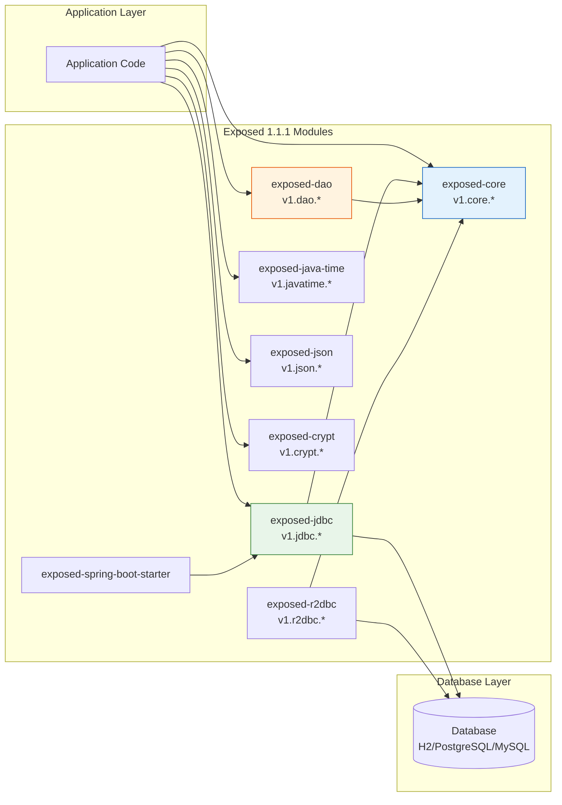

---

## 5. Exposed 기본 예제 (DSL)

### DSL SELECT 구문 변경

```kotlin
// ❌ 이전 (0.61.0)
TestTable
    .slice(TestTable.columnA)
    .select { TestTable.columnA eq 1 }

// ✅ 현재 (1.1.1)
TestTable
    .select(TestTable.columnA)
    .where { TestTable.columnA eq 1 }
```

```kotlin
// ❌ 이전: 전체 컬럼 + 조건
TestTable.select { TestTable.columnA eq 1 }

// ✅ 현재
TestTable.selectAll().where { TestTable.columnA eq 1 }
```

### DSL CRUD 전체 예제 (1.1.1 기준)

```kotlin
import org.jetbrains.exposed.v1.core.*
import org.jetbrains.exposed.v1.jdbc.*
import org.jetbrains.exposed.v1.jdbc.transactions.transaction

object StarWarsFilms : IntIdTable("star_wars_films") {
    val name = varchar("name", 255)
    val sequelId = integer("sequel_id").uniqueIndex()
    val director = varchar("director", 100)
    val rating = double("rating").default(0.0)
}

transaction {
    // CREATE
    val id = StarWarsFilms.insertAndGetId {
        it[name] = "The Last Jedi"
        it[sequelId] = 8
        it[director] = "Rian Johnson"
    }

    // READ
    StarWarsFilms
        .selectAll()
        .where { StarWarsFilms.sequelId greaterEq 7 }
        .orderBy(StarWarsFilms.sequelId)
        .forEach { row -> println(row[StarWarsFilms.name]) }

    // READ — 특정 컬럼만
    StarWarsFilms
        .select(StarWarsFilms.name, StarWarsFilms.director)
        .where { StarWarsFilms.rating greaterEq 8.0 }

    // UPDATE
    StarWarsFilms.update({ StarWarsFilms.sequelId eq 8 }) {
        it[name] = "Episode VIII – The Last Jedi"
    }

    // DELETE
    StarWarsFilms.deleteWhere { StarWarsFilms.sequelId eq 8 }

    // BATCH INSERT
    StarWarsFilms.batchInsert(listOf("A New Hope" to 4, "Empire" to 5)) { (n, s) ->
        this[StarWarsFilms.name] = n
        this[StarWarsFilms.sequelId] = s
        this[StarWarsFilms.director] = "George Lucas"
    }
}
```

### DSL Class Diagram

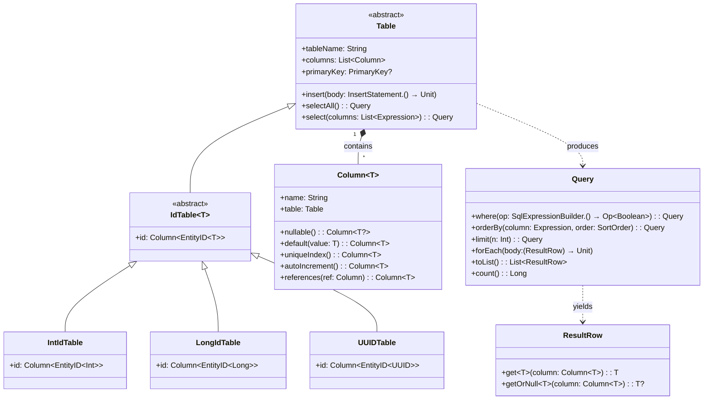

### DSL 데이터 흐름 (Data Flow Diagram)

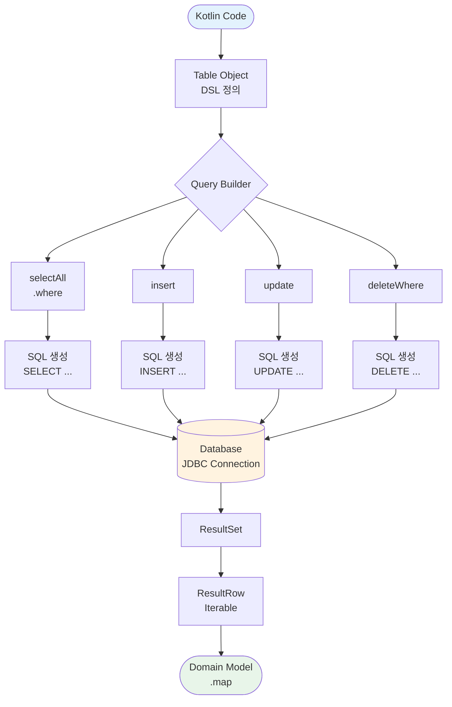

---

## 6.1 Connection & Transaction Setup

### Database 연결 (1.1.1 기준)

```kotlin
import org.jetbrains.exposed.v1.jdbc.Database
import org.jetbrains.exposed.v1.core.DatabaseConfig

// H2 연결
val db = Database.connect(
    url = "jdbc:h2:mem:test;DB_CLOSE_DELAY=-1",
    driver = "org.h2.Driver",
    user = "sa",
    password = ""
)

// DataSource 연결 (Spring 환경)
val db2 = Database.connect(
    datasource = dataSource,
    databaseConfig = DatabaseConfig {
        defaultIsolationLevel = Connection.TRANSACTION_READ_COMMITTED
        maxEntitiesToStoreInCachePerEntity = 1000
    }
)
```

---

## 6.2 DDL

### 테이블 정의 (1.1.1 기준)

```kotlin
import org.jetbrains.exposed.v1.core.Table
import org.jetbrains.exposed.v1.core.dao.id.IntIdTable
import org.jetbrains.exposed.v1.core.dao.id.LongIdTable
import org.jetbrains.exposed.v1.javatime.datetime
import org.jetbrains.exposed.v1.jdbc.SchemaUtils
import org.jetbrains.exposed.v1.jdbc.transactions.transaction

// 기본 Table (PK 직접 지정)
object Cities : Table("city") {
    val id = integer("city_id").autoIncrement()
    val name = varchar("name", 50)
    override val primaryKey = PrimaryKey(id)
}

// IntIdTable (자동 증가 Int PK)
object CountryTable : IntIdTable("country") {
    val code = varchar("code", 2).uniqueIndex()
    val name = varchar("name", 50)
}

// LongIdTable + FK
object OrderTable : LongIdTable("orders") {
    val userId = reference("user_id", UserTable)
    val createdAt = datetime("created_at").defaultExpression(CurrentDateTime)
    val status = enumerationByName<OrderStatus>("status", 20)
}

// 테이블 생성/삭제
transaction {
    SchemaUtils.create(Cities, CountryTable, OrderTable)
    // SchemaUtils.drop(Cities, CountryTable, OrderTable)
}
```

### 테이블 Class Diagram

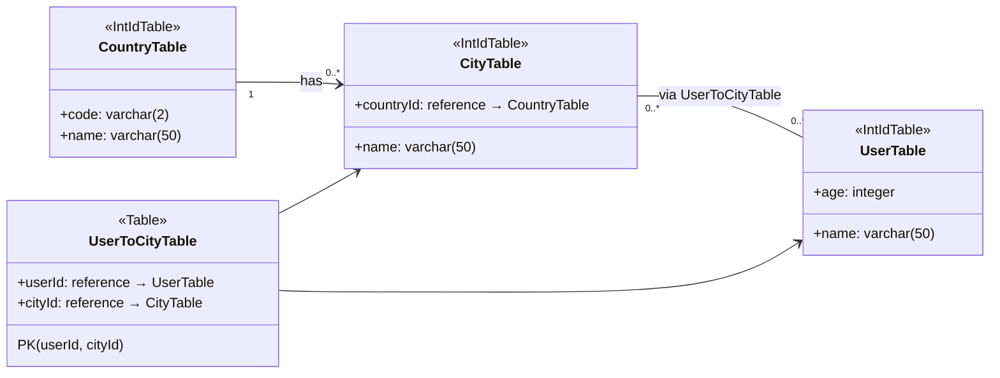

---

## 7.4 Transactions

### transaction() 시그니처 변경

```kotlin
// ❌ 이전 (0.61.0)
import org.jetbrains.exposed.sql.transactions.*

transaction(
    db.transactionManager.defaultIsolationLevel,
    db = db
) { /* ... */ }

// ✅ 현재 (1.1.1) — db가 첫 번째 파라미터
import org.jetbrains.exposed.v1.jdbc.transactions.*

transaction(db) { /* ... */ }

// 격리 수준 명시
transaction(
    db = db,
    transactionIsolation = Connection.TRANSACTION_SERIALIZABLE
) { /* ... */ }
```

### Transaction → JdbcTransaction

```kotlin
// ❌ 이전
import org.jetbrains.exposed.sql.Transaction
fun Transaction.customExtension(): String { /* ... */ }

// ✅ 현재
import org.jetbrains.exposed.v1.jdbc.JdbcTransaction
fun JdbcTransaction.customExtension(): String { /* ... */ }
```

### inTopLevelTransaction 변경

```kotlin
// ✅ 현재 — named parameter 사용
import org.jetbrains.exposed.v1.jdbc.transactions.inTopLevelTransaction

inTopLevelTransaction(
    transactionIsolation = Connection.TRANSACTION_SERIALIZABLE
) { /* ... */ }
```

### Transaction Sequence Diagram

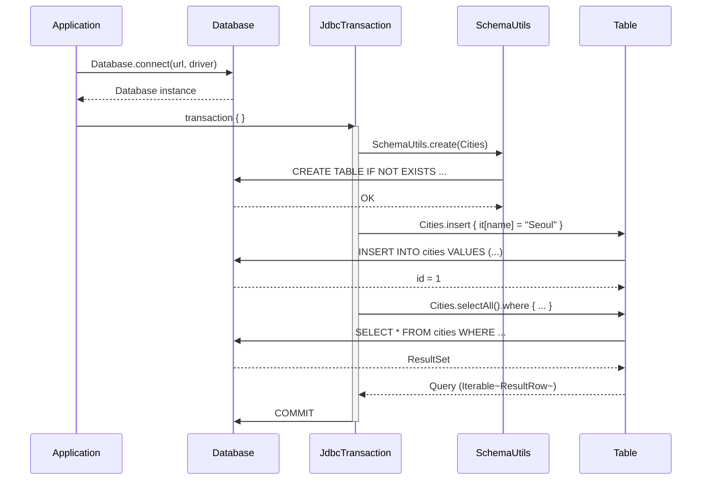

### Transaction 데이터 흐름

```mermaid
flowchart TD
    A([Application]) --> B{transaction\{\}}
    B --> C[JdbcTransaction\n시작]
    C --> D[SQL 실행\nDML Operations]
    D --> E{오류 발생?}
    E -->|No| F[COMMIT]
    E -->|Yes| G[ROLLBACK]
    F --> H([결과 반환])
    G --> I([예외 전파])

    style A fill:#e3f2fd
    style H fill:#e8f5e9
    style I fill:#ffebee
```

---

## 7.5 Exposed Entities (DAO)

### Entity 정의 패턴 (1.1.1)

```kotlin
import org.jetbrains.exposed.v1.core.dao.id.EntityID
import org.jetbrains.exposed.v1.core.dao.id.IntIdTable
import org.jetbrains.exposed.v1.core.dao.id.LongIdTable
import org.jetbrains.exposed.v1.dao.IntEntity
import org.jetbrains.exposed.v1.dao.IntEntityClass
import org.jetbrains.exposed.v1.dao.LongEntity
import org.jetbrains.exposed.v1.dao.LongEntityClass

object Boards : IntIdTable("board") {
    val name = varchar("name", 255).uniqueIndex()
}

object Posts : LongIdTable("post") {
    val boardId = reference("board_id", Boards).nullable()
    val title = varchar("title", 255)
    val content = text("content")
    val parentId = reference("parent_id", Posts).nullable()
}

class Board(id: EntityID<Int>) : IntEntity(id) {
    companion object : IntEntityClass<Board>(Boards)

    var name by Boards.name
    val posts by Post optionalReferrersOn Posts.boardId
}

class Post(id: EntityID<Long>) : LongEntity(id) {
    companion object : LongEntityClass<Post>(Posts)

    var board by Board optionalReferencedOn Posts.boardId
    var title by Posts.title
    var content by Posts.content
    var parent by Post optionalReferencedOn Posts.parentId
    val children by Post optionalReferrersOn Posts.parentId
}
```

### DAO CRUD 예제

```kotlin
transaction {
    // CREATE
    val board = Board.new { name = "General" }
    val post = Post.new {
        this.board = board
        title = "Hello Exposed 1.1!"
        content = "DAO 패턴 예제입니다."
    }

    // READ — findById
    val found = Board.findById(board.id.value)

    // READ — find with condition
    Board.find { Boards.name like "%General%" }.toList()

    // UPDATE — dirty tracking 자동 처리
    found?.name = "General Discussion"

    // DELETE
    found?.delete()

    // 관계 탐색 (lazy loading)
    board.posts.forEach { println(it.title) }
}
```

### DAO Entity Hierarchy Diagram

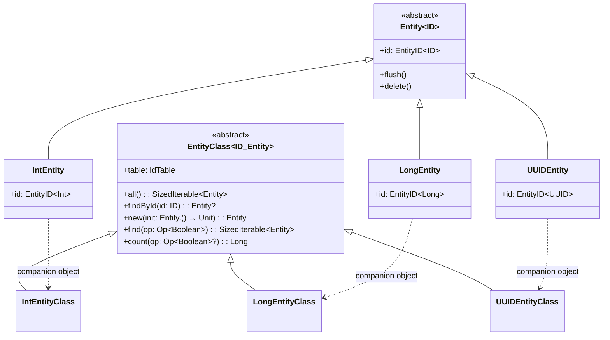

### DAO 데이터 흐름

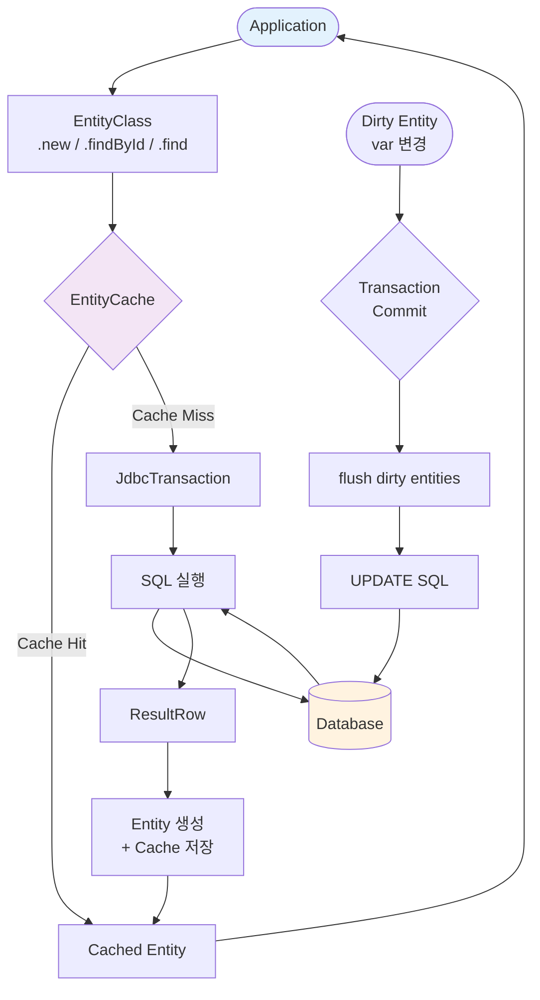

### DAO Sequence Diagram

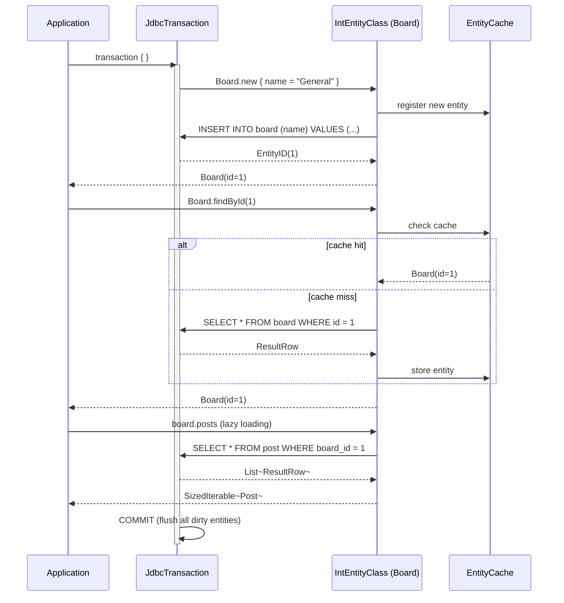

---

## 8. Coroutine 지원

### import 변경

```kotlin
// ✅ 현재 (1.1.1)
import org.jetbrains.exposed.v1.jdbc.transactions.experimental.newSuspendedTransaction
import org.jetbrains.exposed.v1.jdbc.transactions.experimental.suspendedTransactionAsync
```

### Suspend Transaction 패턴

```kotlin
import org.jetbrains.exposed.v1.jdbc.transactions.experimental.newSuspendedTransaction
import kotlinx.coroutines.Dispatchers

suspend fun findCountryByCode(code: String): CountryRecord? =
    newSuspendedTransaction(Dispatchers.IO) {
        CountryTable
            .selectAll()
            .where { CountryTable.code eq code }
            .map { it.toCountryRecord() }
            .singleOrNull()
    }
```

### Coroutine Sequence Diagram

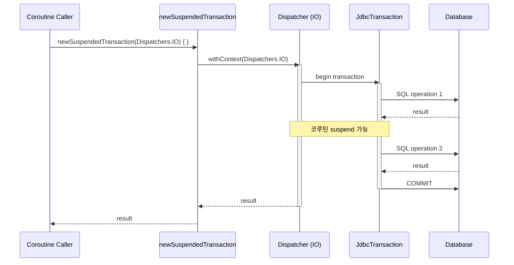

---

## 9. Spring 통합

### Spring Boot 설정 (1.1.1 기준)

```kotlin
import org.jetbrains.exposed.v1.jdbc.Database
import org.jetbrains.exposed.v1.core.DatabaseConfig

@Configuration
class ExposedConfig {
    @Bean
    fun database(dataSource: DataSource): Database {
        return Database.connect(
            datasource = dataSource,
            databaseConfig = DatabaseConfig {
                defaultIsolationLevel = Connection.TRANSACTION_READ_COMMITTED
                maxEntitiesToStoreInCachePerEntity = 1000
            }
        )
    }
}
```

### Spring Repository 패턴

```kotlin
import org.jetbrains.exposed.v1.core.*
import org.jetbrains.exposed.v1.jdbc.*
import org.springframework.stereotype.Repository
import org.springframework.transaction.annotation.Transactional

@Repository
@Transactional(readOnly = true)
class CountryRepository {

    fun findAll(): List<CountryRecord> =
        CountryTable.selectAll()
            .orderBy(CountryTable.name)
            .map { it.toCountryRecord() }

    fun findById(id: Int): CountryRecord? =
        CountryTable.selectAll()
            .where { CountryTable.id eq id }
            .singleOrNull()
            ?.toCountryRecord()

    @Transactional
    fun save(name: String): CountryRecord {
        val id = CountryTable.insertAndGetId { it[CountryTable.name] = name }
        return CountryRecord(id.value, name)
    }
}
```

### Spring Transaction Architecture

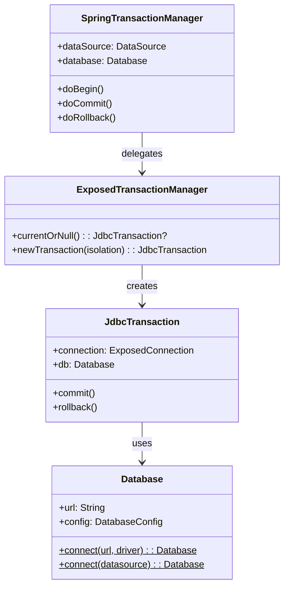

### Spring Transaction 데이터 흐름

```mermaid
flowchart LR
    subgraph "Web Layer"
        REQ([HTTP Request])
        CTRL[Controller]
        RESP([HTTP Response])
    end

    subgraph "Service Layer"
        SVC[@Transactional\nService]
    end

    subgraph "Exposed Transaction"
        STM[SpringTransactionManager]
        TX[JdbcTransaction]
        CACHE[EntityCache]
    end

    subgraph "Data Layer"
        TABLE[Table / Entity]
        DB[(Database)]
    end

    REQ --> CTRL
    CTRL --> SVC
    SVC --> STM
    STM -->|begin| TX
    TX --> TABLE
    TABLE <-->|SQL| DB
    TABLE <--> CACHE
    TX -->|commit| DB
    SVC --> CTRL
    CTRL --> RESP

    style REQ fill:#e3f2fd
    style RESP fill:#e8f5e9
    style DB fill:#fff3e0
    style CACHE fill:#f3e5f5
```

### Spring Boot + Exposed Sequence Diagram

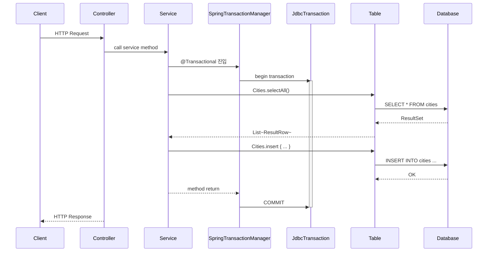

---

## 14. 부록: 마이그레이션 가이드 (0.61 → 1.1.1)

### 마이그레이션 체크리스트

- [ ] **import 일괄 변경**: `org.jetbrains.exposed.sql` → `org.jetbrains.exposed.v1.core` / `v1.jdbc`
- [ ] **import 일괄 변경**: `org.jetbrains.exposed.dao` → `org.jetbrains.exposed.v1.dao`
- [ ] **import 일괄 변경**: `org.jetbrains.exposed.dao.id` → `org.jetbrains.exposed.v1.core.dao.id`
- [ ] **DSL 문법**: `slice().select{}` → `select().where{}`
- [ ] **DSL 문법**: `.select { condition }` → `.selectAll().where { condition }`
- [ ] **Transaction receiver**: `Transaction` → `JdbcTransaction` (JDBC 컨텍스트)
- [ ] **transaction() 시그니처**: `db` 파라미터가 첫 번째 인자로 이동
- [ ] **Dialect 메타데이터**: `currentDialect.xxx()` → `currentDialectMetadata.xxx()`
- [ ] **DML import**: `insert`, `update`, `deleteWhere`, `selectAll` 등은 `v1.jdbc` 패키지
- [ ] **Spring 의존성**: `spring-transaction` 아티팩트 ID 변경 확인
- [ ] **테스트 코드**: 모든 테스트 파일의 import 경로 업데이트

### 마이그레이션 데이터 흐름

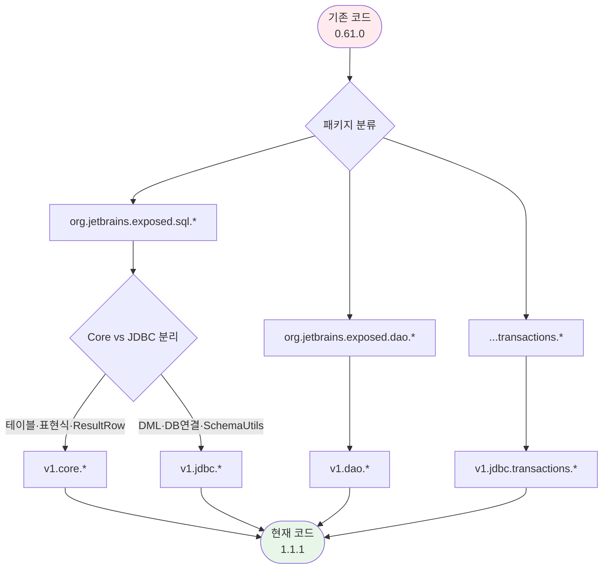

---

## 프로젝트 모듈 구조 다이어그램 (exposed-workshop)

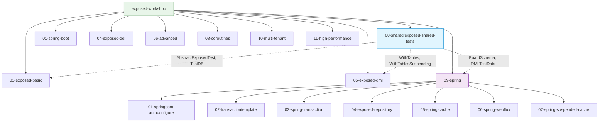
